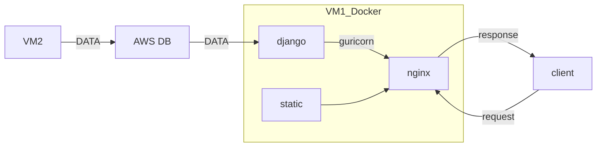

# Design
{: .no_toc }

  

    Table of contents
  

  {: .text-delta }
- TOC
{:toc}

<!------------------------------------ STEP ------------------------------------>

## STEP 1. STRUCTURE

* VM1 : Web instance
* VM2 : Get data instance
* data : word, ohlc

 

<!------------------------------------ STEP ------------------------------------>
## STEP 2. To do list

* backend 데이터 전송 확인(확인 완료)
* frontend 에서는 공동 단어를 모름으로 데이터 전송 구조 변형 필요(완료)

* crawling JSON 파일 깨짐(완료)
