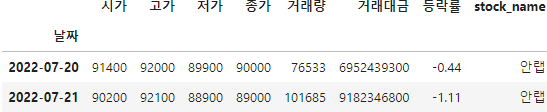

# Site
{: .no_toc }

<details open markdown="block">
  <summary>
    Table of contents
  </summary>
  {: .text-delta }
- TOC
{:toc}
</details>
<!------------------------------------ STEP ------------------------------------>

## STEP 0. Setting

* We start from [[Backend]-[Django]-[Deploy-with-Docker]]([Deploy with Docker | Just the Docs Template (merucode.github.io)](https://merucode.github.io/docs/menu4-backend/menu4-sub2-django/menu4-sub2-sub8-deploy-with-docker.html#step-7-final-file-structure))


## STEP 1. Create App and Load Data

### Step 1-1. [Dev] Creat App

* **`bash`**

  ```bash
  $ docker compose up -d --build
  $ docker exec backend python manage.py startapp charts
  # check to create folder of charts
  $ docker compose donw -v
  ```

* **`django/mysite/settings.py`**

  ```python
  INSTALLED_APPS = [
  	...
      'django.contrib.staticfiles',
      'charts',	### Update
  ]
  ```

* **`django/mysite/urls.py`**

  ```python
  from django.contrib import admin
  from django.urls import path, include ## Update
  ...
  urlpatterns = [
      path('admin/', admin.site.urls),
      path('', include('charts.urls')), ## Update
  ]
  ...
  ```

* **`django/charts/urls.py`(create)**

  ```python
  from django.urls import path
  from . import views
  
  app_name = 'charts'
  
  urlpatterns = [
      path('', views.index, name='index'),
  ]
  ```

* **`django/charts/views.py`**

  ```python
  from django.shortcuts import render
  
  ### Add
  def index(request):
      return render(request, 'charts/index.html')
  ```

* **`django/templates/base.html`(create)**

  ```html
  #
  <!doctype html>
  <html lang="ko">
  <head>
      <!-- Required meta tags -->
      <meta charset="utf-8">
      <meta name="viewport" content="width=device-width, initial-scale=1, shrink-to-fit=no">
      <!--  CSS -->
      <!-- <link rel="stylesheet"  href=""> -->
      <title>mysite</title>
  </head>
  <body>
  <!-- 기본 템플릿 안에 삽입될 내용 Start -->
  
  #
  #
  
  <!-- 기본 템플릿 안에 삽입될 내용 End -->
  </body>
  </html>
  ```

  * .html 안에 # 표시는 지우고 코드 입력(ruby 언어 오류 발생 관련)

* **`django/templates/charts/index.html`(create)**

  ```html
  #
  #
  
  <h1>Hello!</h1>
  
  #
  ```

* **`django/mysite/settings.py`**

  ```python
  ...
  TEMPLATES = [
      {
          'BACKEND': 'django.template.backends.django.DjangoTemplates',
          'DIRS': [BASE_DIR / 'templates'],	## Update
          ...
  ```

  

### Step 1-2. [Dev] Check

* **`bash`**

  ```bash
  $ docker compose up -d --build
  # connect to 'http://localhost:8000/'
  
  $ docker compose down -v
  ```


###  Step 1-3. Load Data

* Make `test table(test_1)` in AWS DB

  

* **`django/charts/models.py`**

  ```python
  from django.db import models
  
  class test_1_model(models.Model):
      date = models.DateField(primary_key=True, db_column='날짜')
      open = models.IntegerField(db_column='시가')
      high = models.IntegerField(db_column='고가')
      low = models.IntegerField(db_column='저가')
      close = models.IntegerField(db_column='종가')
      volume = models.IntegerField(db_column='거래량')
      volume_price = models.IntegerField(db_column='거래대금')
      rate_return = models.IntegerField(db_column='등락률')
      stock_name = models.IntegerField(db_column='ticker')
      
      class Meta:
          managed = False
          db_table = "test_1"
  ```

  

  

  


<br>


<!------------------------------------ STEP ------------------------------------>

## STEP


<br>


<!------------------------------------ STEP ------------------------------------>

## STEP

