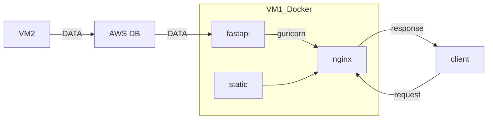

# Design
{: .no_toc }

  

    Table of contents
  

  {: .text-delta }
- TOC
{:toc}

<!------------------------------------ STEP ------------------------------------>

## STEP 1. STRUCTURE

* VM1 : Web instance
* VM2 : Get data instance
* data : word, ohlc

 

<!------------------------------------ STEP ------------------------------------>

## STEP 2. To do list

* Complete crawling code and collect test data
  * on VM instance
* Connect between fastapi and react
* Add function Oauth2 with google 
