# Calculus
{: .no_toc }

  

    Table of contents
  

  {: .text-delta }
- TOC
{:toc}

<!------------------------------------ STEP ------------------------------------>
## STEP 1. Differential

### Step 1-1. basic

 * **differential** :  instantaneous rate of change for function

 * **Meaning of the slope in the graph**

  |positive slope|negative slope|
  | ------------------------------------------------------------ | ------------------------------------------------------------ |
  | 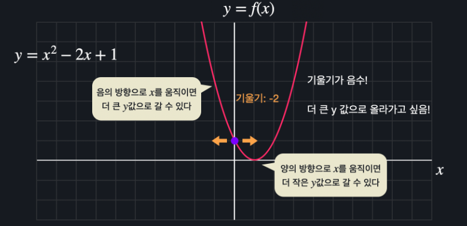 | 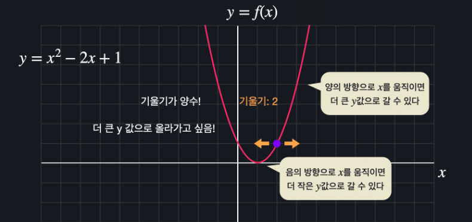 |

* **Meaning of the slope(differential value) zero in the graph** 

  | 극소점 (Local Minimum)                                       | 극대점 (Local Maximum)                                       | 안장점 (Saddle Point)                                        |
  | ------------------------------------------------------------ | ------------------------------------------------------------ | ------------------------------------------------------------ |
  | 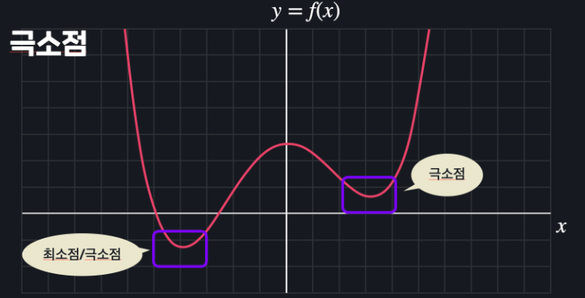 | 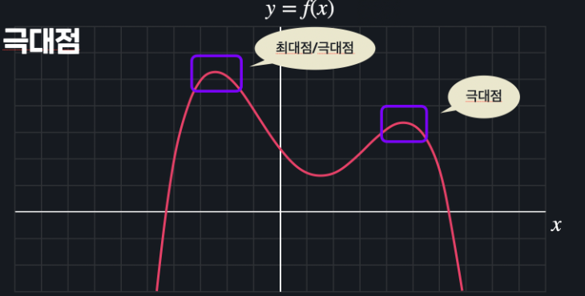 | 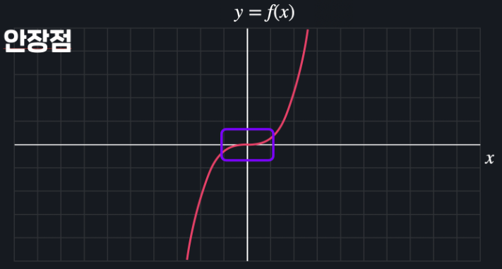 |

  

 

### Step 1-2. high order differential

* **partial derivative** : 편미분

* **Example**

  | function              | 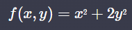 |
  | --------------------- | ------------------------------------------------------------ |
  | **x에 대해서 편미분** | 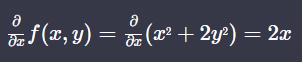 |
  | **y에 대해서 편미분** | 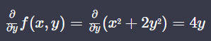 |
  | **합치기**            | 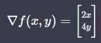 |

  | 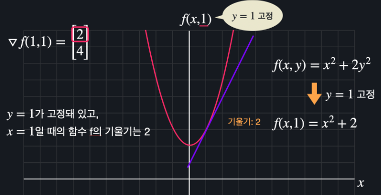 | 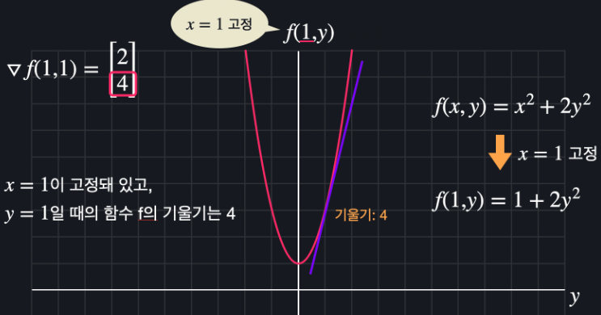 |
  | ------------------------------------------------------------ | ------------------------------------------------------------ |
  | 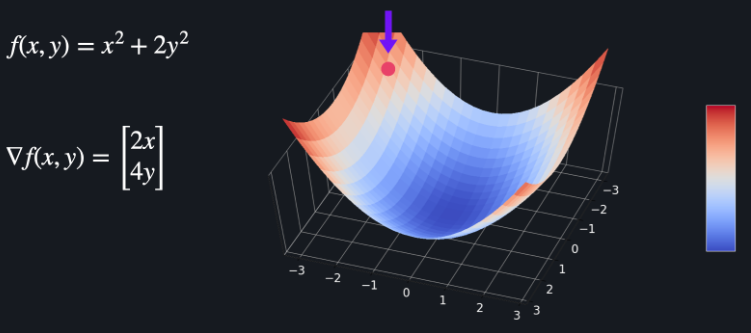 | 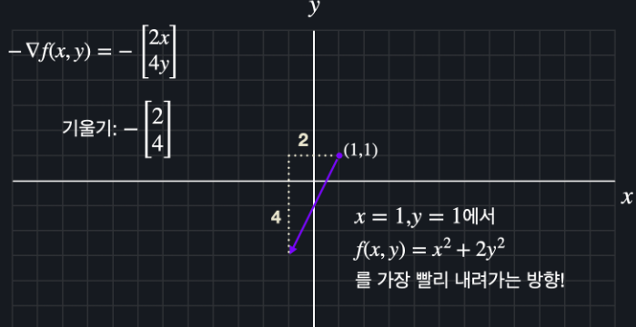 |
  
* 편미분 개념과 기울기 개념은 인풋 변수가 아무리 많아도(고차원의 경우에도) 똑같이 적용 가능
* 편미분을 통해 기울기 벡터를 구할 수 있고, 이 기울기 벡터는 가장 가파르게 올라가는 방향을 가리킴 → **기울기 벡터의 - 값은 가장 가파르게 내려가는 방향**

 

<!------------------------------------ STEP ------------------------------------>
## STEP 2. Composite Function And Chain Rule

### Step 2-1. Composite Function

*When f(y) = y3, y(x) = x2 + 2x + 1*

*f(x) = f(y(x)) = (x2 + 2x + 1)3*

### Step 2-2. Chain Rule

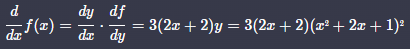

* Generalize

  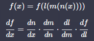
