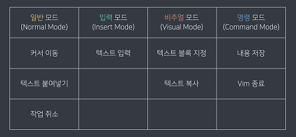
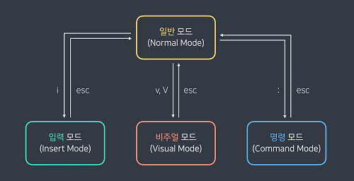

# Linux Basic

{: .no_toc }

  

    Table of contents
  

  {: .text-delta }
- TOC
{:toc}

<!------------------------------------ STEP ------------------------------------>

## STEP 5. Vim

### Step 5-1. Vim mode and change mode

| Vim mode                                                     | Change mode                                                  |
| ------------------------------------------------------------ | ------------------------------------------------------------ |
|  |  |

### Step 5-2. Hotkey

| Description                   | Hotkey                                                       |
| ----------------------------- | ------------------------------------------------------------ |
| 텍스트 한 줄 복사             | 일반 모드 → 복사하고 싶은 줄에 커서 위치 → yy                |
| 텍스트 한 줄 잘라내기         | 일반 모드 → 잘라내고 싶은 줄에 커서 위치 → dd                |
| 특정 영역 복사                | 비주얼 모드(V는 줄 단위, v는 글자 단위) → 복사하고 싶은 영역 커서로 설정 → y |
| 특정 영역 잘라내기            | 비주얼 모드(V는 줄 단위, v는 글자 단위) → 잘라내고 싶은 영역 커서로 설정 → d |
| 텍스트 붙여넣기               | 일반 모드 → 붙여넣고 싶은 위치에 커서 위치 → p               |
| 파일 저장                     | 명령 모드(:) → w! + enter                                    |
| 파일 저장 + vim 종료          | 명령 모드(:) → wq! + enter                                   |
| vim 종료 (내용 저장되지 않음) | 명령 모드(:) → q! + enter                                    |
| CTRL + u/d | 화면 반씩 위/아래로 이동 |

* 붙여넣기 계단 현상 발생 시 : `:set paste` 입력 후 복사
* [vim 단축키](https://string.tistory.com/51)
* [vim 단축키](https://iamfreeman.tistory.com/entry/vi-vim-%ED%8E%B8%EC%A7%91%EA%B8%B0-%EB%AA%85%EB%A0%B9%EC%96%B4-%EC%A0%95%EB%A6%AC-%EB%8B%A8%EC%B6%95%ED%82%A4-%EB%AA%A8%EC%9D%8C-%EB%AA%A9%EB%A1%9D)