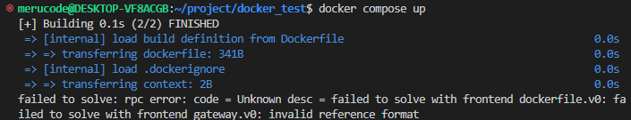
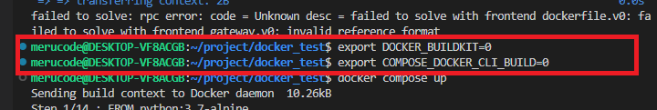
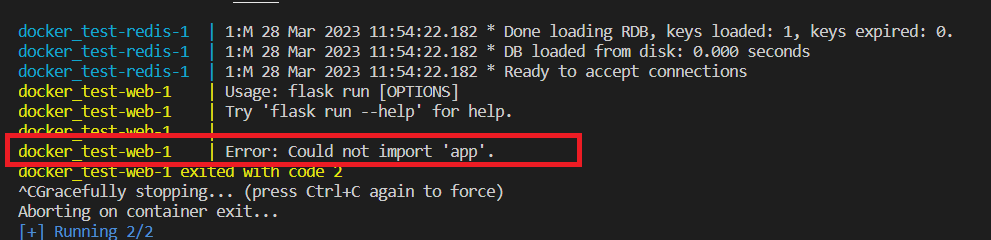
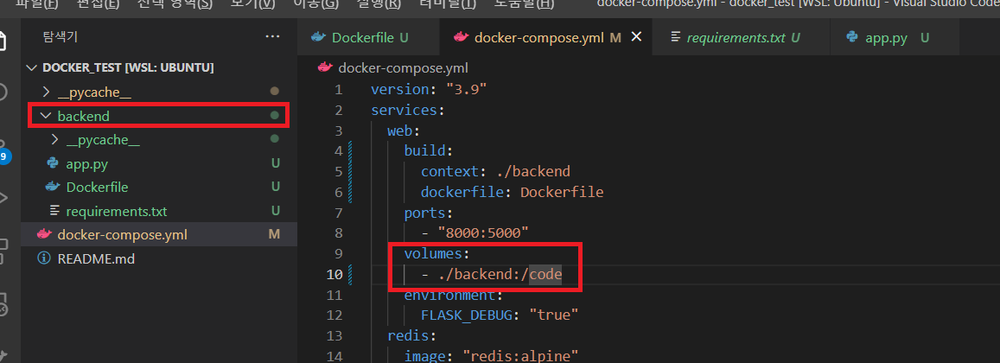
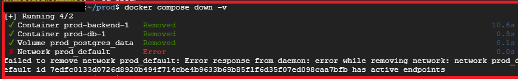

# Trouble Shooting
{: .no_toc .d-inline-block }
ing
{: .label .label-green }

<details open markdown="block">
  <summary>
    Table of contents
  </summary>
  {: .text-delta }
- TOC
{:toc}
</details>

<!------------------------------------ STEP ------------------------------------>

## STEP 1. Docker CMD without sudo

```bash
$ sudo usermod -aG docker $USER
# OR
$ sudo usermod -aG docker $(whoami)
```


<br>

<!------------------------------------ STEP ------------------------------------>

## STEP 2. failed to solve with frontend dockerfile.v0

### Step 2-1. Error



### Step 2-2. Solution

* `Terminal command` 아래 코드 입력

  ```bash
  export DOCKER_BUILDKIT=0 && export COMPOSE_DOCKER_CLI_BUILD=0
  ```

  


<br>

<!------------------------------------ STEP ------------------------------------>

## STEP 3. docker compose up Top-level object must be a mapping

### Step 3-1. Solution

* Dockerfile, docker-compose.yml 저장 여부 확인


<br>

<!------------------------------------ STEP ------------------------------------>

## STEP 4. docker compose up 시 could not import 

### Step 4-1. Error



### Step 4-2. Solution

* volume 경로 확인 및 필요시 재지정




<br>

<!------------------------------------ STEP ------------------------------------>

## STEP 5. docker compose down 시 failed to remove network prod_default

### Step 5-1. Error



### Step 5-2. Solution

* `bash`

  ```bash
  $docker compose down --remove-orphans
  ```

  
