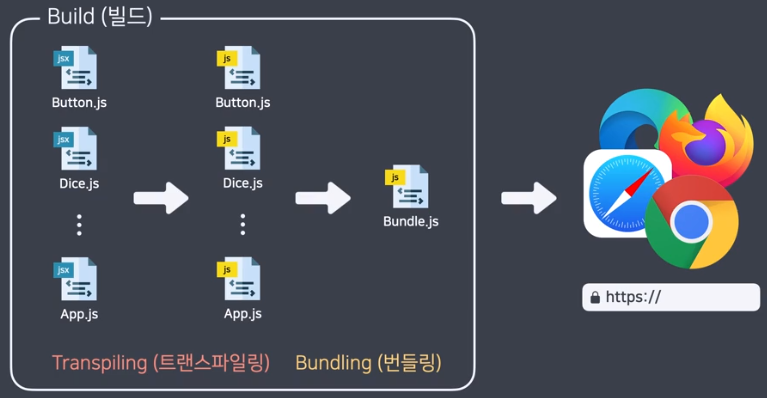

# React Basic
{: .no_toc}

<details open markdown="block">
  <summary>
    Table of contents
  </summary>
  {: .text-delta }
- TOC
{:toc}
</details>

<!------------------------------------ STEP ------------------------------------>
## STEP 1. React 시작하기

### Step 1-1. 개발환경 세팅하기

- 

  - **`Dockerfile`**

    ```dockerfile
    
    ```

  * **`docker-compose-yml`**

    ```dockerfile
    
    ```

- **`bash`**

  ```bash
  # version 확인
  $ node -v
  $ npm -v  
  ```

### Step 1-2. 프로젝트 시작하기

- **`bash`**

  ```bash
  $ npm init react-app [폴더이름]
  $ npm init react-app .  # 현재 폴더에서 react 프로젝트 시작
  
  $ npm run start         # 개발서버 실행(localhost:3000)
  ```

### Step 1-3. React 개발자 도구

- 크롬 웹스토어 확장 프로그램 : react develop tools

<br>

<!------------------------------------ STEP ------------------------------------>
## STEP 2. React 개발 기초

### Step 2-1. 프로젝트 세팅

- **`bash`**

  ```bash
  npm init react-app .   # 현재 폴더에서 react 프로젝트 시작
  ```

- 불필요 파일 삭제
  - public 폴더에서 index.html 외 모두 제거
  - src 폴더에서 index.js 외 모두 제거

- **`index.html`**

  ```html
  <!DOCTYPE html>
  <html lang="ko">
    <head>
      <meta charset="utf-8" />
      <title>주사위 게임</title>
    </head>
    <body>
      <div id="root"></div>
    </body>
  </html>
  ```


- **`index.js`**

  ```react
  import ReactDOM from 'react-dom/client';
  
  const root = ReactDOM.createRoot(document.getElementById('root'));
  root.render(<h1>안녕 리액트!</h1>);
  ```
  - 수업에서는 ReactDOM.render() 함수 안에서 코드를 작성하는데, 최신 버전을 사용하시는 분들은 root.render() 함수 안에서 작성

### Step 2-2. JSX 문법

- react에서 제공하는 js와 html을 함께 사용가능한 문법
- index.js의 root.render 내에 JSX 문법 입력
- html과 차이(Camel Case)

|html|JSX|
|---|---|
|class|className|
|for|htmlFor|
|onmousedown<br>이벤트핸들러|onMouseDown|

### Step 2-3. Fragment

- JSX는 하나의 요소이여야 함
- `<div>`를 이용해서 하나로 묶을 수 있으나, `<div>`를 사용하기 않기를 원할 경우 `<Fragment>` 혹은 `<>` 사용 가능
- `<Fragment>` 사용 시 `import { Fragement } from 'react';` 필요(축약형인 `<>`은 import 불필요)
- 예제

  ```react
  ReactDOM.render(
    <>
      <p>안녕</p>
      <p>리액트!</p>
    </>,
    document.getElementById('root')
  );
  // <></> 없이 사용 시 오류 발생
  ```

### Step 2-4. JSX에서 javascript 표현식 사용하기

- 중괄호`{}` 사용 javascript 표현식 사용
- 중괄호 안에서 for, if문 등의 javascript 문장식 사용 불가
  - 필요하다면 조건 연산자, 배열의 반복 메소드를 활용

- 예제

  ```react
  import ReactDOM from 'react-dom';
  
  const product = 'MacBook';
  const model = 'Air';
  const imageUrl =
    'https://upload.wikimedia.org/wikipedia/commons/thumb/1/1e/MacBook_with_Retina_Display.png/500px-MacBook_with_Retina_Display.png';
  
  function handleClick(e) {
    alert('곧 도착합니다!');
  }
  
  ReactDOM.render(
    <>
      <h1>{product + ' ' + model} 주문하기</h1>
      
      <button onClick={handleClick}>확인</button>
    </>,
    document.getElementById('root')
  );
  ```

### Step 2-5. React Element and Component

- **react element** : JSX 문법으로 작성한 하나의 요소(javascript object)

- ReactDOM.rende 함수로 해석해서 HTML 형태로 브라우저에 띄움

  ```react
  import ReactDOM from 'react-dom';

  const element = <h1>안녕 리액트!</h1>;
  console.log(element);
  ReactDOM.render(element, document.getElementById('root'));
  // log : {$$typeof: Symbol(react.element), type: "h1", key: null, ref: null, props: {…}, …}
  ```

- **react component** : react element를 자유롭게 다루기 위한 하나의 문법

- 간단한 방법으로 javascript function 사용하며, 첫 글자를 **대문자**로 작성해야 함

- 아래 코드에서 JSX 문법으로 작성된 하나의 요소를 리턴하는 Hello 함수가 하나의 컴포넌트

  ```react
  function Hello() {
  return <h1>안녕 리액트</h1>;
  }
  
  const element = (
    <>
      <Hello />
      <Hello />
      <Hello />
    </>
  );
  
  ReactDOM.render(element, document.getElementById('root'));
  ```

### Step 2-6. Props

- **props(properties)** : 컴포넌트에 지정한 속성

  ```react
  //### App.js JSX
  <Dice color="blue" />
  
  //### Dice.js component
  function Dice(props) {
    console.log(props)
    return ;
  }
  
  //### App.js JSX
  <Dice color="red" num={2} /> 
  
  //### Dics.js component
  function Dice(props) {
  const src = DICE_IMAGES[props.color][props.num - 1];
  const alt = `${props.color} ${props.num}`;
  return ;
  }
  //# or
  function Dice({ color = 'blue', num = 1 }) {
  const src = DICE_IMAGES[color][num - 1];
  const alt = `${color} ${num}`;
  return ;
  }
  ```


### Step 2-7. Children

- JSX 문법으로 컴포넌트를 작성할 때, 단일태그가 아니라 여는/닫는 태그의 형태로 작성하면, 그 안의 코드가 children

- 자주 사용하는 props를 직관적으로 작성하고 싶을 때 children으로 사용

    ```react
  //### App.js JSX
  <div>
  <Button>던지기</Button>
  <Button>처음부터</Button>
  </div>
  
  //### Button.js component
  function Button({ children }) {
  return <button>{children}</button>;
  }
  ```
  
  

### Step 2-8. State

- state : setState()는 컴포넌트의 state 객체에 대한 업데이트를 실행. setState에 의해 state가 변경되면, 컴포넌트는 리렌더링 됨
- 기본문법

  ```react
  import { useState } from 'react';
  // ...
    const [num, setNum] = useState(1);
  // ...
  ```

- 예제

  ```react
  import { useState } from 'react';
  import Button from './Button';
  import Dice from './Dice';
  
  function App() {
    const [num, setNum] = useState(1);
  
    const handleRollClick = () => {
      setNum(3); // num state를 3으로 변경!
    };
  
    const handleClearClick = () => {
      setNum(1); // num state를 1로 변경!
    };
  
    return (
      <div>
        <Button onClick={handleRollClick}>던지기</Button>
        <Button onClick={handleClearClick}>처음부터</Button>
        <Dice color="red" num={num} />
      </div>
    );
  }
  
  export default App;
  ```

### Step 2-9. 참조형 state

- spread 문법(`...`) 사용 : 기존 배열 분해 후 참조값 재지정
- 예제

  ```react
  setGameHistory([...gameHistory, nextNum]);
  
  const handleRollClick = () => {
    const nextNum = random(6);
    setGameHistory([...gameHistory, nextNum]); // state가 제대로 변경된다!
  };
  
  /*
    const nextNum = random(6);
    gameHistory.push(nextNum);
    setGameHistory(gameHistory); // state가 제대로 변경되지 않는다!
  의 경우 push로 배열 안에 요소를 변경해도 결과적으로 참조하는 배열의 주소값은
  변경된 것이 아니게 되어 state가 제대로 반영되지 않음
  */
  ```


<br>


<!------------------------------------ STEP ------------------------------------>

## STEP 3. 디자인 적용하기

### Step 3-1. 이미지 불러오기

- 이미지 파일은 `import` 구문을 통해 불러오고, 불러온 이미지 주소를 `src` 속성으로 사용

  ```react
  import diceImg from './assets/dice.png';
  
  function Dice() {
    return ;
  }
  
  export default App;
  ```


### Step 3-2. 인라인 스타일 적용

- css와 차이점
  - `;` 대신 `,` 사용
  - 속성값들은 `''`로 감싸줌
  - `-` 대신 Camel case 사용 : background-color backgroundColor

- 예제

  ```react
  const baseButtonStyle = {
    padding: '14px 27px',
    outline: 'none',
    cursor: 'pointer',
    borderRadius: '9999px',
    fontSize: '17px',
  };
  
  const blueButtonStyle = {
    ...baseButtonStyle,
    border: 'solid 1px #7090ff',
    color: '#7090ff',
    backgroundColor: 'rgba(0, 89, 255, 0.2)',
  };
  
  const redButtonStyle = {
    ...baseButtonStyle,
    border: 'solid 1px #ff4664',
    color: '#ff4664',
    backgroundColor: 'rgba(255, 78, 78, 0.2)',
  };
  
  function Button({ color, children, onClick }) {
    const style = color === 'red' ? redButtonStyle : blueButtonStyle;
    return (
      <button style={style} onClick={onClick}>
        {children}
      </button>
    );
  }
  
  ```

### Step 3-3. CSS 불러오기

- `import` 구문으로 파일을 불러올 수 있는데요, 이때 `from` 키워드 없이 사용

  ```react
  import diceImg from './assets/dice.png';
  import './Dice.css';
  
  function Dice() {
    return ;
  }
  
  export default App;
  ```

### Step 3-4. className 적용하기

- CSS 파일에 정의된 클래스명을 className prop에 문자열로 넣어주면 됨 

- 재사용성을 위해 컴포넌트 구성을 제외한 className prop(마진, 크기 등)을 부모 컴포넌트에서 받으면 더 좋음

  ```css
  /* App.css */
  .App .App-button {
  margin: 6px;
  }
  ```

  ```react
  //### App.js JSX
  import './App.css';
  ..
  
    <div className="App">
    <Button className="App-button" color="blue" onClick={handleRollClick}>
      던지기
    </Button>
  ..
  
  //### Button.js
  import './Button.css';
  import Button from './Button';
  
  function Button({ className = '', color = 'blue', children, onClick }) {
  const classNames = `Button ${color} ${className}`;  //# 부모 className prop도 적용 될 수 있도록 추가(부모.css의 import는 부모.jss에서)
  return (
    <button className={classNames} onClick={onClick}>
      {children}
    </button>
  );
  }
  
  export default Button;
  ```


<br> 

<!------------------------------------ STEP ------------------------------------>

## STEP 4. 배포하기

### Step 4-1. 빌드



- **build** : JSX 문법을 순수 javascript 문법으로 변경(transpiling)하고 압축(bundling)하여 웹서버가 사용하기 좋도록 변환하는 과정

- **`bash`**

  ```bash
  $ npm run build     # create build folder
  $ npx server build  # npm 저장소에서 server 프로그램 다운 후 build 폴더에서 서버 실행(localhost:5000)
  ```

- [BABEL](https://babeljs.io/)
  - Try it out 메뉴에서 transpiling 직접 확인 가능
  
    

<br>

<!------------------------------------ STEP ------------------------------------>
