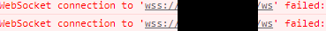
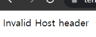

# React Trouble Shooting
{: .no_toc}

<details open markdown="block">
  <summary>
    Table of contents
  </summary>
  {: .text-delta }
- TOC
{:toc}
</details>
<!------------------------------------ STEP ------------------------------------>


## STEP 1. Websocket Connection Fail

### Step 1-1. Trouble



### Step 1-2. Cause

* [https://sonnson.tistory.com/44](https://sonnson.tistory.com/44)
* 원인 : cra에서 기본 포트를 3000포트로 설정해서 나는 에러

### Step 1-3. Solution

* **React**

  * .env 파일에서 WDS_SOCKET_PORT=0 설정

* **nginx**

  * /ws 경로에 다음과 같은 설정 추가

    ```nginx
    location /ws {
        proxy_pass http://dev-front-server;
        proxy_http_version 1.1;
        proxy_set_header Upgrade $http_upgrade;
        proxy_set_header Connection "upgrade";
        proxy_set_header Host $host;
        proxy_set_header Origin "";
    }
    ```

    

<br>

## STEP 1. Invalid Host header

### Step 1-1. Trouble

* frontend 접속 시 `Invalid Host header`



### Step 1-2. Cause

* [https://ducks228.tistory.com/entry/Invalid-Host-Header-%ED%91%9C%EC%8B%9C](https://ducks228.tistory.com/entry/Invalid-Host-Header-%ED%91%9C%EC%8B%9C)
* 원인 : ?

### Step 1-3. Solution

* `/node_modules/react-scripts/config/webpackDevServer.config.js`(**React**)

  * 변경 전

    ```js
    ...
      const disableFirewall = 
        !proxy || process.env.DANGEROUSLY_DISABLE_HOST_CHECK === 'true';
    ...
    ```

  * 변경 후

    ```js
    ...
      const disableFirewall = true
        // !proxy || process.env.DANGEROUSLY_DISABLE_HOST_CHECK === 'true';
    ...
    ```


* 서버 재시작


<br>


## STEP 1. axioserror: network error

### Step 1-1. Trouble

* backend data 요청 시 react `axioserror: network error` 에러 발생

### Step 1-2. Cause

* 요청하는 backend data url 잘못되어 있거나,
* backend에서 해당 url로 데이터를 제공해주지 못하는 경우

### Step 1-3. Solution

* backend url 재설정 또는,
* backend url로 data가 실제 제공되는지 확인

<br>

## STEP 1. Mixed Content

### Step 1-1. Trouble

* backend data 요청 시 console `Mixed Content` 에러 발생

### Step 1-2. Cause

* [https://velog.io/@nemo/mixed-content-error](https://velog.io/@nemo/mixed-content-error)
* https 에서 http로 요청 보낼 시 console 에러 발생

### Step 1-3. Solution

* http 요청을 https 요청으로 바꿔주는 meta 태그 추가
* `public/index.html`
  
  ```
  <meta http-equiv="Content-Security-Policy" content="upgrade-insecure-requests" />
  ```

