# Django Model
{: .no_toc }

<details open markdown="block">
  <summary>
    Table of contents
  </summary>
  {: .text-delta }
- TOC
{:toc}
</details>
<!------------------------------------ STEP ------------------------------------>

## STEP 1. Django Model

### Step 1-1. What is django model

* Django Model : Define the data structure and utilzes the data
* Our Lesson
	1. 데이터베이스 기본 개념 + 장고 모델 연관성
	2. 장고 **migration**
	3. 데이터 간의 관계를 모델로 **표현**
	4. 모델을 통해 데이터 간의 관계를 **활용**


### Step 1-2. Database

* **Database**
	* Relational Database :
		* Save data as shape of table(we use it)
		* SQL
	* Non-Relational Database 
		* Don't save data as shape of table
		* JSON, MongoDB
* **DBMS(Databas Mangement System)**
	* SQlite3, MySQL, PostgreSQL
* **SQL(Structures Query Language)**
	* The language which is communicate with database 

### Step 1-3. Database Table

* **`id` feature**
	* Django **automatically create `id`** field
	* Database **automatically put in `id` as a unique value**
	* `id` field is used for **load data or filter data**
* **Primary Key(`pk`)**
	* Column to **identify** the row
	* Almost case, **primary key = `id`**
* **Use `id` or `pk` whichever is more familiar**

### Step 1-4. Relationship between database and table

* **Foreing key**
	* Use for relation between tables
	* Referencing the **primary key of another table**
* **Type of relationship**(foreing key + 제약조건)
	1. 1:1(user profile)
	2. 1:N (user reviews)
	3. M:N(recommend post)
* django가 알아서 필요한 Foreign key와 제약 조건을 정의

### Step 1-5. ORM

* ORM(Object-Relational Mapper)
	* Django Model → ORM → Database
	* Don't need to write SQL by use ORM

<br>

<!------------------------------------ STEP ------------------------------------>

## STEP 2. Migration

### Step 2-1. Principle of Migration

* **Migration**
	* The process of **moving** content of django model to database table
* 2-Process
	1. Make migration file(`python manage.py makemigrations`)
	2.  Apply migration file(`python manage.py migrate`)
	
|`makemigrations`|`migrate`|
|---|---|
|||

|Process|Management per app|
|---|---|
|||

### Step 2-2. Use Migration

```python
### Make migration file
python manage.py makemigrations [app_label]
python manage.py makemigrations coplate  				# Check change of coplate app and make migration file
python manage.py makemigrations --name "custom_name" 	# --name : Set migration file name(000X_custom_name.py)
python manage.py makemigrations --empty coplate --name "populate_custom" # 비어있는 마이그레이션 파일 생성

### Apply migrate file
python manage.py migrate [app_label] [migration_name]
python manage.py migrate coplate 	# coplate 앱 내에서 적용되지 않은 마이그레이션 파일을 적용해 줌
python manage.py migrate 0006 	# coplate 앱 6번 마이그레이션을 적용해 줌
python manage.py migrate 0005 	# 5번 마이그레이션 적용(6번이 적용된 상태에서 이 커맨드를 실행하면 6번이 취소)
python manage.py migrate zero 	# 앱의 모든 마이그레이션 취소


### Check status of what migration files applied
python manage.py showmigrations [app_label]
python manage.py showmigrations 		# show all
python manage.py showmigrations coplate # show only app
```

### Step 2-3. Migration Depencency

* 마이그레이션을 적용할 때 적용 대상이 아닌 마이그레이션도 적용되는 경우가 있습니다. 마이그레이션을 취소하는 것도 마찬가지인데요. 이건 마이그레이션 디펜던시(migration dependency) 때문
* 장고는 마이그레이션을 적용할 때 알아서 디펜던시를 먼저 적용
* 마이그레이션을 취소할 때는 취소하는 마이그레이션에 대해 디펜던시가 있는 애들을 먼저 취소
* **Migration grahp**

|migrate coplate 001(auth 0001~11 순 먼저 적용)|migrate coplate zero(acount 0002~1 and coplate 0005~2 순 먼저 취소)|
|---|---|
|[](https://www.codeit.kr/learn/5209)||

### Step 2-4. Migrate 주의사항

* 디펜던시에 의해 **의존 마이그레이션 취소 시 의존 마이그레이션 데이터도 모두 삭제**됨(DB에 저장 필요)
* 기존 모델에 칼럼 추가 시 3가지 방법 중 선택
	1. `null=True` 옵션 및 `migrate` 후 admin에서 데이터 입력
	2. `default=value` 옵션
	3. `makemigrations` 후 shell 이용 데이터 입력

### Step 2-5. Data Migration

* **Migration**
	* 테이블 구조 변경 : 테이블 생성, 칼럼 추가/수정
	* 데이터 변경 : 데이터 삽입/수정 
* **Data Migration**
	* **테이블 구조**에 맞게 **데이터를 이동/결합/분리** 시켜줘야 할 때 사용
	* **테이블 결합/분리/기존 칼럼을 이용한 칼럼 추가** 등에 사용

### Step 2-6. Data Migration Example

* `User` 모델에 이메일 도메인을 저장하는 `email_domain` 컬럼 추가

* `models.py`
	```python
	class  User(AbstractUser): 
		... 
		email_domain = models.CharField(max_length=30, null=True)
		# 이렇게 `email_domain` 필드를 추가하고 마이그레이션을 했다고 할게요. 
		# 마이그레이션 파일은  0006_user_email_domain.py 가정
	```
	
* `bash`
	```bash
	# 먼저 비어있는 마이그레이션 파일 생성
	python manage.py makemigrations --empty coplate --name "populate_email_domain"
	```
	
* `0007_populate_email_domain.py`
	```python
	from django.db import migrations 
	
	def save_email_domain(apps, schema_editor): 
		User = apps.get_model('coplate', 'User') 
		for user in User.objects.all():
			user.email_domain = user.email.split('@')[1] 
			user.save()
			 
	class  Migration(migrations.Migration):
		dependencies = [ 
			('coplate', '0006_user_email_domain'), 
		]
		operations = [
			migrations.RunPython(save_email_domain, migrations.RunPython.noop), 
		]
	```
	* 데이터 마이그레이션 함수는 보통 `apps`와 `schema_editor`를 파라미터로 받습니다
	* 모델을 가져올 때는 꼭 `apps.get_model('coplate', 'User')` 이런 식으로 가져옴(model을 직접 import 시 migrate가 반영되지 않은 model을 가져올 우려가 존재함)
	* `operations` 부분을 보시면 `RunPython`이라는 게 있는데요. 말 그대로 파이썬 코드를 실행하는 operation(작업)입니다. 마이그레이션을 적용할 때는 `save_email_domain` 함수를 실행하고, 마이그레이션을 취소할 때는 `migrations.RunPython.noop`이라는 걸 실행하는데, 이건 아무것도 안 하는 함수
	
* 	`bash`
	```bash
	# `email_domain` 컬럼이 생기고 안에 데이터가 채우기
	python manage.py migrate coplate 0007
	# `email_domain` 컬럼 삭제
	python manage.py migrate coplate 0005
	```
	
* `models.py`

  ```python
  # 이후 null=True을 지우고 한번 더 마이그레이션 시 null을 허용하지 않는 필드로 됨
  class  User(AbstractUser): 
  	... 
  	email_domain = models.CharField(max_length=30)
  	...
  ```

<br>

<!------------------------------------ STEP ------------------------------------>

## STEP 3. Data Modeling and Model Implementation
### Step 3-1. Data Modeling

* **Data Modeling**
	* Determining the **structure and format of data** to suit the requirements of the service
* 모델링 그림 시 유의
	* `id` 필드 제외

### Step 3-2. Object Modeling

* 유저, 리뷰, 댓글, 좋아요, 팔로우 예제
	|요구사항|Object Modeling|
	|---|---|
	|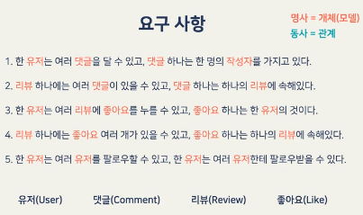| 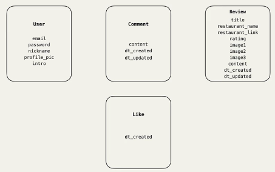 |
* 좋아요, 팔로우 처리
	|좋아요, 팔로우|예제 처리|
	|---|---|
	|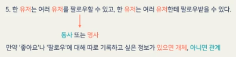|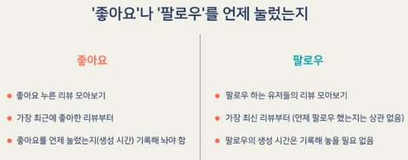|
	
### Step 3-3. Relation Modeling

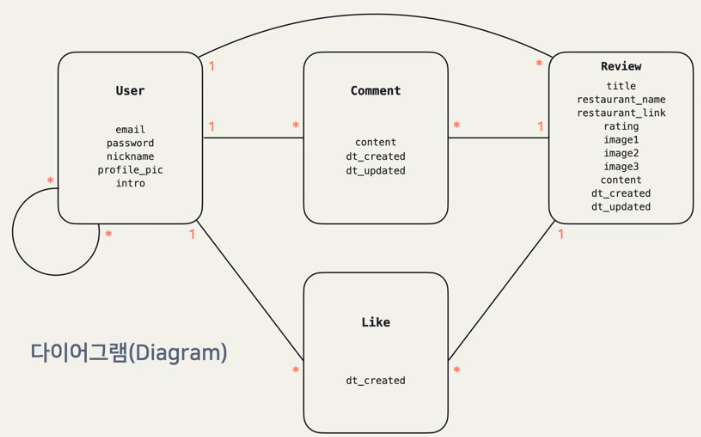

### Step 3-4. Implement 1:N 

* **구조**
	`relation_field = model.ForeignKey(<to_model>, on_delete=...)`
	* 1:N 관계에서 `ForeignKey` 필드를 가지고 있는 쪽이 N
	* <to_model>의 `pk` 저장하며 관계 형성
*  `models.py`

	```python
	class Review(models.Model):
		...
		autor = models.ForeignKey(User, on_delete=models.CASCADE) 
		# 1:N의 간계에서 N쪽에 해당하는 모델에 정의
		# autor=3 이면 id=3인 User와 Relation	 
	```
	
	* `on_delete`: `ForeignKey`가 참조하는 데이터(N)가 삭제되면 어떤 액션을 취할 것인지
		* `models.CASCADE` : 참조하고 있는 오브젝트(N)들도 삭제
		* `models.PROTECT` : 참조하고 있는 오브젝트(N)가 있다면 의존 오브젝트(1)를 삭제 못하도록 함
		* `models.SET_NULL` : 참조하고 있는 오브젝트(N)의 값을 모두 null로 설정
	* `ForeignKey`도 일반 필드처럼 `null`, `blank`, `default` 같은 옵션 사용 가능

* **Example**
	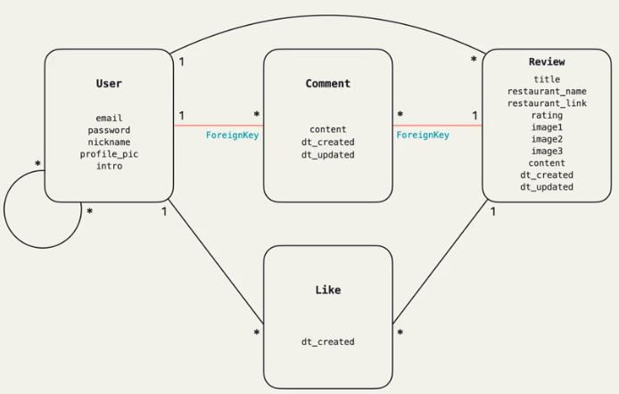
	
	* `models.py`
		```python
		...
		class Commnet(models.Model):
			content = models.TextField(max_length=500, blank=False)
			dt_created = models.DateTimeField(auto_now_add=True)
			dt_updated = models.DateTimeField(auto_now=True)
			# auto_now_add=True : django model 이 최초 저장(insert) 시에만 현재날짜(date.today() 를 적용
			# auto_now=True : django model 이 save 될 때마다 현재날짜(date.today()) 로 갱신
		
			author = models.ForeignKey(User, on_delete=models.CASCADE)
			review = models.ForeignKey(Review, on_delete=models.CASCADE)
			# User와 Review 관계(1:N) 필드 설정
			
			def __str__(self):
				return self.content[:30]
			# 모델 인스턴스 문자열로 표시시 사용
		```

### Step 3-5. Implement 1:1

 * **구조**
	 `relation_field = model.OneToOneField(<to_model>, on_delete=...)`
	 * <to_model>의 `pk` 저장
	 * <to_model>의 인스턴스들이 이미 저장되어 있어야 함
	 * 속해있는 model에서 `OneToOneField` 추가(User와 Profile이 있으면 Profile에 추가)

### Step 3-6. 모델 나누기(1:1)
* Example of dividing user models into user models and profile models
	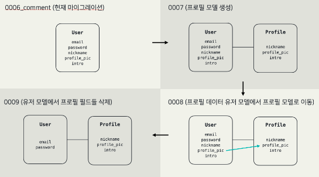
	
	* For don't loss data, we need to go through the following step
		1. Create Profile model
		2. Move profile data to Profile model
		3. Delete profile data from User model
		4. Return User model(cancel migrate)
* **1. Create Profile model**
	* `models.py`
		```python
		class User(AbstractUser): 
			nickname = models.CharField(
				max_length=15, 
				unique=True,
				null=True, 
				validators=[validate_no_special_characters],
				error_messages={'unique': '이미 사용중인 닉네임입니다.'}, 
			) 
			profile_pic = models.ImageField(default='default_profile_pic.jpg', upload_to='profile_pics') 
			intro = models.CharField(max_length=60, blank=True) 
			def  __str__(self): 
				return self.email 
				
		class Profile(models.Model): 
			nickname = models.CharField(
				max_length=15, 
				unique=True, 
				null=True, 
				validators=[validate_no_special_characters],
				error_messages={'unique': '이미 사용중인 닉네임입니다.'}, 
			) 
			profile_pic = models.ImageField(default='default_profile_pic.jpg', upload_to='profile_pics') 
			intro = models.CharField(max_length=60, blank=True)
			user = models.OneToOneField(User, on_delete=models.CASCADE)
		```
	* `bash`
		```bash
		python manage.py makemigrations --name "profile" 
		# create 0007_profile.py
		python manage.py migrate
		```
* **2. Move profile data to Profile model**
	* `bash`
		```bash
		python manage.py makemigrations --empty coplate --name "migrate_profile_data"
		```
	* `0008_migrate_profile_data.py`
		```python
		from django.db import migrations 
		
		def user_to_profile(apps, schema_editor): 
			User = apps.get_model('coplate', 'User') 
			Profile = apps.get_model('coplate', 'Profile') 
			for user in User.objects.all():
				Profile.objects.create(
					nickname = user.nickname,
					profile_pic = user.profile_pic, 
					intro = user.intro, 
					user = user, 
				) 
				
		class Migration(migrations.Migration):
			dependencies = [ 
				('coplate', '0007_profile'), 
			] 
			operations = [
				 migrations.RunPython(user_to_profile), 
			 ]
		```
	* `bash`
		```bash
		python manage.py migrate
		```
* **3. Delete profile data from User model**
	* `models.py`
		```python
		class User(AbstractUser): 
			def  __str__(self): 
				return self.email
		...
		```
	* `forms.py`
		```python
		class ProfileForm(forms.ModelForm):
			class  Meta: 
				model = User 
				fields = [ 
					# 'nickname',  
					# 'profile_pic',  
					# 'intro', 
				] 
				widgets = { 
					# 'intro': forms.Textarea,
				}
		```
	* 이제부터 유저의 닉네임은 이제 `user.nickname` 대신 `user.profile.nickname` 이렇게 접근
	* `bash`
		```bash
		python manage.py makemigrations --name "delete_user_profile_fields"
		python manage.py migrate
		
		### Check
		python manage.py shell
		>> from coplate.models import User, Profile 
		>> user= User.objects.first()
		>> user.nickname
		>> for p in Profile.objects.all():
		>> 	print(p,user, p.nickname, p.profile_pic, p.intro)
		# admin@example.com admin pic.jpg ...
		```
* **4. Return User model(cancel migrate)**
	* `0008_migrate_profile_data.py`
		```python
		...
		def profile_to_user(apps, schema_editor): 
			User = apps.get_model('coplate', 'User') 
			Profile = apps.get_model('coplate', 'Profile') 
			for profile in Profile.objects.all(): 
				user = profile.user 
				user.nickname = profile.nickname 
				user.profile_pic = profile.profile_pic 
				user.intro = profile.intro 
				user.save() 
		class  Migration(migrations.Migration): 
			dependencies = [ 
				('coplate', '0007_profile'), 
			] 
			operations = [
				 migrations.RunPython(user_to_profile, profile_to_user), 
			 ]
			 # migration 시 user_to_profile 실행
			 # migration 취소 시 profile_to_user 실행
		```
	* `bash`
		```bash
		python manage.py migrate coplate 0006
		```
	* `models.py`의  `User` 및 `forms.py` 코드 원복
	*  `0007_profile.py`, `0008_migrate_profile_data.py`, `0009_delete_user_profile_fields.py` 삭제

### Step 3-7. Implement M:N

 * **구조**
	 `relation_field = models.ManyToManyField(<to_model>)`
	 * 두 모델 중 어떤 모델에 넣어도 상관 없음
	 * `on_delete` 옵션 없음
	 * M:N 관계에는 `null` 옵션 없음(비어있는 것을 허용)
	 * 자기 자신 관계 시 `<to_model>`에 `'self'` 입력
		 * 비대칭 관계 : 팔로잉(`symmetrical=False`)
		 * 대칭 관계 : 친구(`symmetrical=True`)
 * **Example**(팔로잉 구현)
	 * `models.py`
		 ```python
		 class User(AbstractUser):
			 ...
			 following = models.ManyToManyField('self', symmetrical=False)
			 ...
		```

### Step 3-8. Generic Relation
* Content Types 장고 문서 :  [https://docs.djangoproject.com/en/2.2/ref/contrib/contenttypes/](https://docs.djangoproject.com/en/2.2/ref/contrib/contenttypes/)

* 좋아요 기능 확장과 일반 모델 구현시 단점 및 Generic

	|좋아요 기능 확장|Database Desine|Generic|
	|---|---|---|
	|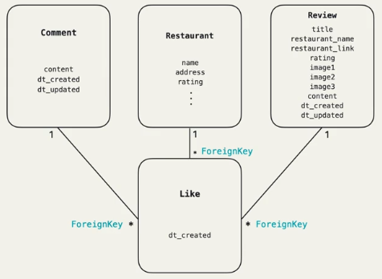| 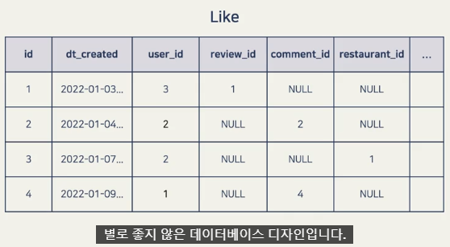 | 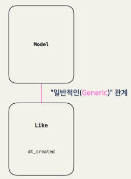 |


* contenttypes : 장고 어플리케이션에 사용되는 모든 모델에 대한 정보를 관리하는 앱

### Step 3-9. Implement Generic Relation

* `models.py`
	```python
	...
	from django.contrib.contenttypes.models import ContentType
	from django.contrib.fields import GenericForeignKey
	...
	class Like(models.Model):
		dt_created = models.DataTimeField(auto_now_add=True)
		user = models.ForeignKey(Uesr, on_delete=CASCADE)
		
		# Generic Relation
		content_type = models.ForeignKey(ContentType, on_delete=models.CASCADE)
		object_id = models.PositiveIntegerField() # 양수
		liked_object = GenericForeignKey('content_type', 'object_id') 
		# GenericForeignKey는 on_delete 옵션 없음
		# 일반 ForeignKey와 같이 pk 저장하는 필드가 아니라 그냥 오브젝트를 쉽게 접근할 수 있도록 해주는 필드
		# 좋아요를 누른 리뷰가 삭제되면 liked_object가 null이 될 뿐(추후 삭제 방법 챕터에서 학습 예정)
	
		def __srt__(self):
			return f"({self.user}, {self.liekd_object})"		
	```
	* `GenericForeignKey`를 생성할 때 ContentType 필드와 오브젝트 id 필드를 파라미터로 넘겨줘야 하는데, `content_type`과 `object_id`라는 이름을 사용했다면 이 부분을 비워놔도 됩니다.


### Step 3-10. Model Meta Option

* **Meta Option** : 모델 자체에 대한 설정
* **Exameple**
	* `models.py`
		```python
		class Review(models.Model):
			...
			class Meta:
				ordering = ['-dt_created'] 
				# 리뷰 가져올 때 생성 시간 기준 내림차순(최신순)
				ordering = ['dt_created']
				# 생성 시간 기준 오름차순(오래된 순)	
		```
*  모델 메타 옵션:  [https://docs.djangoproject.com/en/2.2/ref/models/options/](https://docs.djangoproject.com/en/2.2/ref/models/options/)

### Step 3-11. ModelAdmin

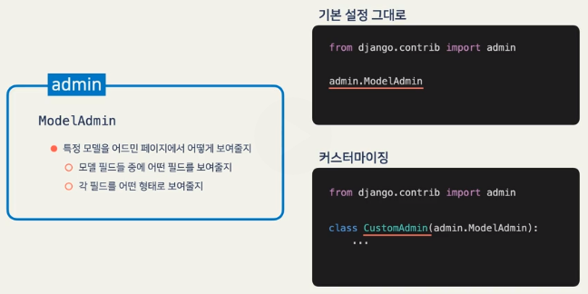

* `admin.py`
	```python
	...
	from .models import User, Review, Comment, Like	### Add Comment, Like
	UserAdmin.fieldsets += ('Custom field', {'fields': (...,'following',)}),
	### Add following field
	
	admin.site.register(User, Useradmin)
	admin.site.register(Review)
	admin.site.register(Comment)### Add
	admin.site.register(Like) 	### Add		
	```

### Step 3-12. Admin:Inline Example

* Admin의 Review항목에서 Review를 가르키는 오브젝트(Comment, Like)를 다루기
* `models.py`(일반관계)
	```python
	...
	class CommentInline(admin.StackedInline):
		model = Comment		
	...
	class ReviewAdmin(admin.ModelAdmin):
		inlines = (
			CommentInline,
		)
	...
	admin.site.register(Review, ReviewAdmin)
	# admin.site.register(Review)는 기본값인 ModelAdmin 사용
	```
* `models.py`(Generic)
	```python
	...
	from django.contrib.contenttypes.admin import GenericStackedInline
	...
	class LikeInline(GenericStackedInline):
		model = Like
	...
	class ReviewAdmin(admin.ModelAdmin):
		inlines = (
			CommentInline,
			LikeInline,
		)
	class CommentAdmin(admin.ModelAdmin):
		inlines = (
			LikeInline,
		)
	...
	admin.site.register(Comment, CommentAdmin)	
	```
### Step 3-13. Admin:Inline Example(ManyToManyField)

* Amdin 사이트 다른 값 수정 시 `ManyToManyField`에서 `필수 항목입니다.` 에러메시지 나온다면
	`blank=True` 사용
	* `ManyToManyField`에 `null` 옵션은 사용할 수 없지만 `blank` 옵션은 사용 가능
* `admin.py`
	```python
	...
	class UserInline(admin.StackedInline):
		# model = <model>.<ManyToManyField>.through
		model = User.following.through
		# self 관계인 경우 fk_name(ForeignKey) 설정, self 아니면 설정 불필요
		# ManyToManyField 가르키는(following) 오브젝트 수정 : 'from_<model>' 
		# ManyToManyField 역관계(follower) 오브젝트 수정 : 'to_<model>'
		fk_name = 'to_user'			 
		verbose_name = 'Follower'
		verbose_name_plural = 'Followers'
		...
	UserAdmin.inlines = (UserInline,) 
	```
* 어드민 사이트와  `ManyToManyField`:  [https://docs.djangoproject.com/en/2.2/ref/contrib/admin/#working-with-many-to-many-models](https://docs.djangoproject.com/en/2.2/ref/contrib/admin/#working-with-many-to-many-models)
*   똑같은 모델을 가리키는 필드가 여러 개 있을 때 (`ManyToManyField('self')`도 해당):  [https://docs.djangoproject.com/en/2.2/ref/contrib/admin/#working-with-a-model-with-two-or-more-foreign-keys-to-the-same-parent-model](https://docs.djangoproject.com/en/2.2/ref/contrib/admin/#working-with-a-model-with-two-or-more-foreign-keys-to-the-same-parent-model)


<br>

<!------------------------------------ STEP ------------------------------------>

## STEP 4. 

  

  

  
