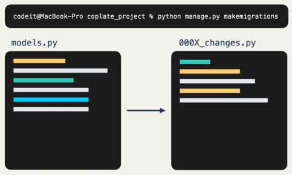
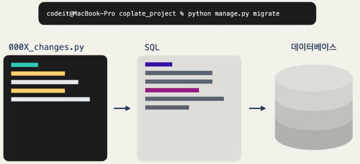
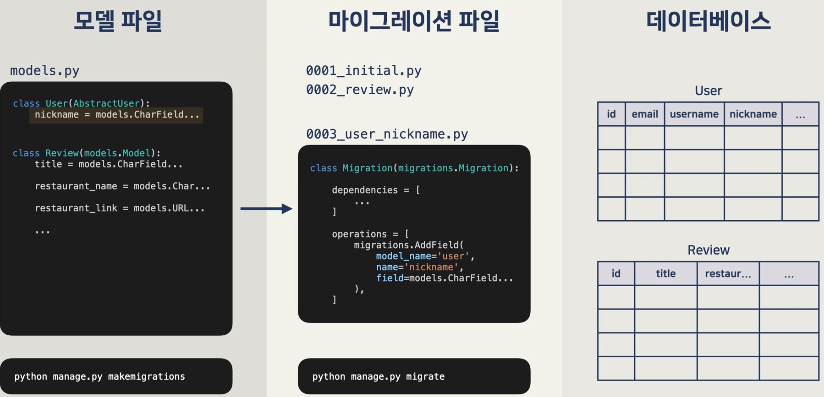
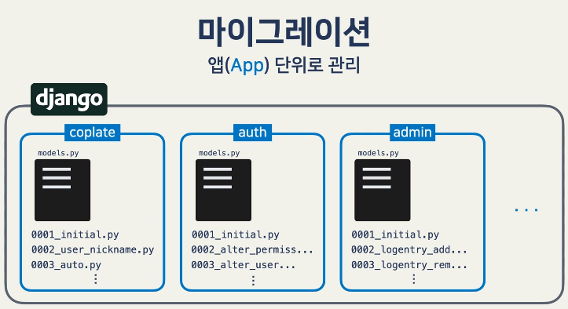
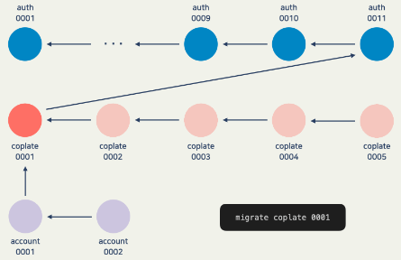
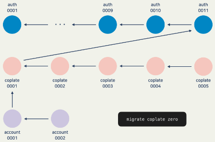

# Django Model
{: .no_toc }

<details open markdown="block">
  <summary>
    Table of contents
  </summary>
  {: .text-delta }
- TOC
{:toc}
</details>
<!------------------------------------ STEP ------------------------------------>

## STEP 1. Django Model

### Step 1-1. What is django model

* Django Model : Define the data structure and utilzes the data
* Our Lesson
	1. 데이터베이스 기본 개념 + 장고 모델 연관성
	2. 장고 **migration**
	3. 데이터 간의 관계를 모델로 **표현**
	4. 모델을 통해 데이터 간의 관계를 **활용**


### Step 1-2. Database

* **Database**
	* Relational Database :
		* Save data as shape of table(we use it)
		* SQL
	* Non-Relational Database 
		* Don't save data as shape of table
		* JSON, MongoDB
* **DBMS(Databas Mangement System)**
	* SQlite3, MySQL, PostgreSQL
* **SQL(Structures Query Language)**
	* The language which is communicate with database 

### Step 1-3. Database Table

* **`id` feature**
	* Django **automatically create `id`** field
	* Database **automatically put in `id` as a unique value**
	* `id` field is used for **load data or filter data**
* **Primary Key(`pk`)**
	* Column to **identify** the row
	* Almost case, **primary key = `id`**
* **Use `id` or `pk` whichever is more familiar**

### Step 1-4. Relationship between database and table

* **Foreing key**
	* Use for relation between tables
	* Referencing the **primary key of another table**
* **Type of relationship**(foreing key + 제약조건)
	1. 1:1(user profile)
	2. 1:N (user reviews)
	3. M:N(recommend post)
* django가 알아서 필요한 Foreign key와 제약 조건을 정의

### Step 1-5. ORM

* ORM(Object-Relational Mapper)
	* Django Model → ORM → Database
	* Don't need to write SQL by use ORM

<br>

<!------------------------------------ STEP ------------------------------------>

## STEP 2. Migration

### Step 2-1. Principle of Migration

* **Migration**
	* The process of **moving** content of django model to database table
* 2-Process
	1. Make migration file(`python manage.py makemigrations`)
	2.  Apply migration file(`python manage.py migrate`)
	
|`makemigrations`|`migrate`|
|---|---|
|||

|Process|Management per app|
|---|---|
|||

### Step 2-2. Use Migration

```python
### Make migration file
python manage.py makemigrations [app_label]
python manage.py makemigrations coplate  				# Check change of coplate app and make migration file
python manage.py makemigrations --name "custom_name" 	# --name : Set migration file name(000X_custom_name.py)
python manage.py makemigrations --empty coplate --name "populate_custom" # 비어있는 마이그레이션 파일 생성

### Apply migrate file
python manage.py migrate [app_label] [migration_name]
python manage.py migrate coplate 	# coplate 앱 내에서 적용되지 않은 마이그레이션 파일을 적용해 줌
python manage.py migrate 0006 	# coplate 앱 6번 마이그레이션을 적용해 줌
python manage.py migrate 0005 	# 5번 마이그레이션 적용(6번이 적용된 상태에서 이 커맨드를 실행하면 6번이 취소)
python manage.py migrate zero 	# 앱의 모든 마이그레이션 취소


### Check status of what migration files applied
python manage.py showmigrations [app_label]
python manage.py showmigrations 		# show all
python manage.py showmigrations coplate # show only app
```

### Step 2-3. Migration Depencency

* 마이그레이션을 적용할 때 적용 대상이 아닌 마이그레이션도 적용되는 경우가 있습니다. 마이그레이션을 취소하는 것도 마찬가지인데요. 이건 마이그레이션 디펜던시(migration dependency) 때문
* 장고는 마이그레이션을 적용할 때 알아서 디펜던시를 먼저 적용
* 마이그레이션을 취소할 때는 취소하는 마이그레이션에 대해 디펜던시가 있는 애들을 먼저 취소
* **Migration grahp**

|migrate coplate 001(auth 0001~11 순 먼저 적용)|migrate coplate zero(acount 0002~1 and coplate 0005~2 순 먼저 취소)|
|---|---|
|[](https://www.codeit.kr/learn/5209)||

### Step 2-4. Migrate 주의사항

* 디펜던시에 의해 **의존 마이그레이션 취소 시 의존 마이그레이션 데이터도 모두 삭제**됨(DB에 저장 필요)
* 기존 모델에 칼럼 추가 시 3가지 방법 중 선택
	1. `null=True` 옵션 및 `migrate` 후 admin에서 데이터 입력
	2. `default=value` 옵션
	3. `makemigrations` 후 shell 이용 데이터 입력

### Step 2-5. Data Migration

* **Migration**
	* 테이블 구조 변경 : 테이블 생성, 칼럼 추가/수정
	* 데이터 변경 : 데이터 삽입/수정 
* **Data Migration**
	* **테이블 구조**에 맞게 **데이터를 이동/결합/분리** 시켜줘야 할 때 사용
	* **테이블 결합/분리/기존 칼럼을 이용한 칼럼 추가** 등에 사용

### Step 2-6. Data Migration Example

* `User` 모델에 이메일 도메인을 저장하는 `email_domain` 컬럼 추가

* `models.py`
	```python
	class  User(AbstractUser): 
		... 
		email_domain = models.CharField(max_length=30, null=True)
		# 이렇게 `email_domain` 필드를 추가하고 마이그레이션을 했다고 할게요. 
		# 마이그레이션 파일은  0006_user_email_domain.py 가정
	```
	
* `bash`
	```bash
	# 먼저 비어있는 마이그레이션 파일 생성
	python manage.py makemigrations --empty coplate --name "populate_email_domain"
	```
	
* `0007_populate_email_domain.py`
	```python
	from django.db import migrations 
	
	def save_email_domain(apps, schema_editor): 
		User = apps.get_model('coplate', 'User') 
		for user in User.objects.all():
			user.email_domain = user.email.split('@')[1] 
			user.save()
			 
	class  Migration(migrations.Migration):
		dependencies = [ 
				('coplate', '0006_user_email_domain'), 
			]
			operations = [
				migrations.RunPython(save_email_domain, migrations.RunPython.noop), 
			]
	```
	* 데이터 마이그레이션 함수는 보통 `apps`와 `schema_editor`를 파라미터로 받습니다
	* 모델을 가져올 때는 꼭 `apps.get_model('coplate', 'User')` 이런 식으로 가져옴(model을 직접 import 시 migrate가 반영되지 않은 model을 가져올 우려가 존재함)
	* `operations` 부분을 보시면 `RunPython`이라는 게 있는데요. 말 그대로 파이썬 코드를 실행하는 operation(작업)입니다. 마이그레이션을 적용할 때는 `save_email_domain` 함수를 실행하고, 마이그레이션을 취소할 때는 `migrations.RunPython.noop`이라는 걸 실행하는데, 이건 아무것도 안 하는 함수
	
* 	`bash`
	```bash
	# `email_domain` 컬럼이 생기고 안에 데이터가 채우기
	python manage.py migrate coplate 0007
	# `email_domain` 컬럼 삭제
	python manage.py migrate coplate 0005
	```
	
* `models.py`

  ```python
  # 이후 null=True을 지우고 한번 더 마이그레이션 시 null을 허용하지 않는 필드로 됨
  class  User(AbstractUser): 
  	... 
  	email_domain = models.CharField(max_length=30)
  	...
  ```

  

  

  
