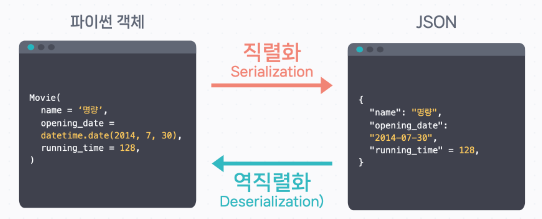
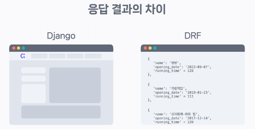
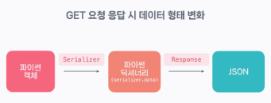
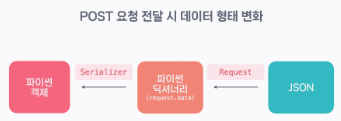
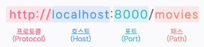
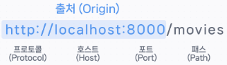

# DRF Basic
{: .no_toc }


<details open markdown="block">
  <summary>
    Table of contents
  </summary>
  {: .text-delta }
- TOC
{:toc}
</details>
<!------------------------------------ STEP ------------------------------------>

## STEP 1. DRF(Django REST Framework)

### Step 1-1. What is DRF?

* Role of DRF

   
  
  

### Step 1-2. What is REST?

* REST(Representational State Transfer) : 자원을 이름으로 구분하여 해당 자원의 상태(정보)를 주고 받는 모든 것을 뜻

* Status Code

  | Status Code      | 항목                                                         |
  | ---------------- | ------------------------------------------------------------ |
  | 1XX (정보 전달)  | 100 (진행, Continue) / 101 (프로토콜 전환, Switching Protocol) |
  | 2XX (성공)       | 200 (성공, OK) / 201 (작성됨, Created) / 202 (허용됨, Accepted) / 203 (신뢰할 수 없는 정보, Non-Authoritative Information) /<br>204 (콘텐츠 없음, No Content) / 205 (콘텐츠 재설정, Reset Content) |
  | 3XX (리다이렉션) | 300 (여러 개의 선택 항목, Multiple Choice) / 301 (영구 이동, Moved Permanently) / 302 (임시 이동, Found) / <br>304 (수정되지 않음, Not Modified) |
  | 4XX (실패)       | 400 (잘못된 요청, Bad Request) / 401 (권한 없음, Unauthorized) / 402 (결제 필요, Payment Required) / <br>403 (금지됨, Forbidden) / 404 (찾을 수 없음, Not Found) |
  | 5XX (서버 오류)  | 500 (내부 서버 오류, Internal Server Error) / 501 (구현되지 않음, Not Implemented) / <br>502 (잘못된 게이트웨이, Bad Gateway) / 503 (서비스를 사용할 수 없음, Service Unavailable) |

* URL Desing

  | HTTP 메소드 | **설명**         | **URL 예시** |
  | ----------- | ---------------- | ------------ |
  | GET         | 조회             | /movies      |
  | POST        | 생성             | /movies      |
  | GET         | 특정 데이터 조회 | /movies/:id  |
  | PATCH       | 특정 데이터 수정 | /movies/:id  |
  | DELETE      | 특정 데이터 삭제 | /movies/:id  |

  ```
  http://localhost:8000/movies/1/ 		# X(마지막에 슬래시가 있는 것과 없는 것은 서로 다른 자원)
  URL: http://localhost:8000/movies/1 	# O
  
  http://localhost:8000/popular_movies	# X
  http://localhost:8000/PopularMovies		# X
  http://localhost:8000/popular-movies	# O(구분자 - 사용)
  ```


### Step 1-3. Preparing Development Environment(Install DRF)

* `Dockerfile`

  ```dockerfile
  FROM python:3.9-alpine 
  
  WORKDIR /usr/src/app
    
  ENV PYTHONDONTWRITEBYTECODE 1
  ENV PYTHONUNBUFFERED 1
  
  RUN pip install --upgrade pip
  COPY ./requirements.txt .
  RUN pip install -r requirements.txt
  
  COPY . .
  ```

* `docker-compose.yml`

  ```dockerfile
  version: '3.7'
    
  services:
    backend:
      container_name: drf
      build:
        context: ./
        dockerfile: Dockerfile
      ports:
        - "8000:8000"
      volumes:
        - ./:/usr/src/app/
      command: /bin/sh   # run -it mode
      stdin_open: true   # run -it mode
      tty: true		   # run -it mode
  ```

* `requirements.txt`

  ```
  Django==4.0
  djangorestframework==3.13.1
  ```

* `bash`

  ```bash
  $ docker compose up -d --build
  $ docker exec -it drf /bin/sh
  /usr/src/app # django-admin startproject movie_api
  /usr/src/app # exit
  $ docker compose down
  ```

* `movie_api/settings.py`

  ```python
  INSTALLED_APPS = [
      ...
      'django.contrib.staticfiles',
      'rest_framework'	# ADD
  ]
  ```

  * DRF를 사용하기 위해서는 `settings.py`에 있는 `INSTALLED_APPS`에 `rest_framework`를 추가


### Step 1-4. Preparing Development Environment(Create model)

* `bash`

  ```bash
  $ docker compose up -d --build
  $ docker exec -it drf /bin/sh
  /usr/src/app # cd movie_api/
  /usr/src/app/movie_api # python manage.py startapp movies
  /usr/src/app/movie_api # exit
  $ docker compose down
  ```

* `movie_api/settings.py`

  ```python
  INSTALLED_APPS = [
      ...
      'django.contrib.staticfiles',
      'rest_framework',
      'movies'	# ADD
  ]
  ```

* `movies/models.py`

  ```python
  from django.db import models
  
  
  class Movie(models.Model):					###  ADD
      name = models.CharField(max_length=30)
      opening_date = models.DateField()
      running_time = models.IntegerField()
      overview = models.TextField()			###
  ```

* [movies.json](https://bakey-api.codeit.kr/api/files/resource?root=static&seqId=5826&directory=movies.json&name=movies.json) 다운로드 및 manage.py 파일이 있는 폴더에 위치

* `bash`

  ```bash
  $ docker compose up -d --build
  $ docker exec -it drf /bin/sh
  /usr/src/app # cd movie_api/
  /usr/src/app/movie_api # python manage.py makemigrations
  /usr/src/app/movie_api # python manage.py migrate
  /usr/src/app/movie_api # python manage.py loaddata movies.json
  /usr/src/app/movie_api # exit
  $ docker compose down
  ```

  * `loaddata`는 JSON 형식의 파일로부터 데이터를 받아 Django 데이터 베이스에 입력해 주는 명령어


<br>


<!------------------------------------ STEP ------------------------------------>

## STEP 2. Serializer

### Step 2-1. Read Data

* **Exectuion Step**

  1. Create serializers

  2. Connect between model and view
  3. Setting URL and check
  4. Check

* **1. Create Serializers**

  * `movies/serializers.py`(create)

    ```python
    from rest_framework import serializers	# 시리얼라이저를 생성하기 위한 라이브러리 
    from .models import Movie				# 사용할 모델
    
    class MovieSerializer(serializers.Serializer):
        id = serializers.IntegerField()
        name = serializers.CharField()
        opening_date = serializers.DateField()
        running_time = serializers.IntegerField()
        overview = serializers.CharField()
    ```

    *  사용할 필드 이름은 꼭 **모델에서 사용하는 필드 이름과 일치**

    * `id`는 Django 모델이 자동으로 정의해 주는 필드. `GET` 요청을 보낼 때 함께 조회하고 싶어서 추가

* **2. Connect between model and view**

  * `movies/views.py`

    ```python
    from rest_framework.decorators import api_view		# api 제어용(데코레이션)
    from rest_framework.response import Response		# 반환 시 JSON 변환용
    
    from .models import Movie							# 모델 데이터
    from .serializers import MovieSerializer			# 만들어 둔 Serializer 
    
    @api_view(['GET'])									# GET 메소드만 허용하는 API를 제공
    def movie_list(request):
        movies = Movie.objects.all()					# 모든 영화 객체를 가져와 
        serializer = MovieSerializer(movies, many=True)	
        # MovieSerializer에 입력 및 파이썬 딕셔너리 형태로 변환
        # 여러 데이터를 직렬화하는 것이라면 many=True 필요
        return Response(serializer.data, status=200)	# JSON 형태 변환
    ```

    * `@api_view(['GET'])`으로 함수형 뷰인 `movie_list()`가 `GET` 메소드만 허용하는 API를 제공
      * `movie_list()`를 수정하지 않고 `api_view()`의 기능을 추가

    * `MovieSerializer`에 파이썬 객체 형태의 데이터인 `movies`를 넣어 주면 데이터가 파이썬 딕셔너리 형태로 변환. 변환된 데이터에는 `serializer.data`로 접근

    * `Response`는 `rest_framework`에서 제공하는 특별한 응답 클래스
      * `MovieSerializer`를 통해 파이썬 딕셔너리로 변환된 데이터는 `Response`에서 최종적으로 JSON 형태로 변환

* **3. Setting URL**

  * `movie_api/urls.py`

    ```python
    from django.contrib import admin
    from django.urls import path, include
    
    urlpatterns = [
        path('admin/', admin.site.urls),
        path('', include('movies.urls')),
    ]
    ```

  * `movies/urls.py`

    ```python
    from django.urls import path
    from .views import movie_list
    
    urlpatterns = [
        path('movies', movie_list),    
    ]
    ```

* **4. Check**

  * `movie_api/Dockerfile`

    * Move Dockerfile to movie_api folder

  * `dockercompose.yml`

    ```
    version: '3.7'
      
    services:
      backend:
        container_name: drf
        build:
          context: ./movie_api/
          dockerfile: Dockerfile
        ports:
          - "8000:8000"
        volumes:
          - ./movie_api/:/usr/src/app/
        command: ["python","manage.py","runserver","--noreload","0:8000"]
    ```

  * `bash`

    ```bash
    docker compose up -d --build
    ```

  * Connect to `http://localhost:8000/movies`


### Step 2-2. Create Data

* **Exectuion Step**

  1. Modify serializers
  2. Modify views
  3. Check

* **Modify serializers**

  * `movies/serializers.py`

    ```python
    class MovieSerializer(serializers.Serializer):
        id = serializers.IntegerField(read_only=True)		# Update 
        name = serializers.CharField()
        opening_date = serializers.DateField()
        running_time = serializers.IntegerField()
        overview = serializers.CharField()
    
        def create(self, validated_data):					### Add
            return Movie.objects.create(**validated_data)	###
    ```

    * `id` 필드에 `read_only`라는 옵션이 사용. 필드를 조회 시에만 사용하고 싶을 때 쓰는 옵션
    * `create()` 함수는 파라미터로 `validated_data`를 받습니다. `validated_data`는 유효성 검사를 마친 데이터라는 의미로, `MovieSerializer` 필드들에 해당하는 데이터가 딕셔너리 형태로 전달
    * `Movie` 모델에 `Movie.objects.create()`로 `validated_data`를 넣어 주면 데이터가 생성됩니다. 이때, 언패킹(`**`)을 사용하면 쉽게 처리
      * 언패킹을 사용하지 않고, 직접 입력하는 경우 : name, opening_data 등 모두 별도 입력 필요
      * 언패킹을 사용하는 경우 : 딕셔너리 형태의 변수 하나로 언패킹하여 입력 가능

* **Modify views**

  * `movies/views.py`

    ```python
    ...
    from rest_framework import status	# 상태 응답을 위한 라이브러리
    ...
    
    @api_view(['GET', 'POST'])			# POST 요청도 받을 수 있도록 POST 추가
    def movie_list(request):
        if request.method == 'GET':		# GET 요청일 경우 이전 데이터 조회 처리
            movies = Movie.objects.all()
            serializer = MovieSerializer(movies, many=True)
            return Response(serializer.data, status=status.HTTP_200_OK)
        elif request.method == 'POST':	# POST 요청일 경우 데이터 생성 처리
            data = request.data
            serializer = MovieSerializer(data=data)
            if serializer.is_valid():	# 유효성 검사
                serializer.save()		# save() 함수를 통한 create() 함수 실행
                return Response(serializer.data, status=status.HTTP_201_CREATED)
            return Response(serializer.errors, status=status.HTTP_400_BAD_REQUEST)
    ```

    * `save()` 함수가 실행되어 `MovieSerializer`에서 정의했던 `create()` 함수가 실행되고, `Movie` 객체가 생성

* **Check**

  * `bash`

    ```bash
    docker compose up -d --build
    ```

  * Connect to `http://localhost:8000/movies`

  * 페이지 내 Content 박스에 아래 내용 입력 후 POST 버튼 눌러서 요청

    ```
    {
        "name": "반도",
        "opening_date": "2020-07-15",
        "running_time": 115,
        "overview": "전대미문의 재난 이후 4년이 흐른 대한민국은 버려진 땅이 되어버렸다. 사람들은 고립된 섬이 된 반도에 갇혔고 누구의 생사도 확인할 수 없는 상황에서 정석은 피할 수 없는 미션을 받고 한국 땅에 다시 발을 들인다. 정석은 미지의 세계인 그곳에서 예상치 못한 습격을 받고 일촉즉발의 순간 ‘반도’의 생존자들을 만나게 된다."
    }
    ```


### Step 2-3. Read, Update, Delete Specific Data

* **What is End point?**

  * End point: API를 생성할 때 엔드 포인트란 서버의 리소스(데이터)에 접근하게 해주는 URL

  * End point for specific data

    | HTTP Method | 엔드포인트  | 기능                         | CRUD           |
    | ----------- | ----------- | ---------------------------- | -------------- |
    | GET         | /movies/:id | 특정한 영화 데이터 조회      | Read           |
    | PATCH       | /movies/:id | 특정한 영화 데이터 부분 수정 | Partial Update |
    | PUT         | /movies/:id | 특정한 영화 데이터 모두 수정 | Update         |
    | DELETE      | /movies/:id | 특정한 영화 데이터 삭제      | Delete         |

* **Exectuion Step**

  1. Setting URLs
  2. Connect to endpoint
  3. Modify serializer(for data update, delete)
  4. Modify view(for data update, delete)
  5. Check

* **Setting URLs**

  * `movies/urls.py`

    ```python
    from django.urls import path
    from .views import movie_list, movie_detail
    
    urlpatterns = [
        path('movies', movie_list), 
        path('movies/<int:pk>', movie_detail),    
    ]
    ```

    * 영화의 `id`는 URL 파라미터로 받으면 되는데요. 이때 `pk`라는 이름으로 파라미터가 전달됩니다(`pk`는 Primary key, 즉 `id`를 뜻합니다).

* **Connect to endpoint**

  * `movies/views.py`

    ```python
    @api_view(['GET', 'PATCH', 'DELETE'])
    def movie_detail(request, pk):	
        pass
    ```

    * `urls.py`에 작성한 변수명인 `pk`를 파라미터로 넘겨주면 영화를 구분할 수 있는 식별자를 뷰에서 사용

* **Modify serializer(for data update, delete)**

  * `movies/serializers.py`

    ```python
    class MovieSerializer(serializers.Serializer):
        ...
        
        def create(self, validated_data):
            ...
            
        def update(self, instance, validated_data):
            instance.name = validated_data.get('name', instance.name)
            instance.opening_date = validated_data.get('opening_date', instance.opening_date)
            instance.running_time = validated_data.get('running_time', instance.running_time)
            instance.overview = validated_data.get('overview', instance.overview)
            instance.save()
            return instance
    ```

    * `validated_data`는 `create()` 함수에서와 마찬가지로 유효성 검사를 마친 데이터
    * `instance`는 수정할 데이터
    * 데이터를 수정하는 방식이 `PUT`(모든 필드의 데이터 수정)이 아니라 `PATCH`(특정 필드의 데이터 수정)이므로, 수정 요청이 들어온 필드만 `validated_data`로 수정하고, 나머지는 기존의 값을 그대로 사용
    * `get()`은 파라미터로 키(Key)와 기본값(Default Value)을 받습니다. 만약, 딕셔너리에 키에 맞는 데이터가 존재한다면 데이터를 반환하고, 키에 맞는 데이터가 존재하지 않다면 설정한 기본값을 반환
    * 이후, `Movie` 객체에 존재하는 `save()` 함수로 수정한 값을 저장하고, 수정된 객체를 반환

* **Modify view(for data update, delete)**

  * `movies/views.py`

    ```python
    ...
    from rest_framework.generics import get_object_or_404
    # CH 3-4. 개별 객체 요청 정상 구분 처리를 위한 라이브러리
    ...
    
    @api_view(['GET', 'POST'])
    def movie_list(request):
        ...
    
    @api_view(['GET', 'PATCH', 'DELETE'])                   
    def movie_detail(request, pk):
        movie = get_object_or_404(Movie, pk=pk)             
        # 데이터 없을 경우 404 에러 처리
        # 첫 번째 파라미터로는 조회할 모델을, 두 번째 파라미터로는 조회할 pk 값을 입력
        
        if request.method == 'GET':                         # GET 요청 처리하기
            serializer = MovieSerializer(movie) 
            return Response(serializer.data, status=status.HTTP_200_OK)
        
        if request.method == 'PATCH':                       # PATCH 요청 처리하기
            serializer = MovieSerializer(movie, data=request.data, partial=True) 
            if serializer.is_valid():
                serializer.save()    
                return Response(serializer.data, status=status.HTTP_200_OK)
            return Response(serializer.errors, status=status.HTTP_400_BAD_REQUEST)
    
        if request.method == 'DELETE':                      # DELETE 요청 처리하기
            movie.delete()
            return Response(status=status.HTTP_204_NO_CONTENT)
    ```

    *  `@api_view()`에는 사용할 HTTP Method인 `GET`(특정한 영화 데이터 조회), `PATCH`(특정한 영화 데이터 수정), `DELETE`(특정한 영화 데이터 삭제)를 작성
    * 특정한 영화 객체 데이터 `get_object_or_404()`로 받아오기(존재하지 않는다면 404 에러)
    * `PATCH` 요청이 들어오면 `MovieSerializer`에 수정하려는 영화 객체(`movie`)를 넣어 주고, 수정할 데이터(`request.data`)를 `data` 옵션에 넣어줌
      * `PATCH`는 부분 데이터 수정이기 때문에 `partial` 옵션을 `True`로 했습니다. 모든 데이터를 수정하는 `PUT` 요청을 처리해야 한다면 `partial` 옵션을 적지 않아도 됨
      *  `is_valid()`로 검증합니다. 정상적으로 처리되면 `serializer.data`와 함께 상태 코드 `200`을 반환
    * `DELETE` 요청이 들어오면 `movie` 객체를 `delete()` 함수로 삭제합니다. 데이터가 삭제되면 반환할 데이터가 없기 때문에 상태 코드인 `204`만 반환

* **Check**

  * `bash`

    ```bash
    docker compose up -d --build
    ```

  * Connect to `http://localhost:8000/movies/2`

  * 페이지 내 Content 박스에 아래 내용 입력 후 PATCH 버튼 눌러서 요청

    ```
    {
        "name": "부당거래",
        "opening_date": "2010-10-28",
        "running_time": 119,
        "overview":"온 국민을 충격으로 몰아넣은 연쇄 살인 사건. 계속된 검거 실패로 대통령이 직접 사건에 개입하고, 수사 중 용의자가 사망하는 사고가 발생하자 경찰청은 마지막 카드를 꺼내든다. 가짜 범인을 만들어 사건을 종결 짓는 것. 사건의 담당인 광역수사대 최철기는 승진을 보장해주겠다는 상부의 조건을 받아들이고 사건에 뛰어들게 된다. 그는 스폰서인 해동 장석구를 이용해 배우를 세우고 대국민을 상대로 한 이벤트를 완벽하게 마무리 짓는다. 한편 부동산 업계의 큰 손 태경 김회장으로부터 스폰을 받는 검사 주양은 최철기가 입찰 비리건으로 김회장을 구속시켰다는 사실에 분개해 그의 뒤를 캐기 시작하는데..."
    }
    ```

  * 페이지 내 DELETE 버튼 눌러서 삭제 요청

  * `http://localhost:8000/movies/2` 재접속 시 404 에러 확인


### Step 2-4. Model Serializer

* **Model Serializer** 
  * `Serializer` 클래스를 사용하려면 모든 필드를 타입에 맞게 정의하고, 데이터 생성과 수정을 위해서 `create()`와 `update()` 함수를 사용하는 것을 간단하게 해줌
  * `serializers` 안에 존재하는 클래스로  `Meta` 클래스를 선언하고, 어떤 모델과 필드를 사용할지 정의하는 식으로 사용

* **Previous Serializer**

  * `movies/serializers.py`

    ```python
    class MovieSerializer(serializers.Serializer):
        id = serializers.IntegerField(read_only=True)
        name = serializers.CharField()
        opening_date = serializers.DateField()
        running_time = serializers.IntegerField()
        overview = serializers.CharField()
    
        def create(self, validated_data):
            return Movie.objects.create(**validated_data)
    
        def update(self, instance, validated_data):
            instance.name = validated_data.get('name', instance.name)
            instance.opening_date = validated_data.get('opening_date', instance.opening_date)
            instance.running_time = validated_data.get('running_time', instance.running_time)
            instance.overview = validated_data.get('overview', instance.overview)
            instance.save()
            return instance
    ```

* **Model Serializer**

  * `movies/serializers.py`

    ```python
    # create, update 가능
    class MovieSerializer(serializers.ModelSerializer):
        class Meta:
            model = Movie
            fields = ['id', 'name', 'opening_date', 'running_time', 'overview']
    ```

  * `ModelSerializer`에는 두 가지 옵션을 필수적으로 사용. `model`과 `fields`
    * `model`은 생성한 시리얼라이저가 어떤 모델을 사용할지 지정하는 옵션입니다.
    *  `fields`는 모델 중 어떤 필드를 사용할지 작성하는 옵션입니다. 
    * 두 옵션을 선언하기만 하면 `Serializer` 클래스로 만든 시리얼라이저와 동일한 기능을 합니다.
    * 이때, `id` 필드에 `read_only` 옵션이 사라졌는데요. 이는, `ModelSerializer`를 사용하면 데이터베이스에서 생성해 주는 필드에 자동으로 `read_only` 옵션을 넣기 때문입니다. 물론, 필드에 `read_only` 옵션을 별도로 추가하는 방법 역시 존재


### Step 2-5. Validation

* 시리얼라이저에 존재하는 모든 필드에는 `validators` 옵션을 사용 가능
  * 보통은 유효성 검사 로직이 담긴 validator를 `validators`의 값으로 전달하는 식으로 사용
  * 이때 사용하는 validator는 DRF와 Django에서 제공하는 것들 모두 사용 가능

* **길이 제한 유효성 검사**

  * **Django의 `MaxLengthValidator`와 `MinLengthValidator`**

    * `movies/serializers.py`

      ```python
      ...
      from django.core.validators import MaxLengthValidator, MinLengthValidator
      ...
      
      class MovieSerializer(serializers.ModelSerializer):
          ...
          overview = serializers.CharField(validators=[MinLengthValidator(limit_value=10), MaxLengthValidator(limit_value=300)])
      ```

  * **유효성 검사 함수를 직접 만들어서 사용** 

    * `movies/serializers.py`

      ```python
      # `value`를 파라미터로 받는 유효성 검사 함수를 생성하고, 그 함수를 이용해 `validators`를 사용
      def overview_validator(value):
          if value > 300:
              raise ValidationError('소개 문구는 최대 300자 이하로 작성해야 합니다.')
          elif value < 10:
              raise ValidationError('소개 문구는 최소 10자 이상으로 작성해야 합니다.')
          return value
      ...
      
      class MovieSerializer(serializers.ModelSerializer):
          overview = serializers.CharField(validators=[overview_validator])
          ...
      ```

* **유일성 여부 확인**

  * **DRF의 `UniqueValidator()` : 특정한 하나의 필드에서 값이 유일한지 확인**

    * `movies/serializers.py`

      ```python
      ...
      from rest_framework.validators import UniqueValidator
      
      class MovieSerializer(serializers.ModelSerializer):
          name = serializers.CharField(validators=[UniqueValidator(
              queryset=Movie.objects.all(),
              message='이미 존재하는 영화 이름입니다.',
          )])
          
          class Meta:
              model = Movie
              fields = ['id', 'name', 'opening_date', 'running_time', 'overview']
      ```

      * `queryset`은 유일성을 확인하기 위해 조회할 데이터를 적는 **필수 옵션**.  `Movie` 모델 전체에서 유일성을 확인할 것이기 때문에 모든 데이터(`Movie.objects.all()`)를 입력
      *  `message`는 이미 값이 존재할 때 보여줄 에러 메시지를 작성하는 옵션. 비필수 옵션

  * **DRF의 `UniqueTogetherValidator()` : 두 개 이상의 필드에서 값이 유일한지 확인**

    * `movies/serializers.py`

      ```python
      # 영화의 이름이 같더라도 소개 문구가 같지 않으면 데이터를 생성할 수 있도록 한 코드
      ...
      from rest_framework.validators import UniqueTogetherValidator
      
      class MovieSerializer(serializers.ModelSerializer):
          class Meta:
              model = Movie
              fields = ['id', 'name', 'opening_date', 'running_time', 'overview']
              validators = [
                  UniqueTogetherValidator(
                      queryset=Movie.objects.all(),
                      fields=['name', 'overview'],
                  )
              ]
      ```

      * `Meta` 속성에 추가해서 사용
      * `fields`는 `queryset`에서 조회한 데이터 중 어떤 필드들을 기준으로 유일성 검사를 할지 정의하는 **필수 옵션**

* **Model Seiralizer 필드 유효성 검사**

  * DRF에서는 `validate_[필드명]`이라는 함수를 이용해서 필드명에 대한 유효성 검사 가능

    * `movies/serializers.py`

      ```python
      class ActorSerializer(serializers.ModelSerializer):
          class Meta:
              model = Actor
              fields = ['id', 'name', 'gender', 'birth_date']
      
          def validate_gender(self, value):
              if value not in ['M', 'F']:
                  raise ValidationError('배우의 성별은 "M" 혹은 "F"로 작성되어야 합니다.')
              return value
      ```


### Step 2-6. 관계 직렬화

* **Exectuion Step**

  1. Make related model
  2. Create related model serializer
  3. Create api endpoint
  4. Create api view
  5. Check

* **Make related model**

  * `movies/models.py`

    ```python
    ...
    class Review(models.Model):
        movie = models.ForeignKey(Movie, on_delete=models.CASCADE)	# 1(영화):N(리뷰)
        username = models.CharField(max_length=30)
        star = models.IntegerField()
        comment = models.CharField(max_length=100)
        created = models.DateTimeField(auto_now_add=True)	# 데이터베이스에 저장 시 자동으로 현재 시간이 저장
    ```


  * `dockercompose.yml`

    ```dockerfile
        ...
        command: /bin/sh   # run -it mode 
        stdin_open: true   # run -it mode
        tty: true		   # run -it mode
        # command: ["python","manage.py","runserver","--noreload","0:8000"]
    ```

  * `bash`

    ```bash
    $ docker compose up -d --build
    $ docker exec -it drf /bin/sh
    /usr/src/app # python manage.py makemigrations
    /usr/src/app # python manage.py migrate
    /usr/src/app # exit
    $ docker compose down
    ```

  * `dockercompose.yml`

    ```dockerfile
        ...
        command: ["python","manage.py","runserver","--noreload","0:8000"]
        # command: /bin/sh   # run -it mode 
        # stdin_open: true   # run -it mode
        # tty: true			 # run -it mode
    ```

* **Create related model serializer**

  * `movies/serializers.py`

    ```python
    ...
    from .models import Movie, Review
    ...
    class ReviewSerializer(serializers.ModelSerializer):
        class Meta:
            model = Review
            fields = ['id', 'movie', 'username', 'star', 'comment', 'created']
            extra_kwargs = {
                'movie': {'read_only': True},
            }
    ```

    * `movie`와 같이 관계를 표현하는 필드를 직렬화 할 때는 `pk`, 즉 `id` 값이 사용
    * `extra_kwargs` 옵션을 사용하여 `movie` 필드를 `'read_only': True`로 설정했는데요. 이는 리뷰를 생성할 때는 영화 정보(`id`)를 입력받지 않고 URL 받아올 예정
    * `id`와 `created`는 데이터베이스에서 자동 생성되는 필드이기 때문에 역시 `read_only` 설정이 필요합니다. 하지만, `ModelSerializer`는 자동 생성 필드에 기본적으로 `read_only`를 추가

* **Create api endpoint**

  * `movies/urls.py`

    ```python
    ...
    from .views import movie_list, movie_detail, review_list
    
    urlpatterns = [
        ...
        path('movies/<int:pk>/reviews', review_list),
    ]
    ```

* **Create api view**

  * `movies/views.py`

    ```python
    @api_view(['GET', 'POST'])	# GET 방식과 POST 방식을 받을 수 있도록 @api_view()에 설정
    def review_list(request, pk):
        movie = get_object_or_404(Movie, pk=pk) # 해당 movie 데이터 받기(미존재시 404 에러)
    
        if request.method == 'GET':             # GET 요청처리
            reviews = Review.objects.filter(movie=movie)        
            # 영화 ID 기준으로 작성된 리뷰 데이터 가져옴 
            serializer = ReviewSerializer(reviews, many=True)
            return Response(serializer.data, status=status.HTTP_200_OK)
    
        if request.method == 'POST':            # POST 요청처리
            serializer = ReviewSerializer(data=request.data)
            if serializer.is_valid():           # 유효성 검사
                serializer.save(movie=movie)    
                # create() 함수에 존재하는 validated_data에 movie 변수를 넘겨줌
                return Response(serializer.data, status=status.HTTP_201_CREATED)
            return Response(serializer.errors, status=status.HTTP_400_BAD_REQUEST)
    ```

    * `serializer.save()`에 파라미터로 `movie=movie`가 전달
      * `ReviewSerializer`에서 영화 데이터를 직접 입력 받지 않고 URL에서 `pk` 값을 기준으로 입력 받기 때문에 `save()`에 `movie`를 전달한 것입니다. 그러면 시리얼라이저가 `create()` 함수에 존재하는 `validated_data`에 `movie` 변수를 넘겨줍니다.


* **Check**

  * `bash`

    ```bash
    docker compose up -d --build
    ```

  * Connect to `http://localhost:8000/movies/5/reviews`

  * 페이지 내 Content 박스에 아래 내용 입력 후 POST 버튼 눌러서 요청

    ```
    {
        "username": "철수",
        "star": 4,
        "comment": "너무 재밌게 봤어요."
    }
    ```

  * Connect to `http://localhost:8000/movies/5/reviews` and check review


### Step 2-7. 역관계 직렬화

* 역관계란?

  * `Review` 모델에서 `ForeignKey` 필드를 사용해 영화를 참조할 수 있었죠? 반대로 `Movie` 모델에서 `Review` 모델을 참조할 수도 있습니다. 이를 역관계라고 함

  * `ForeignKey`, `ManyToManyField`, `OneToOneField` 등 관계를 표현하는 필드에 참조되는 모델에는 이런 역관계가 존재합니다. 역관계를 사용하면 데이터를 더욱 쉽게 관리

    ```python
    # 1(Movie):N(Review) 관계를 가지는 모델
    class Movie(models.Model):
        pass
    
    class Review(models.Model):
        movie = models.ForeignKey(Movie)
    
    # 1번 영화의 리뷰들을 조회하는 방법(역관계를 사용하는 경우)
    movie = Movie.objects.get(pk=1)
    reviews = movie.review_set.all()
    # Movie와 Review의 관계는 1:N 관계이기 때문에, 특정한 Movie 객체를 참조하는 Review 정보들은 review_set에 담겨있습니다(역관계 이름은 [역관계를 가지는 모델명]_set 형태로 사용할 수 있습니다)
    ```

* **Exectuion Step**

  1. Add field for Deserialization
  2. Check

* **Add field for Deserialization**

  * `movies/serializers.py`

    ```python
    class MovieSerializer(serializers.ModelSerializer):
        class Meta:
            model = Movie
            fields = [
                'id', 
                'name', 
                'review_set',   # Add deserialization field
                'opening_date', 
                'running_time', 
                'overview'
                ]
            read_only_fields = ['review_set']   # Add read option to deserialization field 
    ```

    * 영화 데이터 생성(`POST`) 시 영화에 속하는 리뷰를 함께 생성하는 것은 API 기획 의도와 맞지 않죠? 때문에 `review_set` 필드에 `read_only` 옵션을 추가

* **Check**

  * `bash`

    ```bash
    docker compose up -d --build
    ```

  * Connect to `http://localhost:8000/movies/5`

* **역관계 이름 바꾸는 경우**(`related_name`)

  - `movies/models.py`

    ```python
    class Review(models.Model):
        movie = models.ForeignKey(Movie, on_delete=models.CASCADE, related_name='reviews')
    ```

  - `bash`

    ```bash
    $ python manage.py makemigrations
    $ python manage.py migrate
    ```

  - `movies/serializers.py`

    ```python
    class MovieSerializer(serializers.ModelSerializer):
        class Meta:
            model = Movie
            fields = ['id', 'name', 'reviews', 'opening_date', 'running_time', 'overview']
            read_only_fields = ['reviews']
    ```

  - 위 코드 수행시 `review_set`에서 `review`로 필드이름 사용가능

* **역관계 이름과 다른 이름 사용하기**(`PrimaryKeyRelatedField`)

  * 모델들의 필드 이름을 수정하는 게 어려운 특별한 상황이 생길 수 있습니다. 예를 들어 이미 많은 곳에서 `모델명_set` 형태의 이름을 사용하고 있어서, 모델 하나를 수정하면 의존된 수많은 코드를 수정하는 경우

  * `PrimaryKeyRelatedField` 사용 시 `ModelSerializer`로 관계를 표현할 경우 별도로 필드를 지정하지 않아도 기본값으로 사용

  * `movies/serializers.py`

    ```python
    class MovieSerializer(serializers.ModelSerializer):
        movie_reviews = serializers.PrimaryKeyRelatedField(source='review_set', many=True, read_only=True)
        
        class Meta:
            model = Movie
            fields = ['id', 'name', 'movie_reviews', 'opening_date', 'running_time', 'overview']
    ```

  * 가장 먼저, 영화에 속한 리뷰들에 대한 변수명을 `movie_reviews`로 수정하였습니다. 이를 통해, API 조회 시 바뀐 변수명으로 영화에 속한 리뷰 데이터들을 조회할 수 있게 됩니다.

  * 이때, `movie_reviews`라는 변수명은 `review_set`라는 역관계를 참조하기 때문에 `source`에 `reviews`를 설정했습니다. 또, 하나의 객체가 아닌 여러 객체를 포함하기 때문에 `many`를 사용했습니다.

  * 마지막으로, 중복된 코드를 줄이기 위해 `Meta` 속성에 존재했던 `read_only_fields` 옵션을 제거하고 `read_only` 옵션을 `movie_reviews` 변수에 추가했습니다.


# 여기까지 코드 수행


### Step 2-8. 다양한 관계 직렬화

* 관계 필드를 직렬화할 때 `pk`를 사용하지 않는 다른 방식

  1. StringRelatedField
  2. Nested Serializer

* **StringRelatedField** : 관련된 객체들을 문자열로 직렬화 

  * `MovieSerializer`에 `Review` 정보 추가하기

    * `movies/models.py`

      ```python
      class Review(models.Model):
          ...
          def __str__(self):
              return self.comment
      # 위와 같이 정의하고 리뷰 객체를 출력하면 리뷰의 comment 필드가 출력
      # DRF에서는 관계를 직렬화할 때 관련된 객체의 __str__() 메소드가 사용되도록 할 수 있습니다. 이때 사용하는 필드가 바로 StringRelatedField
      ```

    * `movies/serializers.py`

      ```python
      class MovieSerializer(serializers.ModelSerializer):
          reviews = serializers.StringRelatedField(many=True)
          
          class Meta:
              model = Movie
              fields = ['id', 'name', 'reviews', 'opening_date', 'running_time', 'overview']
      # reviews의 타입을 StringRelatedField로 설정하고, 하나의 영화에 포함된 리뷰들은 여러개일 수 있기 때문에 many 속성을 True로 설정했습니다. 
      # 이때, StringRelatedField 필드는 그 자체로 조회만 가능한 필드이기 때문에 read_only 옵션을 추가하지 않아도 됩니다.
      ```
	*  `ReviewSerializer`에 `Movie` 정보 추가하기
		* `movies/models.py`
			```python
			class Movie(models.Model):
				...  
				def __str__(self): 
					return self.name
			```
		* `movies/serializers.py`
			```python
			class ReviewSerializer(serializers.ModelSerializer):
				movie = serializers.StringRelatedField() 
				class Meta: 
					model = Review 
					fields = ['id', 'movie', 'username', 'star', 'comment', 'created']
			```

* **Nested Serializer** : 관련된 객체의 모든 정보(필드)를 직렬화
	*  `MovieSerializer`에  `Review`  정보 추가하기
		* `movies/serializers.py`
			```python
			class ReviewSerializer(serializers.ModelSerializer):
			...  
			class MovieSerializer(serializers.ModelSerializer):
			# MovieSerializer 선언 전에 ReviewSerializer가 선언되어야함. 
				reviews = ReviewSerializer(many=True, read_only=True)
				class Meta: 
					model = Movie 
					fields = ['id', 'name', 'reviews', 'opening_date', 'running_time', 'overview']
			```
	*  `ReviewSerializer`에  `Movie`  정보 추가하기
		* `movies/serializers.py`
			```python
			class MovieSerializer(serializers.ModelSerializer):
				class Meta: 
				model = Movie 
				fields = ['id', 'name', 'reviews', 'opening_date', 'running_time', 'overview'] 
				read_only_fields = ['reviews'] 
			
			class ReviewSerializer(serializers.ModelSerializer): 
			# ReviewSerializer 선언 전에 MovieSerializer가 선언되어야함. 
				movie = MovieSerializer(read_only=True) 
				class Meta: 
					model = Review 
					fields = ['id', 'movie', 'username', 'star', 'comment', 'created']
			```

  

<br>

<!------------------------------------ STEP ------------------------------------>

## STEP 3. View for DRF

### Step 3-1. Request and Response in DRF

|Request|Response|
|---|---|
|||

### Step 3-2. Class View : Read, Create

* python class name : UpperCaseCamelCase
* **Previous view**
	* `movies/views.py`
		```python
		@api_view(['GET', 'POST'])  
		def  movie_list(request): 
			if request.method == 'GET': 
				movies = Movie.objects.all()
				serializer = MovieSerializer(movies, many=True) 
				return Response(serializer.data, status=status.HTTP_200_OK) 
			elif request.method == 'POST': 
				data = request.data 
				serializer = MovieSerializer(data=data) 
				if serializer.is_valid():
					serializer.save() 
					return Response(serializer.data, status=status.HTTP_201_CREATED) 
				return Response(serializer.errors, status=status.HTTP_400_BAD_REQUEST)
		```
* **Class view**
	* `movies/views.py`
		```python
		from rest_framework.views import APIView
		...
		class  MovieList(APIView): 
			def get(self, request): 	# self 필요
			movies = Movie.objects.all()
			serializer = MovieSerializer(movies, many=True) 
				return Response(serializer.data) 
			
			def post(self, request): 
			serializer = MovieSerializer(data=request.data) 
			if serializer.is_valid(raise_exception=True): 
				serializer.save() 
				return Response(serializer.data, status=status.HTTP_201_CREATED) 
			return Response(serializer.errors, status=status.HTTP_400_BAD_REQUEST)
		```
	* `movies/urls.py`
		```python
		from .views import MovieList
		urlpatterns = [ 
			path('movies', MovieList.as_view()), 
		]
		```
		* `.as_view()` 사용 

### Step 3-3. Class View : Data Read, Update, Delete

* **Previous view**
	* `movies/views.py`
		```python
		@api_view(['GET', 'PATCH', 'DELETE'])
		def movie_detail(request, pk): 
			movie = get_object_or_404(Movie, pk=pk) 
			
			if request.method == 'GET':
				serializer = MovieSerializer(movie) 
				return Response(serializer.data, status=status.HTTP_200_OK) 
			elif request.method == 'PATCH':
				serializer = MovieSerializer( movie, data=request.data, partial=True) 
				if serializer.is_valid():
					serializer.save() 
					return Response(serializer.data, status=status.HTTP_200_OK) 
				return Response(serializer.errors, status=status.HTTP_400_BAD_REQUEST) 
			elif request.method == 'DELETE':
				movie.delete() 
				return Response(status=status.HTTP_204_NO_CONTENT)
		```

* **Class view**
	* `movies/views.py`
		```python
		class MovieDetail(APIView): 
			def get_object(self, pk): 
				movie = get_object_or_404(Movie, pk=pk) 
				return movie 
				
			def get(self, request, pk): 
				movie = self.get_object(pk) 
				serializer = MovieSerializer(movie) 
				return Response(serializer.data) 
			
			def patch(self, request, pk):
				movie = self.get_object(pk)
				serializer = MovieSerializer(movie, data=request.data, partial=True) 
				if serializer.is_valid(raise_exception=True):
					serializer.save() 
					return Response(serializer.data) 
				return Response(serializer.errors, status=status.HTTP_400_BAD_REQUEST) 
			
			def delete(self, request, pk): 
				movie = self.get_object(pk)
				movie.delete() 
				return Response(status=status.HTTP_204_NO_CONTENT)
		```
	* `movies/urls.py`
		```python
		from .views import MovieList, MovieDetail 
		urlpatterns = [ 
			path('movies/<int:pk>', MovieDetail.as_view()), 
		]
		```

### Step 3-4. Generic View : Read, Create

* `ListCreateAPIView`
	* `queryset`(또는 `get_queryset()`)과 `serializer_class`는 필수 옵션
		* `queryset` : `GET` 요청을 처리할 때 돌려줄 객체들을 지정
		* `serializer_class` : 조회와 생성 시 사용할 시리얼라이저를 설정
* **Previous view** : Step 3-2. Class view
* **Generic view**
	* `movies/views.py`
		```python
		### MovieList : 일반 조회, 생성
		from rest_framework.generics import ListCreateAPIView 
		... 
		class  MovieList(ListCreateAPIView): 
			queryset = Movie.objects.all() 
			serializer_class = MovieSerializer
		```
* **Previous view**
	* `movies/views.py`
		```python
		@api_view(['GET', 'POST'])  
		def review_list(request, pk): 
			movie = get_object_or_404(Movie, pk=pk) 
			if request.method == 'GET': 
				reviews = Review.objects.filter(movie=movie) 
				serializer = ReviewSerializer(reviews, many=True) 
				return Response(serializer.data, status=status.HTTP_200_OK) 
			elif request.method == 'POST': 
				serializer = ReviewSerializer(data=request.data) 
				if serializer.is_valid(): 
					serializer.save(movie=movie) 
					return Response(serializer.data, status=status.HTTP_201_CREATED) 
				return Response(serializer.errors, status=status.HTTP_400_BAD_REQUEST)
		```
* **Generic view**
	* `movies/views.py`
		```python
		### ReviewList : URL로 pk 값을 받아 특정 영화 선택 후 영화 기준으로 리뷰 조회
		class ReviewList(ListCreateAPIView): 
			serializer_class = ReviewSerializer 
			
			def get_queryset(self): 
				movie = get_object_or_404(Movie, pk=self.kwargs.get('pk')) 
				return Review.objects.filter(movie=movie) 
				
			def perform_create(self, serializer): 
				movie = get_object_or_404(Movie, pk=self.kwargs.get('pk')) 
				serializer.save(movie=movie)
		```
	* `movies/urls.py`
		```python
		from .views import MovieList, ReviewList
		...
		urlpatterns = [
			path('movies/<int:pk>/reviews', ReviewList.as_view()),
		]
		```

### Step 3-5. Generic View : Data Read, Updaet, Delete

*  `RetrieveUpdateDestroyAPIView`
	* `queryset`과 `serializer_class`는 필수 옵션
* **Previous view** : Step 3-3. Class view
* **Generic view**
	```python
	from rest_framework.generics import RetrieveUpdateDestroyAPIView
	...
	class MovieDetail(RetrieveUpdateDestroyAPIView): 
		queryset = Movie.objects.all() 
		serializer_class = MovieSerializer
	```

###  Step 3-6. Generic View Summary

* **Kind of Generic View**

	|허용 HTTP Method|이름|엔드 포인트|기능|
	|---|---|---|---|
	|GET|ListAPIView|/movies|데이터 목록 조회|
	|POST|CreateAPIView|/movies|데이터 생성|
	|GET POST|ListCreateAPIView|/movies|데이터 목록 조회 및 생성|
	|GET|RetrieveAPIView|/movies:id|데이터 상세 조회|
	|PUT PATCH|UpdateAPIView|/movies:id|데이터 수정|
	|DELETE|DestoryAPIView|//movies:id|데이터 삭제|
	|GET PUT PATCH|RetrieveUpdateAPIView|/movies:id|데이터 상세 조회 및 수정|
	|GET DELETE|RetrieveDestroyAPIView|/movies:id|데이터 상세 조회 및 삭제|
	|GET PUT PATCH DELETE|RetrieveUpdateDestroyAPIView|/movies:id|데이터 상세 조회, 수정 및 삭제|

* **Option of Generic View**
		```python

	```
	*  `queryset`
		* 뷰에서 사용할 쿼리셋을 지정해 주는 속성
		* `ListAPIView`가 들어가는 제네릭 뷰인 경우 `queryset`을 직렬화
		* `RetrieveAPIView`, `UpdateAPIView`, `DestoryAPIView`가 들어가는 제네릭 뷰인 경우 `queryset`에서 특정한 객체를 가져옴
		* 데이터 생성에 사용되는 `CreateAPIView`에서는 사용하지 않음
	* `serializer_class`
		* 시리얼라이저를 정하는 옵션
		* 모든 제네릭 뷰에 정의해야 하는 **필수 옵션**
		```python
		class MovieListAPIView(ListAPIView): 
			queryset = Movie.objects.all() 
			serializer_class = MovieSerializer
	```
	* `lookup_field`와 `lookup_url_kwarg`
		* `lookup_field`은	위에서 정의한 `queryset`에서 특정 객체를 찾을 때 어떤 필드를 기준으로 할지 정해줌
		* `lookup_url_kwarg`은 URL로부터 받아오는 변수명을 지정
		* 이 두 옵션은 특정한 객체를 사용해야 하는 `RetrieveAPIView`, `UpdateAPIView`, `DeleteAPIView` 혹은 이 세 개를 조합한 제네릭 뷰에서 사용
		```python
		# movies/models.py
		class Movie(models.Model): 
			... 
			name = models.CharField(max_length=30)
			
		# views.py
		class MovieRetrieveUpdateDestroyAPIView(RetrieveUpdateDestroyAPIView): 
			queryset = Movie.objects.all() 
			serializer_class = MovieSerializer 
			lookup_field = 'name' 
			lookup_url_kwarg = 'name'
		
		# urls.py
		urlpatterns = [ 
			path('movies/<str:name>', RetrieveUpdateDestroyAPIView.as_view()) 
		]
		"""
		위처럼 코드를 작성하면 URL로 전달되는 name파라미터를 받아서(lookup_url_kwarg의 역할)
		Movie의 name필드를 기준으로 영화를 찾습니다(lookup_field의 역할)
		lookup_field`의 기본값은 pk이고 lookup_url_kwarg의 기본값은 lookup_field와 같음
		그래서 URL에 pk(id)를 사용하면 lookup_field와 lookup_url_kwarg를 설정하지 않아도 됨
		"""
		```

###  Step 3-7. Pagination

* Implement pagination using **generic view**
* **전역 페이지네이션**
	* 앞으로 호출할 모든 API에서 결과의 개수를 조절
	* `movie_api/settings.py`
		```python
		REST_FRAMEWORK = { 
			'DEFAULT_PAGINATION_CLASS': 'rest_framework.pagination.PageNumberPagination',
			'PAGE_SIZE': 3, 
		}
		```
		* `rest_framework.pagination.PageNumberPagination` : 페이지네이션
		* `PAGE_SIZE` : api 요청 시 결과 반환 갯수
			* Pagination에 따른 추가 반환 변수
				- `count`: 해당 API에 존재하는 실제 데이터의 개수
				- `next`: 데이터의 개수가 최대 결과물 개수보다 클 경우 다음 데이터의 URL (없으면  `null`)
				- `previous`: 현재 요청한 데이터 이전의 데이터가 존재하는 경우 이전 데이터의 URL (없으면  `null`)
				- `results`: 요청한 데이터를 페이지네이션한 결과

* **개별 페이지네이션**
	* 특정한 뷰에서 페이지네이션을 처리하기 위해선 paginator를 생성 필요
	* `movies/views.py`
		```python
		from rest_framework.pagination import PageNumberPagination
		...
		class MoviePageNumberPagination(PageNumberPagination): 
			page_size = 2
		...
		class MovieList(ListCreateAPIView):
			queryset = Movie.objects.all()
			serializer_class = MovieSerializer 
			pagination_class = MoviePageNumberPagination
		# page_size에 따라 api 요청 시 2개씩 반환
		```


<br>

<!------------------------------------ STEP ------------------------------------>

## STEP 4. 배포 유의사항

### Step 4-1. CORS 에러 처리하기

* CORS(Cross-Origin Resource Sharing)
	* 교차 출처(Origin) 리소스 공유
	* CORS를 위해서는 별도의 설정이 필요(필요한 설정을 하지 않은 채 서로 다른 출처에서 리소스를 공유하려고 하면 에러가 발생)

	|URL|Origin|
	|---|---|
	|||
	
* **DRF에서 CORS 처리하기**
	* `bash`
		```bash
		pip install django-cors-headers
		```
	* `movie_api/settings.py`
		```python
		INSTALLED_APPS = [
			..., 
			'corsheaders', 
		] 
		
		MIDDLEWARE = [ 
		# 최상단에 작성
		  'corsheaders.middleware.CorsMiddleware', 
		  ..., 
	  ] 
	  
	  CORS_ALLOWED_ORIGINS = [
	  'http://localhost:3000', 
	  ]
		```
		*`CORS_ALLOWED_ORIGINS` 목록에 API 요청을 허용하고 싶은 출처(예를 들어 `http://localhost:3000`)를 입력


