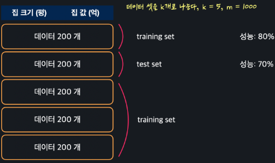

# Model Evaluation and Hyper Parameter
{: .no_toc .d-inline-block }
ing
{: .label .label-green }
<details open markdown="block">
  <summary>
    Table of contents
  </summary>
  {: .text-delta }
- TOC
{:toc}
</details>

<!------------------------------------ STEP ------------------------------------>
## STEP 0. Increase Machince Learning Performance

1. Data Preprocessing
2. Regularization
3. Model evaluation and Hyper parameter

<br>

<!------------------------------------ STEP ------------------------------------>
## STEP 1. k-fold cross validation

### Step 1-1. Issue

|good for only test set|not good for only test set|
|---|---|
|||

### Step 1-2. k-fold cross validation

|1-fold|2-fold|performance|
|---|---|---|
||||

### Step 1-3. sklearn

```python
from sklearn import datatsets
from sklearn.model_selection import corss_val_score # instead of train_test_split
from skleran.linear_model import LogisticRegression

import numpy as np
import pandas as pd

import warnings
warnings.simplefilter(action='ignore', category=FutureWarning) # Prevent Alerts from Occurring

iris_data = datastes.load_iris()
X = pd.DataFrame(iris_data.data, columns=iris_data.feature_names)
y = pd.DataFrame(iris_data.target, columns=['Class'])

logistic_model = LogisticRegression(max_iter=2000)
score = np.average(cross_val_score(logistic_model, X, y, y.values.ravel(), cv=5)) 
### cv: k
### y.values.ravel(): Prevent Alerts from Occurring
```

<br>

<!------------------------------------ STEP ------------------------------------>
## STEP 2. Grid Search

### Step 2-1. Hyper Parameter

* **Hyper Parameter** 
	* **Parameters set before learning**
		* `ex>alpha, interation`
		
	*  Depending on which value you use, there is a big difference in performance

* **Grid Search**
	* **Find good hyper parameter**
	* From `default value` change little by little

* **Example from lasso model**
	

### Step 2-2. sklearn

```python
from sklearn.linear_model import LogisticRegression
from sklearn.model_selection import GridSearchCV

import numpy as np
import pandas as pd

# 경고 메시지 출력 억제 코드
import warnings
warnings.simplefilter(action='ignore')
GENDER_FILE_PATH = './datasets/gender.csv'

# 데이터 셋을 가지고 온다
gender_df = pd.read_csv(GENDER_FILE_PATH)

X = pd.get_dummies(gender_df.drop(['Gender'], axis=1)) # 입력 변수를 one-hot encode한다
y = gender_df[['Gender']].values.ravel()

# 여기에 코드를 작성하세요
model = LogisticRegression()
hyper_parameters = {
    'penalty': ['l1', 'l2'], 
    'max_iter': [500, 1000, 1500, 2000]
}
hyper_parameter_tuner = GridSearchCV(model, hyper_parameters, cv=5)
hyper_parameter_tuner.fit(X,y)  # max_iter값이 충분치 못했다는 경보 발생 가능
best_params = hyper_parameter_tuner.best_params_
```