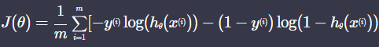

# Summary
{: .no_toc .d-inline-block }
ing
{: .label .label-green }
<details open markdown="block">
  <summary>
    Table of contents
  </summary>
  {: .text-delta }
- TOC
{:toc}
</details>

<!------------------------------------ STEP ------------------------------------>
## STEP 1. Basic

### Step 1-1. Linear Regression

* Reason why don't use linear regression for  classification
	* Respond sensitively to exceptional data

|Linear Regression for classification|Exceptional Data|
|---|---|
|||

### Step 1-2. Logistic Regression

* **Sigmoid** 
	
	* Linear regression results have no range limit
	* Sigmoid results have 0~1 range so suitable for classification
	* Sigmoid results have 0~1 continuous number. So, we call 'Logistic Regression'. but it is used for classification

|Sigmoid graph|Exceptional Data|
|---|---|
|||

<br>

<!------------------------------------ STEP ------------------------------------>
## STEP 2. Hypothesis Function

* **Logistic hypothesis function *h(x)***
	
	
	

	* *g(x)* is linear regression hypothesis function
	
* **output meaning**
	[](https://www.codeit.kr/learn/3068)

* **Example**

|h<sub>θ</sub>(x)|θ<sub>0</sub>|θ<sub>1</sub>|
|---|---|---|
||||

<br>

<!------------------------------------ STEP ------------------------------------>
## STEP 3. Decision Boundary

* **results of *h(x)* 0.5**

* **Single feature**

|*h(x)*|Sigmoid Graph|Decision Boundary|
|---|---|---|
||||

* **Two features**

|*h(x)*|Decision Boundary Graph|Decision Boundary|
|---|---|---|
||||

<br>

<!------------------------------------ STEP ------------------------------------>

## STEP 4. Log Loss(cross entropy)

|Linear Regression Error|Logistic Regression Error|
|---|---|
|MSE|log-loss|

 * **Log loss**
	 
|y=1|y=0|
|---|---|
|||
|||

<br>

<!------------------------------------ STEP ------------------------------------>
## STEP 5. Loss Function

### Step 5-1. Log Loss


| y=0                                                          | y=1                                                          |
| ------------------------------------------------------------ | ------------------------------------------------------------ |
|  | [](https://www.codeit.kr/learn/3039) |

### Step 5-2.  Loss Function



<br>

<!------------------------------------ STEP ------------------------------------>

## STEP 6. Gradient descent

|Loss Function|θ Update|θ Update|
|---|---|---|
|[image 0:56](https://www.codeit.kr/learn/3040)|[image 1:47](https://www.codeit.kr/learn/3040)|[image 2:13](https://www.codeit.kr/learn/3040)|

* **Same as Linear Regression θ Update Equation**
	* Loss function is different, but result of partial derivative is same
	* In θ Update Equation, Only *h(x)* is different from linear regression

* **Matrix Expression**

|Items|Equation|Expression|
|---|---|---|
|**X**|[image](https://www.codeit.kr/learn/3084)||
|**θ**|||
|**g<sub>θ</sub>(x)**|||
|**h<sub>θ</sub>(x)**|||
|**error**|||
|**loss function**|||
|**θ Update**|||

<br>

<!------------------------------------ STEP ------------------------------------>
## STEP 7. Example Code

```python
import numpy as np

def sigmoid(x):
    return 1 / (1 + np.exp(-x))
    
def prediction(X, theta):
    g = X @ theta
    h = sigmoid(g)
    return h
    
def gradient_descent(X, theta, y, iterations, alpha):
    m = len(X)  # 입력 변수 개수 저장

    for _ in range(iterations):
        h = prediction(X, theta)
        error = h-y
        theta = theta - alpha/m * (X.T @ error)
            
    return theta
    
    
# 입력 변수
hours_studied = np.array([0.2, 0.3, 0.7, 1, 1.3, 1.8, 2, 2.1, 2.2, 3, 4, 4.2, 4, 4.7, 5.0, 5.9])  # 공부 시간 (단위: 100시간)
gpa_rank = np.array([0.9, 0.95, 0.8, 0.82, 0.7, 0.6, 0.55, 0.67, 0.4, 0.3, 0.2, 0.2, 0.15, 0.18, 0.15, 0.05]) # 학년 내신 (백분률)
number_of_tries = np.array([1, 2, 2, 2, 4, 2, 2, 2, 3, 3, 3, 3, 2, 4, 1, 2])  # 시험 응시 횟수

# 목표 변수
passed = np.array([0, 0, 0, 0, 0, 0, 0, 0, 1, 1, 1, 1, 1, 1, 1, 1])  # 시험 통과 여부 (0: 탈락, 1:통과)

# 설계 행렬 X 정의
X = np.array([
    np.ones(16),
    hours_studied,
    gpa_rank,
    number_of_tries
]).T

# 입력 변수 y 정의
y = passed	

theta = [0, 0, 0, 0]  # 파라미터 초기값 설정
theta = gradient_descent(X, theta, y, 300, 0.1)  # 경사 하강법을 사용해서 최적의 파라미터를 찾는다
```

<br>

<!------------------------------------ STEP ------------------------------------>
## STEP 8. 3 or more Classification

* **e-mail Example**

|Strategy 1|Strategy 2|Strategy 3|
|---|---|---|
|[image](https://www.codeit.kr/learn/3072)|||

* **Conclusion**
 [image 2:46](https://www.codeit.kr/learn/3041)

<br>

<!------------------------------------ STEP ------------------------------------>
## STEP 9. Normal Equation
* hard to find θ using simple matrix operations,
because sigmoid include **e**
[image](https://www.codeit.kr/learn/3046)

<br>

<!------------------------------------ STEP ------------------------------------>
## STEP 10. sklearn

```python
from sklearn.datasets import load_iris
from sklearn.model_selection import train_test_split
from sklearn.linear_model import LogisticRegression


import pandas as pd

iris_data = load_iris()
# iris_data.DESCR

x = pd.DataFrame(iris_data.data, columns=iris_data.feature_names)
y= pd.DataFrame(iris_data.target, columns=['class'])

x_train, x_test, y_train, y_test = train_test_split(x, y, test_size=0.2, random_state=5)

y_train = y_train.values.ravel() # 안써도 되나 경고 발생(경고 제거용?)

model = LogisticRegression(solver='saga', max_iter=2000)
# solver : 최적화 시 어떤 알고리즘 쓸지 결정
# max_iter : interation(possiple to stop on optimize before max_iter)
model.fit(x_train, y_train)

model.predict(x_test)
# logistic evaluation
model.score(x_test, y_test)
```
