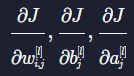

# ANN Basic
{: .no_toc .d-inline-block }
ing
{: .label .label-green }

  

    Table of contents
  

  {: .text-delta }
- TOC
{:toc}

<!------------------------------------ STEP ------------------------------------>
## STEP 1. MNIST Dataset

* MNIST Dataset  : Black and white handwritten digits dataset
	* 28x28 → 784 pixel data
	* Express the gray scale as a decimal between 0 and 1, 0~1 is result of min-max normalization(0~255)
	* Expression of MNIST data 5
		`([0, 0, 0, 0, ..., 0.66, 0.12, 0.99, 0.80, 0.77, 0.55, ..., 0, 0, 0, 0], 5)`

 

<!------------------------------------ STEP ------------------------------------>
## STEP 2. Review Rogistic Regression

### Step 2-1. Hypothesis Function

### Step 2-2. Model Cisualized

### Step 2-3. Predict

| Predict                                                      | Predict                                                      |
| ------------------------------------------------------------ | ------------------------------------------------------------ |
|  |  |

 

<!------------------------------------ STEP ------------------------------------>
## STEP 3. Ann Basic

### Step 3-1. Hypothesis Function

* Purpose of a logistic regression model is to find the parameter theta values that best fit the data, the purpose of an artificial neural network is to find the weights and biases that best fit the given data
* From logistic regression, θ0 is marked as b, the rest of θ is marked as w

### Step 3-2. Model Visualized(Layer)

| Model                                                        | Learning                                                     | Activation                                                   |
| ------------------------------------------------------------ | ------------------------------------------------------------ | ------------------------------------------------------------ |
|  |  |  |

### Step 3-3. Expression

* **parameter**

|Items|Description|Note|
|---|---|---|
|Layer|L = Number of hidden layer + 1||
|Output||l: layer i:th|
|Weight||**reverse of matrix expression** i: l-1 th, j: l th|
|Bias|||

* **input/output data**

|Input|Output(One-hot encoding)|
|---|---|
|||
|||

 

<!------------------------------------ STEP ------------------------------------>
## STEP 4. Forward Propagation

### Step 4-1. Output Calculation

### Step 4-2. Layer Calculation

| Component                                                    | Calculation                                                  |
| ------------------------------------------------------------ | ------------------------------------------------------------ |
|  |  |

### Step 4-3. Forward propagation

 	

<!------------------------------------ STEP ------------------------------------>
## STEP 5. Hypothesis and Loss Function

### Step 5-1. Hypothesis Function

* Hypothesis function that calculates the **output of the last layer neurons** according to the given weights and biases.\

  | Hypothesis function                                          | Ex                                                           |
  | ------------------------------------------------------------ | ------------------------------------------------------------ |
  |  |  |

### Step 5-2. Loss Function(MSE)

| Loss function(MSE)                                           | Ex                                                           |
| ------------------------------------------------------------ | ------------------------------------------------------------ |
|  |  |

* *hw(x(i)) = ai[L]*

###  Step 5-3. Non Convex function(MSE loss function in ANN)

| Ann MSE Loss function Non Convex function                    | Reason to use graedent descent                               |
| ------------------------------------------------------------ | ------------------------------------------------------------ |
|  |  |

 

<!------------------------------------ STEP ------------------------------------>
## STEP 6. Back Propagation

* [math reference](https://merucode.github.io/docs/menu6-deep-learning/menu6-sub9-math/menu6-sub9-sub1-calculus.html#step-2-composite-function-and-chain-rule)

* Purpose of back progagation : **Update weight and bias(gradient descent)**
  * Purpose of forward progation : **Calculate hypothesis function output **

### Step 6-1. Partial Derivative

| Item               | Expression                                                   | Image                                                        | Note           |
| :----------------- | :----------------------------------------------------------- | ------------------------------------------------------------ | -------------- |
| **Component**      |  |                                                              |                |
| **Weight**         |   |  | Update W       |
| **Bias**           |   |  | Update b       |
| **Pre activation** |   |  | Calculate W, b |

### Step 6-2. Chain Rule

| Before apply to chain rule                                   | After apply to chain rule                                    |
| ------------------------------------------------------------ | ------------------------------------------------------------ |
|  |  |

### Step 6-3. Gradient Descent

### Step 6-4. Matrix Expression

| Items              | Expression                                                   | Maxtix                                                       | Maxtix Expression                                            |
| ------------------ | ------------------------------------------------------------ | ------------------------------------------------------------ | ------------------------------------------------------------ |
| **Simplification** |    |                                                              |                                                              |
| **Bias**           |  |  |  |
| **Weight**         |     |  |  |
| **Pre activation** |    |  |  |

