# Reinforcement Learning Basic
{: .no_toc .d-inline-block }
ing
{: .label .label-green }
<details open markdown="block">
  <summary>
    Table of contents
  </summary>
  {: .text-delta }
- TOC
{:toc}
</details>

<!------------------------------------ STEP ------------------------------------>
## Step 1. Linear Regression

* **Linear regression** : finding the line that best represents the data here.
  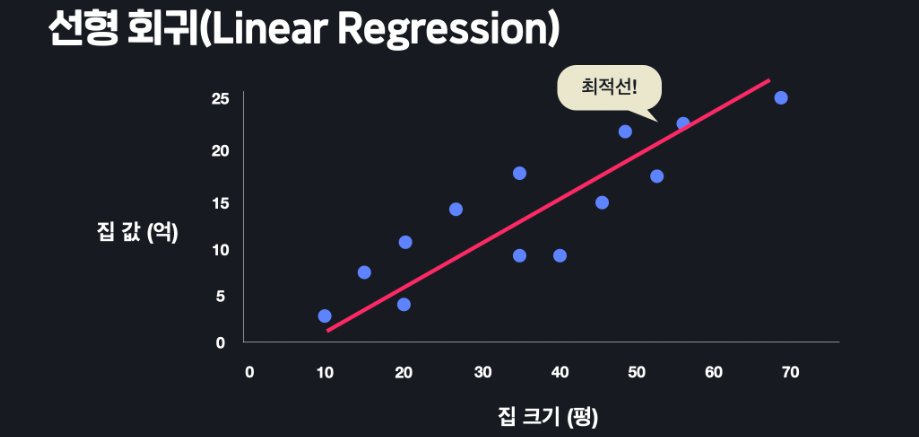
* **variable and data expression**
	* input value : feature
	* output value : target
	* data expression
	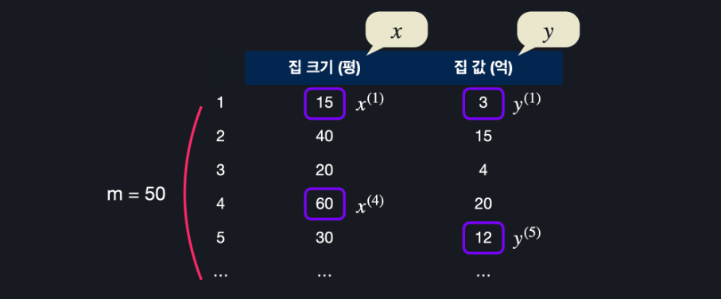

<br>

## STEP 2. hypothesis function

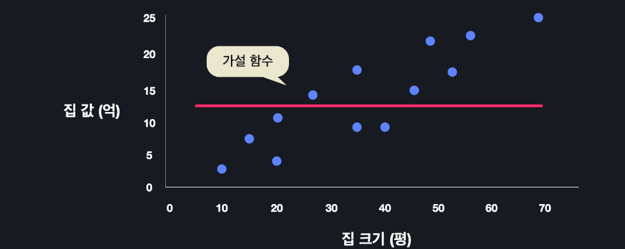

* **hypothesis function expression**
	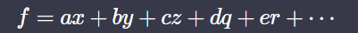
	covert to other expression for more consistency:
	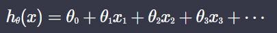
	or
	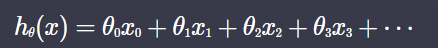 (x<sub>0</sub>=1)

<br>

## STEP 3. MSE(mean squared error)
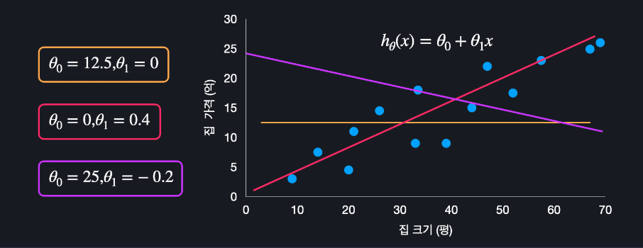

* **How can measure performance for hypothesis function?**

* **find good performance hypothesis function** : To have small MSE

* MSE Example : data is consist of "집 크기" and "집 가격"

  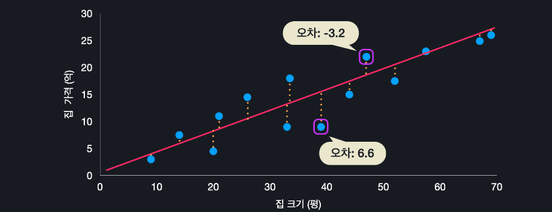

  

* **MSE function**
	
	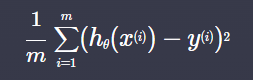
	
	* *square reason : Negative-positive unity and error penalty*

{: .highlight }
> Proceed with the example function 
>
> *h(x)* = *θ*<sub>0</sub>+*θ*<sub>1</sub>*x*

## STEP 4. Loss Function
* **Loss function**

  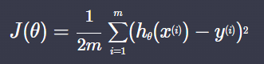

  * *1/2 reason : After process, to make it easier to calculate*

* **Why input theta(θ)?**

  * Because we find **h(x)(hypothesis function)  which consist of theta** that have **small loss function**
  *h(x)* = *θ*<sub>0</sub>+*θ*<sub>1</sub>*x*+... 
  * θ is mean not only θ<sub>0</sub> but θ<sub>0</sub>, θ<sub>1</sub>, θ<sub>2</sub> ...

<br>

## STEP 5.  Gradient descent

* **theta update method** : **손실 함수 J에 각 θ(θ<sub>0</sub>, θ<sub>1</sub>, θ<sub>2</sub> ...)로 편미분한 값(순간 기울기에)에 -를 취하여 가장 내려가는 방향으로 점차적으로 접근(alpha : leaning rate)**
	
	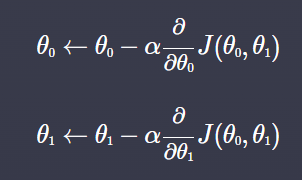

* Example case(*h(x)* = *θ*<sub>0</sub>+*θ*<sub>1</sub>*x*)

  | θ<sub>0</sub> Update                                         | *θ*<sub>1</sub> Update                                       |
  | ------------------------------------------------------------ | ------------------------------------------------------------ |
  | 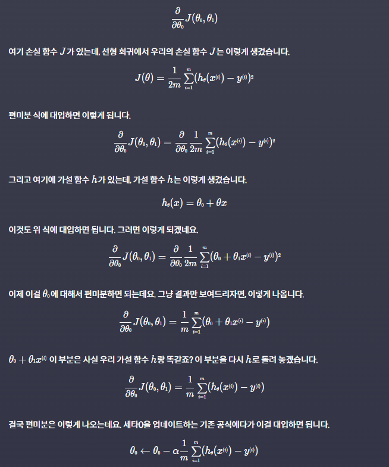 | 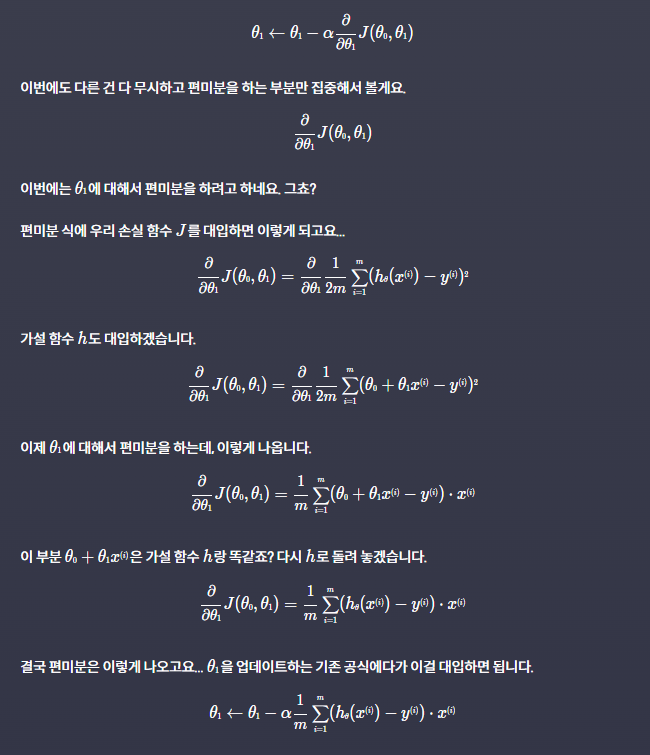 |
  |  | 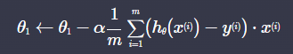 |

<br>

## STEP 6. Easily express using matrix(Example)
|Description|Expression|Matrix Expression|
|---|---|---|
|hypothesis function||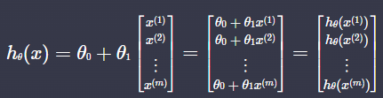|
|error|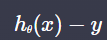|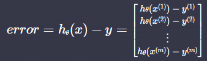|
|loss function|||
|*θ*<sub>0</sub> update<br>(Gradient descent)||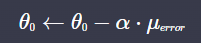<br>|
|*θ*<sub>1</sub> update<br/>(Gradient descent)||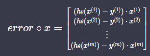<br>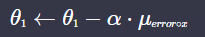|

* Example code

	```python
	import numpy as np
	import matplotlib.pyplot as plt
	
	def prediction(theta_0, theta_1, x):	# hypothesis function
	    H = theta_0 + theta_1 * x
	    return H
	    
	def prediction_difference(theta_0, theta_1, x, y):	# error
	    H = prediction(theta_0, theta_1, x)
	    error = H - y
	    return error
	    
	def gradient_descent(theta_0, theta_1, x, y, iterations, alpha): # alpha : learning rate
		m = len(x)		### for cost visualized
		cost_list = []	### for cost visualized
		
	    for _ in range(iterations):  # 정해진 번만큼 경사 하강을 한다
	        error = prediction_difference(theta_0, theta_1, x, y)
	        cost = (error @ error) / 2
	        # 여기서 theta update에 사용되는 update 값은 코드로서 미분을 진행하지는 않고 위에서 계산한 공식 이용
	        theta_0 = theta_0 - alpha * error.mean()		
	        theta_1 = theta_1 - alpha * (error * x).mean()  
		    """for hypothesis function visualized
		    if i % 10 == 0: 
			    plt.scatter(house_size, house_price)
			    plt.plot(house_size, prediction(theta_0, theta_1, x), colro='red')
			    plt.show()"""
	    return theta_0, theta_1, cost_list
	    
	
	house_size = np.array([3.3, 3.35, 3.9, 4.4, 4.7, 5.2, 5.75, 6.7, 6.9]) # input variable
	house_price = np.array([0.9, 1.8, 0.9, 1.5, 2.2, 1.75, 2.3, 2.49, 2.6]) # output variable
	
	theta_0 = 2.5	# theta 값들 초기화 (아무 값이나 시작함)
	theta_1 = 0
	
	theta_0, theta_1, cost_list = gradient_descent(theta_0, theta_1, house_size, house_price, 200, 0.1)
	plt.plot(cost_list)	### for cost visualized
	```

<br>

## STEP 7. Learning Rate

* Assuming 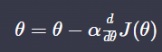
	* *J(θ) is Quadratic expression for theta*

| *α*가 너무 큰 경우                                           | *α*가 너무 작은 경우                                         | *α*가 적절한 경우                                            |
| ------------------------------------------------------------ | ------------------------------------------------------------ | ------------------------------------------------------------ |
| 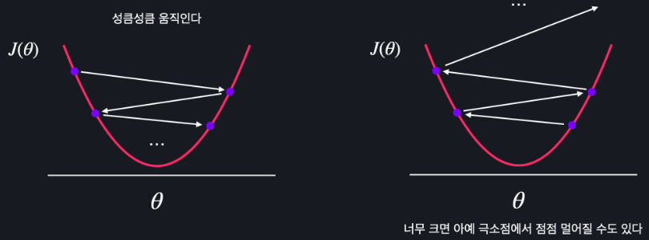 | 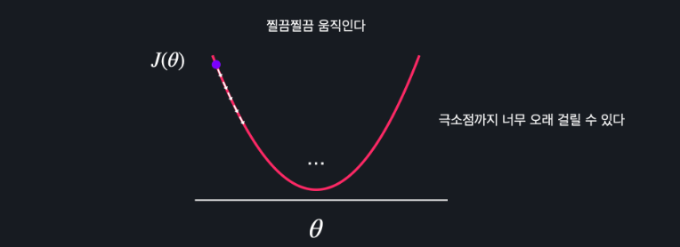 | 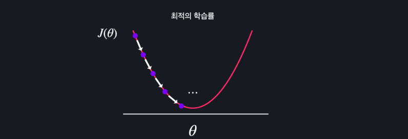 |
| 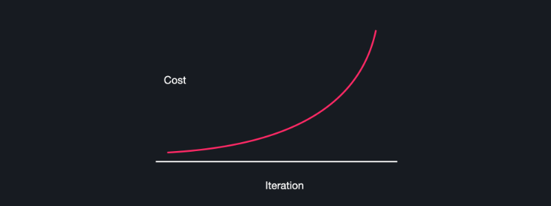 | 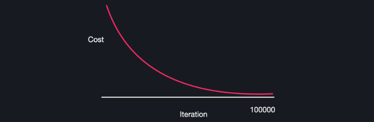<br>big `iteration` | 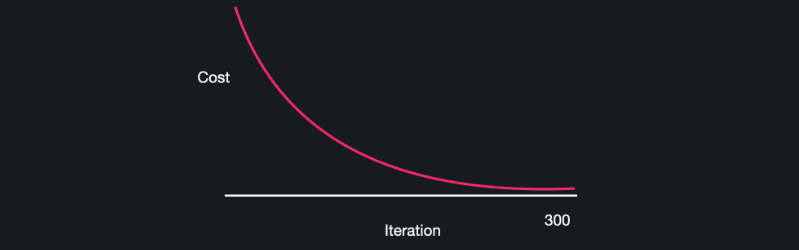 |

* 일반적으로 1.0 ~ 0.0 사이의 숫자로 정하고(1,0.1, 0.01, 0.001 또는 0.5, 0.05, 0.005 이런 식으로), 여러 개를 실험해보면서 경사 하강을 제일 적게 하면서 손실이 잘 줄어드는 학습률을 선택

<br>

## STEP 8. Evaluate Model

* **RMSE(root mean square error)** : Adjust error to units similar to data(previous error is squared)
* **Training Set vs. Test Set**
	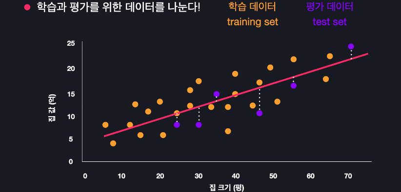
	**Using test set, calculating RMSE(training set is optimized for model)**

<br>

## STEP 9. Sklearn

```python
from sklearn.datasets import load_boston # basic data set
from sklearn.model_selection import train_test_split
import pandas as pd

boston_dataset = load_boston()
boston_dataset.DESCR
boston_dataset.feature_names
boston_dataset.data # boston_dataset.data.shape
boston_dataset.target # boston_dataset.target.shape

x = pd.DataFrame(boston_dataset.data, columns=boston_dataset.feature_name)

x = x[['Age']] # `Age` Using as input value
y = pd.DataFrame(boston_dataset.target, columns=['MEDV'])

### Split Train, Test Data Set
x_train, x_test, y_train, y_test = train_test_split(x, y, test_szie=0.2 random_state=5)

```
