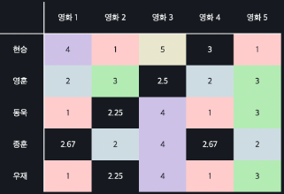
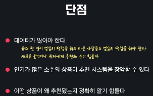
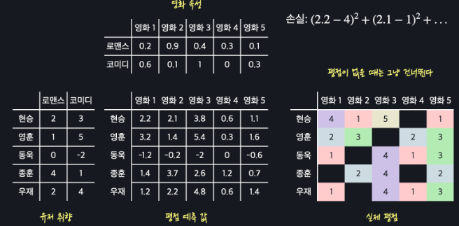
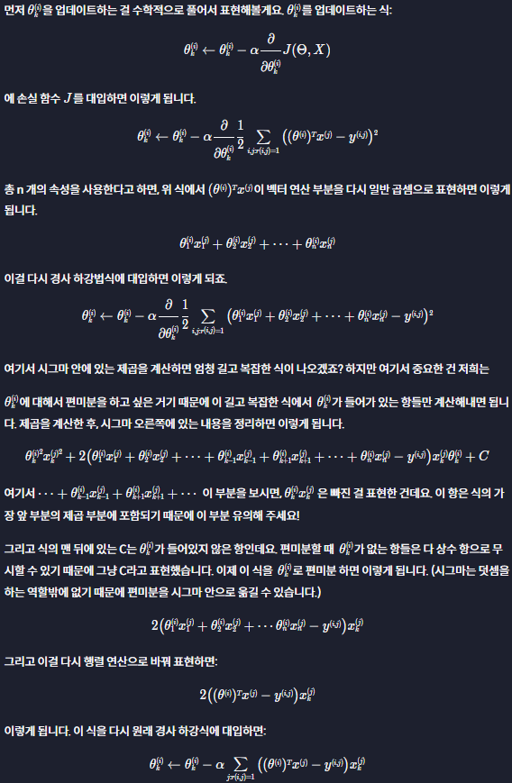

# Recommendation System
{: .no_toc .d-inline-block }
ing
{: .label .label-green }

<details open markdown="block">
  <summary>
    Table of contents
  </summary>
  {: .text-delta }
- TOC
{:toc}
</details>
<!------------------------------------ STEP ------------------------------------>

## STEP 0. Explicit/Implicit Data

| Explicit                                                     | Implicit                                                     |
| ------------------------------------------------------------ | ------------------------------------------------------------ |
|  |  |
| directly show preference of user                             | easy to get data                                             |


## STEP 1. Content Based

### Step 1-1. Dataset


### Step 1-2. Regression

* We use multiple linear regression(**any regression also possible**)
* Hypothesis function
  * *h<sub>θ</sub>(x) = θ<sup>T</sup>x*

| x                                                            | θ                                                            |
| ------------------------------------------------------------ | ------------------------------------------------------------ |
|  |  |


### Step 1-3. Gradient Descent

* Loss function
  
* Gradient descent

| θ Update                                                     | Graph                                                        |
| ------------------------------------------------------------ | ------------------------------------------------------------ |
| <br> |  |

### Step 1-4. Predict Rating

| Predict From Model                                           | Repeat all User                                              | Recommandation                                               |
| ------------------------------------------------------------ | ------------------------------------------------------------ | ------------------------------------------------------------ |
|  |  |  |

### Step 1-5.  Merits and Demerits

| Merits                                                       | Demerits                                                     |
| ------------------------------------------------------------ | ------------------------------------------------------------ |
|  |  |

### Step 1-6. sklearn

```python
from sklearn.linear_model import LinearRegression
from sklearn.model_selection import train_test_split

import pandas as pd
import numpy as np

MOVIE_DATA_PATH = './data/movie_rating.csv'

movie_rating_df = pd.read_csv(MOVIE_DATA_PATH)

features =['romance', 'action', 'comedy', 'heart-warming']

X = movie_rating_df[features]
y = movie_rating_df[['rating']]
X_train, X_test, y_train, y_test = train_test_split(X, y, test_size=0.2, random_state=5)

model = LinearRegression()
model.fit(X_train, y_train)
y_test_predict = model.predict(X_test)
```

<br>

## STEP 2. Collaborative Filtering

### Step 2-1. Collaborative Filtering


### Step 2-2. Dataset

* rating : r<sub>i</sub><sup>(a)</sup>(a: user, i: moive) 

  

​	

### Step 2-3. Find Similar Users

* **Euclidean distance** : use length

​		

* **Cosine similarity** : use angle

  

* **Similar Users**

  * Low euclidean distance value
  * High cosine similarity value


### Step 2-4. Data Preprocessing

| **Fill with mean**                                           | **Mean Normalization**                                       |
| ------------------------------------------------------------ | ------------------------------------------------------------ |
|  |  |


### Step 2-5. Predict Rating

| Predict From Model                                           | Recommnadation                                               |
| ------------------------------------------------------------ | ------------------------------------------------------------ |
|  |  |


### Step 2-6. Merits and Demerits

| Merits                                                       | Demerits                                                     |
| ------------------------------------------------------------ | ------------------------------------------------------------ |
|  |  |


### Step 2-7. Product Base Collaborative Filtering

* Until now, We use **user base collaborative filtering**
  * We also use **product base**

| Product Base Collaborative Filtering                         | Comparison                                                   |
| ------------------------------------------------------------ | ------------------------------------------------------------ |
|  |  |

### Step 2-8. sklearn

```python
import pandas as pd
import numpy as np
from math import sqrt

RATING_DATA_PATH = './data/ratings.csv' # 받아올 평점 데이터 경로 정의
np.set_printoptions(precision=2)  		# 소수점 둘째 자리까지만 출력

def distance(user_1, user_2):
    """유클리드 거리를 계산해주는 함수"""
    return sqrt(np.sum((user_1 - user_2)**2))
    
def filter_users_without_movie(rating_data, movie_id):
    """movie_id 번째 영화를 평가하지 않은 유저들은 미리 제외해주는 함수"""
    return rating_data[~np.isnan(rating_data[:,movie_id])]
    
def fill_nan_with_user_mean(rating_data):
    """평점 데이터의 빈값들을 각 유저 평균 값으로 체워주는 함수"""
    filled_data = np.copy(rating_data)  # 평점 데이터를 훼손하지 않기 위해 복사
    row_mean = np.nanmean(filled_data, axis=1)  # 유저 평균 평점 계산
    
    inds = np.where(np.isnan(filled_data))  # 비어 있는 인덱스들을 구한다
    filled_data[inds] = np.take(row_mean, inds[0])  #빈 인덱스를 유저 평점으로 채운다
    
    return filled_data
    
def get_k_neighbors(user_id, rating_data, k):
    """user_id에 해당하는 유저의 이웃들을 찾아주는 함수"""
    distance_data = np.copy(rating_data)  # 평점 데이터를 훼손하지 않기 위해 복사
    # 마지막에 거리 데이터를 담을 열 추가한다
    distance_data = np.append(distance_data, np.zeros((distance_data.shape[0], 1)), axis=1)
    
    for i in range(len(distance_data)):
        row = distance_data[i]
        if i == user_id:  # 같은 유저면 거리를 무한대로 설정
            row[-1] = np.inf
        else:  # 다른 유저면 마지막 열에 거리 데이터를 저장
            row[-1] = distance(distance_data[user_id][:-1], row[:-1])   

    distance_data = distance_data[np.argsort(distance_data[:, -1])]	    # 데이터를 거리 열을 기준으로 정렬한다

    return distance_data[:k, :-1]	    # 가장 가까운 k개의 행만 리턴한다 + 마지막(거리) 열은 제외한다
    
def predict_user_rating(rating_data, k, user_id, movie_id,):
    """예측 행렬에 따라 유저의 영화 평점 예측 값 구하기"""
    # movie_id 번째 영화를 보지 않은 유저를 데이터에서 미리 제외시킨다
    filtered_data = filter_users_without_movie(rating_data, movie_id)
    # 빈값들이 채워진 새로운 행렬을 만든다
    filled_data = fill_nan_with_user_mean(filtered_data)
    # 유저 user_id와 비슷한 k개의 유저 데이터를 찾는다
    neighbors = get_k_neighbors(user_id, filled_data, k)

    movie_predit_rate = neighbors[:,movie_id].mean()
    return  movie_predit_rate
    
# 테스트 코드
rating_data = pd.read_csv(RATING_DATA_PATH, index_col='user_id').values	# 평점 데이터를 불러온다
predict_user_rating(rating_data, 5, 0, 3)  # 5개의 이웃들을 써서 유저 0의 영화 3에 대한 예측 평점 구하기
```


<br>

## STEP 3. Factorization

### Step 3-1. Factorization

| Factorization                                                |                                                              |
| ------------------------------------------------------------ | ------------------------------------------------------------ |
|  |  |


### Step 3-2. Dataset

| user features      |  |  |
| ------------------ | ------------------------------------------------------------ | ------------------------------------------------------------ |
| **movie features** |  |  |
| **predict rating** |  |                                                              |
| **real rating**    |  |                                                              |
| **exist rating**   |  |                                                              |


### Step 3-3. Loss Function

| Loss Function                                                | Visualized                                                   |
| ------------------------------------------------------------ | ------------------------------------------------------------ |
|  |  |


### Step 3-4. Gradient Descent

| x, θ Update                                                  | x, θ Update                                                  |
| ------------------------------------------------------------ | ------------------------------------------------------------ |
|  |  |

| θ Update Calculation                                         | x Update Calculation                                         |
| ------------------------------------------------------------ | ------------------------------------------------------------ |
|  |  |


### Step 3-5. Non-Convex Function


### Step 3-6. Nomalization


### Step 3-8. sklearn

```python
import numpy as np
import pandas as pd
import matplotlib.pyplot as plt

RATING_DATA_PATH = './data/ratings.csv'  # 데이터 파일 경로 정의
# numpy 출력 옵션 설정
np.set_printoptions(precision=2)
np.set_printoptions(suppress=True)

def predict(Theta, X):
    """유저 취향과 상품 속성을 곱해서 예측 값을 계산하는 함수"""
    return Theta @ X


def cost(prediction, R):
    """행렬 인수분해 알고리즘의 손실을 계산해주는 함수"""
    return np.nansum((prediction - R)**2)


def initialize(R, num_features):
    """임의로 유저 취향과 상품 속성 행렬들을 만들어주는 함수"""
    num_users, num_items = R.shape
    
    Theta = np.random.rand(num_users, num_features)
    X = np.random.rand(num_features, num_items)
    
    return Theta, X


def gradient_descent(R, Theta, X, iteration, alpha, lambda_):
    """행렬 인수분해 경사 하강 함수"""
    num_user, num_items = R.shape
    num_features = len(X)
    costs = []
        
    for _ in range(iteration):
        prediction = predict(Theta, X)
        error = prediction - R
        costs.append(cost(prediction, R))
                          
        for i in range(num_user):
            for j in range(num_items):
                if not np.isnan(R[i][j]):	# 실제 평점이 존재하는 것만 경사하강법에 사용
                    for k in range(num_features):
                        # error 값에 nan 존재하므로 nansum 사용
                        Theta[i][k] -= alpha * (np.nansum(error[i, :]*X[k, :]) + lambda_*Theta[i][k]) 
                        X[k][j] -= alpha * (np.nansum(error[:, j]*Theta[:, k]) + lambda_*X[k][j])  
    return Theta, X, costs


#----------------------테스트(채점) 코드----------------------
ratings_df = pd.read_csv(RATING_DATA_PATH, index_col='user_id') # 평점 데이터를 가지고 온다

for row in ratings_df.values:	# 평점 데이터에 mean normalization을 적용한다
    row -= np.nanmean(row)
       
R = ratings_df.values	# df to array
        
Theta, X = initialize(R, 5)  # 행렬들 초기화
Theta, X, costs = gradient_descent(R, Theta, X, 200, 0.001, 0.01)  # 경사 하강
    
# 손실이 줄어드는 걸 시각화 하는 코드 (디버깅에 도움이 됨)
# plt.plot(costs)

print(Theta, X)
```


### Step 3-9. Features

* Actually, We don't know features(it's made by gradient descent)

  


<br>

## STEP 4. How to Use

| Show list from each model                                    | Average                                                      |
| ------------------------------------------------------------ | ------------------------------------------------------------ |
|  |  |

