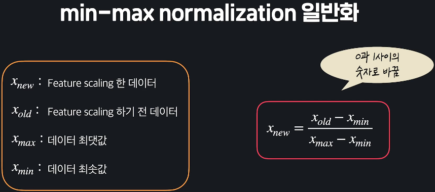
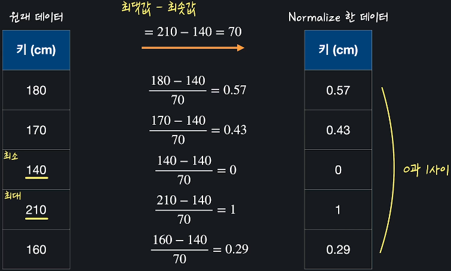
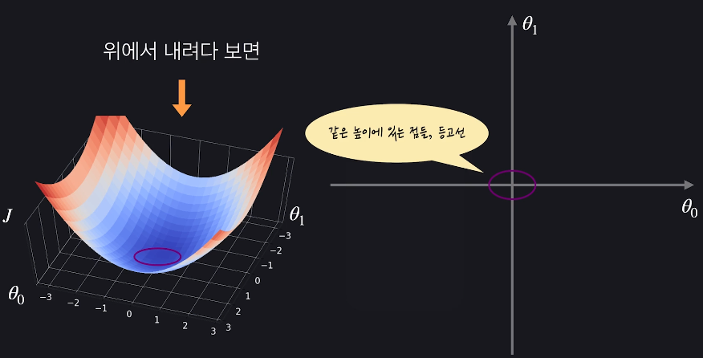
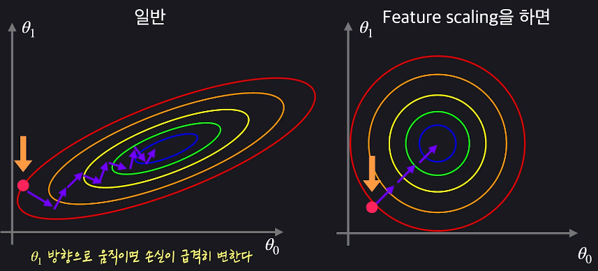
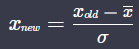
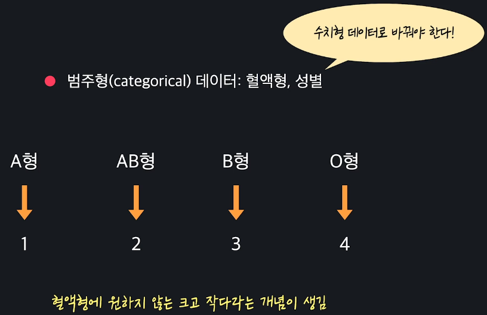
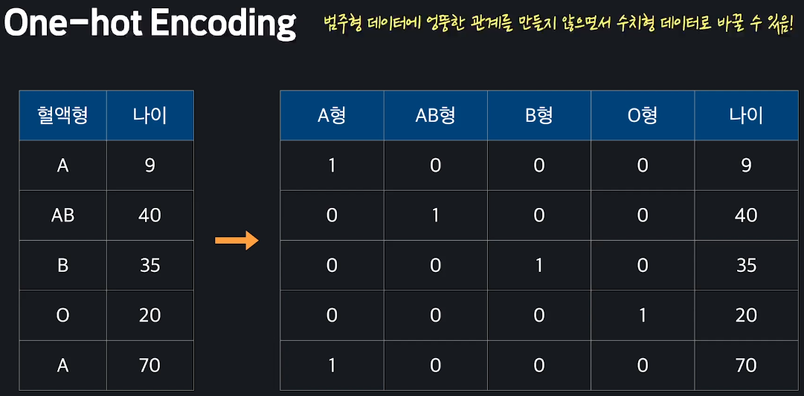

# Data Preprocessing
{: .no_toc .d-inline-block }
ing
{: .label .label-green }
<details open markdown="block">
  <summary>
    Table of contents
  </summary>
  {: .text-delta }
- TOC
{:toc}
</details>

<!------------------------------------ STEP ------------------------------------>
## STEP 0. Increase Machince Learning Performance

1. Data Preprocessing
2. Regularization
3. Model evaluation and Hyper parameter

<br>

<!------------------------------------ STEP ------------------------------------>
## STEP 1. Feature Scaling: Normalization

### Step 1-1. Feature Scaling
* Adjust to input value range
* Help to more faster gradient descent

<br>

<!------------------------------------ STEP ------------------------------------>
## STEP 2. Min-Max Normalization(feature scaling)

### Step 2-1. Min-Max Normalization


| Equation                                                     | Example                                                      |
| ------------------------------------------------------------ | ------------------------------------------------------------ |
|  |  |

### Step 2-2. sklearn

```python
import pandas as pd
import numpy as np
from sklearn import preprocessing

CSV_FILE_PATH = '../datasets/data.csv'
data_df = pd.read_csv(CSV_FILE_PATH)
df_to_nomalized = data_df[['col1','col2']] # col1, col2 : wanna be nomalized

scaler = preprocessing.MinMaxScaler()
nomalized_data = scaler.fit_transform(df_to_nomalized)	# Return array

nomalized_df = pd.DataFrame(nomalized_data, columns=df_to_nomalized.columns.tolist())
```

### Step 2-3. Relation with Gradient Descent

|  |
| ------------------------------------------------------------ |
| <br>*일반 : x<sub>1</sub>의 크기가 큰 경우* |

* Apply to not only linear regression, but also **all algorithm using gradient descent**


<br>

<!------------------------------------ STEP ------------------------------------>
## STEP 3. Standardization(feature scaling)

### Step 3-1.  Standardization



* x<sub>new</sub> 
	* mean : 0, std : 1
	* called by `z-score`
		* *ex>180의 z-score는 1.164인데요, 이건 “180은 평균값(173.8) 보다 1.164 표준편차(5.325)만큼 크다”라는 뜻입니다. (173.8 + 1.164 x 5.325 = 180)*

### Step 3-2. sklearn

```python
import pandas as pd
import numpy as np
from sklearn import preprocessing

CSV_FILE_PATH = '../datasets/data.csv'
# 소수점 5번째 자리까지만 출력되도록 설정 
pd.set_option('display.float_format', lambda x: '%.5f' % x)

data_df = pd.read_csv(CSV_FILE_PATH)
df_to_standardized = data_df[['col1','col2']] # col1, col2 : wanna be nomalized

scaler = preprocessing.StandardScaler()
standardized_data = scaler.fit_transform(df_to_standardized) # Return array

standardized_df = pd.DataFrame(standardized_data, columns=df_to_standardized.columns.tolist())
```

<br>

<!------------------------------------ STEP ------------------------------------>
## STEP 4. One-hot Encoding

### Step 4-1. One-hot Encoding

* Data for machine learning
	-   수치형(numerical) 데이터: 나이, 몸무게, 키
	-   범주형(categorical) 데이터: 혈액형, 성별

* **Handling Categorical Data**

|Just change|One-hot Encod|
|---|---|
|||

### Step 4-2. Example Code(pandas)

```python
import pandas as pd

PATH = '../datasets/titanic.csv'
titanic_df = pd.read_csv(PATH)

# 원하는 열만 추출해서 one-hot encoding
titanic_sex_embarked = titanic_df[['Sex', 'Embarked']]
df_to_enconding = pd.get_dummies(titanic_sex_embarked)


# df 전체에서 원하는 열만 one-hot encoding
df_to_encoding = pd.get_dummies(data=titanic_df, columns=['Sex','Embarked']]
```
