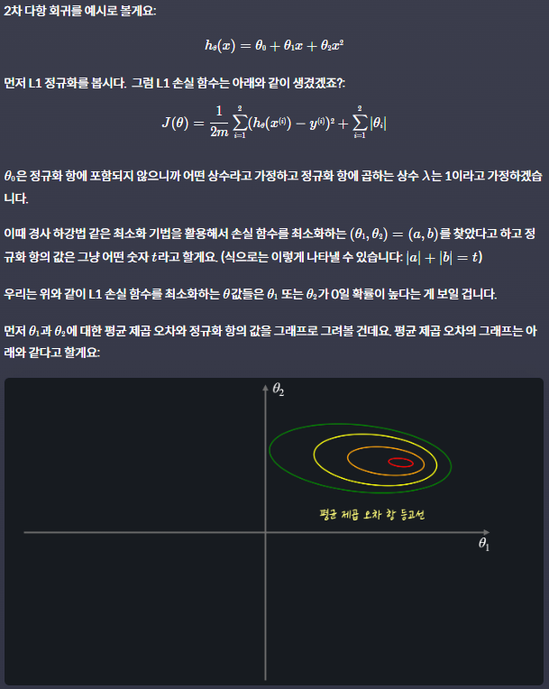

# Regularization
{: .no_toc .d-inline-block }
ing
{: .label .label-green }
<details open markdown="block">
  <summary>
    Table of contents
  </summary>
  {: .text-delta }
- TOC
{:toc}
</details>

<!------------------------------------ STEP ------------------------------------>
## STEP 0. Increase Machince Learning Performance

1. Data Preprocessing
2. Regularization
3. Model evaluation and Hyper parameter

<br>

<!------------------------------------ STEP ------------------------------------>
## STEP 1. Bias and Variance

### Step 1-1. Bias and Variance

|Items|Graph|Problem|
|---|---|---|
|high bias||low performance|
|low bias||over optimization|
|low variance|  ||
|high variance||over optimization|

* variance : How consistent the model's performance is when given various test data


### Step 1-2.	Bias-Variance Tradeoff

|underfit(과소적합)|overfit(과적합)|
|---|---|
|||

* **Bias-Variance Tradeoff** 
	* In general, bias and variance have a **relationship where as one decreases, the other increases**
	* So, We try to find **model which have balance between overfit and underfit**

* To solve **underfit**
	* using more **polynomial linear regression**

* To solve **overerfit**
	* **Regularization**

### Step 1-3. sklearn

```python
from sklearn.linear_model import LinearRegression
from sklearn.model_selection import train_test_split
from sklearn.metrics import mean_squared_error
from sklearn.preprocessing import PolynomialFeatures

from math import sqrt

import numpy as np
import pandas as pd

PATH = ",,/datasets/admission_data.csv"
admission_df = pd.read_csv(PATH).drop('Serial No.', axis=1)	# drop don't need columns

X = admission_df.drop(['Admit'], axis=1) # drop target
polynomial_transformer = PolynomialFeatures(6)
polynomial_features = polynomial_transformer.fit_transform(X.values)
features = polynomial_transformer.get_feature_names(X.columns)
X = pd.DataFrame(polynomial_features, columns=features)

y = admission_df[['Admit']]

X_train, X_test, y_train, y_test = train_test_split(x, y, test_size=0.3, random_state=5)

model = LinearRegression()
model.fit(X_train, y_train)

y_train_predict = model.predict(X_train)
y_test_predict = model.predict(X_test)

mse_train = mean_squared_error(y_train, y_train_predict)
mse_test = mean_squared_error(y_test, y_test_predict)

sqrt(mse_train) # 0.0015
sqrt(mse_test)	# 5.090
### This mean overfit
```

<br>

<!------------------------------------ STEP ------------------------------------>
## STEP 2. Regularization

### Step 2-1. Regularization

* **Regularization** : Avoid overfitting
	*  **Prevent θ from getting too big**
	
	| overfit reason                                               | Regularization                                               |
	| ------------------------------------------------------------ | ------------------------------------------------------------ |
	|  |  |
	
	
	
* **Regularization**
	
	* Loss function : '가설 함수를 평가하기 위한 함수'
	* **‘training 데이터에 대한 오차도 작고 θ값들도 작아야 좋은 가설 함수다'**의 수학적 표현
		* **J(θ) = Loss Function + Regularization term**
  	
  
### Step 2-2. L1, L2 Regularization 


### Step 2-3. sklearn

```python
### L1(Lasso)	### L2(Ridge)
from sklearn.linear_model import Lasso # instead of LinearRegression
### if wanna use L2 → import Ridge
from sklearn.model_selection import train_test_split
from sklearn.metrics import mean_squared_error
from sklearn.preprocessing import PolynomialFeatures

from math import sqrt

import numpy as np
import pandas as pd

PATH = ",,/datasets/admission_data.csv'
admission_df = pd.read_csv(PATH).drop('Serial No.', axis=1)	# drop don't need columns

X = admission_df.drop(['Admit'], axis=1) # drop target
polynomial_transformer = PolynomialFeatures(6)
polynomial_features = polynomial_transformer.fit_transform(X.values)
features = polynomial_transformer.get_feature_names(X.columns)
X = pd.DataFrame(polynomial_features, columns=features)

y = admission_df[['Admit']]

X_train, X_test, y_train, y_test = train_test_split(x, y, test_size=0.3, random_state=5)

model = Lasso(alpha=0.001, max_lter=1000, normalize=True) # instead of LinearRegression() 
### alpha:λ, normalize: features scaling itself
### if wanna use L2 → model = Ridge(...same..)
model.fit(X_train, y_train)

y_train_predict = model.predict(X_train)
y_test_predict = model.predict(X_test)

mse_train = mean_squared_error(y_train, y_train_predict)
mse_test = mean_squared_error(y_test, y_test_predict)

sqrt(mse_train) # 0.063(linear regession model 0.0015)
sqrt(mse_test)	# 0.060(linear regession model 5.090)
```

<br>

<!------------------------------------ STEP ------------------------------------>
### Step 2-4. Generalization

* 정규화는 모델의 파라미터 (즉 학습을 통해 찾고자 하는 값들 - 회귀의 경우 θ)에 대한 **손실 함수를 최소화 하는 모든 알고리즘에 적용**할 수 있음
	* 다중 회귀, (다중) 다항 회귀, 로지스틱 회귀 모델 모두에 정규화를 적용 가능
	

* `LogisticRegression`의 경우 `sklearn`에서 자동으로 **L2 정규화 적용**

	```python
	LogisticRegression(penalty='l1') # L1 정규화 사용 
	LogisticRegression(penalty='l2') # L2 정규화 사용 
	LogisticRegression() # L2 정규화 사용
	```

*  **Deep learning models** are also algorithms that minimize the loss function. 
	* **Regularization is very important even in deep learning** because deep learning models are often overfitted
	  

<br>

<!------------------------------------ STEP ------------------------------------>

### Step 2-5. Difference between L1 and L2

* **Difference between L1 and L2**

|L1|L2|
|---|---|
|**several θ values ​​to zero**|**θ values reduce them slightly**|
|Remove θ that are considered unimportant to the model||
|For calculation, need to reduce θ number|Don't need to reduce θ number|

* **Example Image**


* **Reason L1 Reduce θ**

