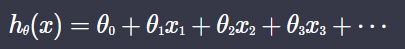
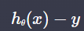
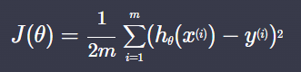
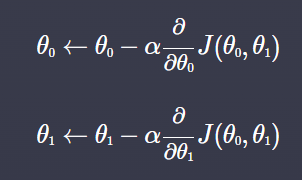

# Summary
{: .no_toc .d-inline-block }
ing
{: .label .label-green }

  

    Table of contents
  

  {: .text-delta }
- TOC
{:toc}

<!------------------------------------ STEP ------------------------------------>
## STEP 1. Linear Regression

|item|expression|description|
|---|---|---|
|**hypothesis function**||prediction line using θ|
|**error**|||
|**loss function**||J(θ) mean for error sqare|
|**gradient descent**||θ update by partial derivative J(θ) - J(θ)를 각 θ에 대하여 편미분 후 부호를 반대로 바꾸면 가장 빨리 내려갈 수 있는 방향(loss function이 작은 값을 가질 수 있는)으로 이동 -가장 작은 J(θ)를 가지는 H(x)가 가장 성능이 좋음|