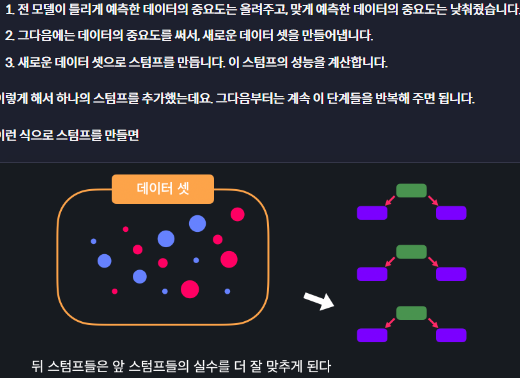

# Decision Trees and Ensemble
{: .no_toc .d-inline-block }
ing
{: .label .label-green }
<details open markdown="block">
  <summary>
    Table of contents
  </summary>
  {: .text-delta }
- TOC
{:toc}
</details>

<!------------------------------------ STEP ------------------------------------>
## STEP 1. Decision Tree

### Step 1-1. Decision Tree


* In machine learning, **node question is made by learning**
	* **Purpose of decision tree is we find the nodes** that can best classify the data though classifying the training data, 
	
### Step 1-2. Gini Impurity

* **Gini impurity** : The degree of shuffling of the data set
	* High value mean more impure

|Example Function|Example Data|
|---|---|
||<br>|

### Step 1-3. Node

* **Good Node** : **Low gini impourity** of dataset divided by node 
	* Node Evaluation Example
		
* Type of Node : Classification, Question
* Node Selection
	
* Depth of decision tree

* Node for numerical features


### Step 1-4. Feature Importance


|Node importance|Example|
|---|---|
|||
|**Feature Importance**|**Feature Importance**|
|||


### Step 1-5. sklearn

```python
from sklearn.datasets import load_breast_cancer
from sklearn.model_selection import train_test_split
from sklearn.tree import DecisionTreeClassifier

import pandas as pd

cancer_data = load_breast_cancer()

X = pd.DataFrame(cancer_data.data, columns=cancer_data.feature_names)
y = pd.DataFrame(cancer_data.target, columns=['class'])
X_train, X_test, y_train, y_test = train_test_split(X, y, test_size=0.2, random_state=5)
y_train = y_train.values.ravel()    # not occur error massage for learning

model = DecisionTreeClassifier(max_depth=5)
model.fit(X_train, y_train)

predictions = model.predict(X_test)
score = model.score(X_test, y_test)
print(predictions, score)

'''중요도 시각화
importances = model.feature_importances_ 		
indices_sorted = np.argsort(importances)

plt.figure()
plt.title("Feature importance")
plt.bar(range(len(importances)), importancse[indices_sorted])
plt.xticks(range(len(importances)), X.columns[indeics_sorted], rotation=90)
'''
```

<br>

## STEP 2. Random Forest

### Step 2-1. Ensemble

* Decision trees disadvantage :  **inaccuracy(low performance)**
	* Why learn decision trees?  By application, other models with good performance can be created
* **Ensemble** : Building a number of models and combining their predictions to create a comprehensive forecast

### Step 2-2. Random Forest(bagging)

* Bootstrapping dataset
	
	
* Bagging

  

* Randomly Creating Decision Trees
	
### Step 2-3. sklearn

```python
from sklearn.datasets import load_breast_cancer
from sklearn.model_selection import train_test_split
from sklearn.ensemble import RandomForestClassifier

import pandas as pd

cancer_data = load_breast_cancer()

X = pd.DataFrame(cancer_data.data, columns=cancer_data.feature_names)
y = pd.DataFrame(cancer_data.target, columns=['class'])
X_train, X_test, y_train, y_test = train_test_split(X, y, test_size=0.2)
y_train = y_train.values.ravel()    # not occur error massage for learning

model = RandomForestClassifier(n_estimators=10, max_depth=4) # n_estimators: the number of random tree models
model.fit(X_train, y_train)

predictions = model.predict(X_test)
score = model.score(X_test, y_test)
print(predictions, score)
```

<br>

## STEP 3. Adaboost

### Step 3-1. Boosting


### Step 3-2. Adaboost

|Stump|Dataset|
|---|---|
|||
|**Predict**|**Summary**|
|||

### Step 3-3. Stump Performance

|Dataset|First Stump|
|---|---|
|||
|**Performance**|**Summary**|
|||

### Step 3-4. Update importance

|Weight function| graph                                                        |
|---|---|
|||
|**Update**|**Rebalancing**|
|||

### Step 3-5. Update Stump

|Method|New Dataset|
|---|---|
|||
|**Stump**|**Summary**|
|||

### Step 3-6. Predict


### Step 3-7. skleran

```python
from sklearn.datasets import load_breast_cancer
from sklearn.model_selection import train_test_split
from sklearn.ensemble import AdaBoostClassifier

import pandas as pd

cancer_data = load_breast_cancer()

X = pd.DataFrame(cancer_data.data, columns=cancer_data.feature_names)
y = pd.DataFrame(cancer_data.target, columns=['class'])
X_train, X_test, y_train, y_test = train_test_split(X, y, test_size=0.2, random_state=5)
y_train = y_train.values.ravel()    # not occur error massage for learning

model = AdaBoostClassifier(n_estimators=50, random_state=5)	# n_estimators: the number of stumps
model.fit(X_train, y_train)
predictions = model.predict(X_test)
score = model.score(X_test, y_test)

print(predictions, score)
```
