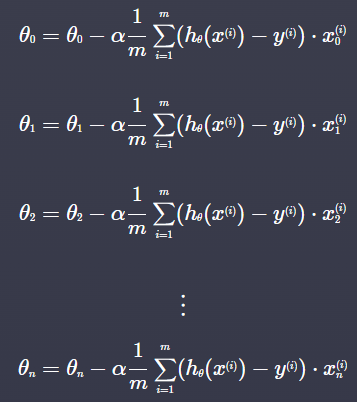
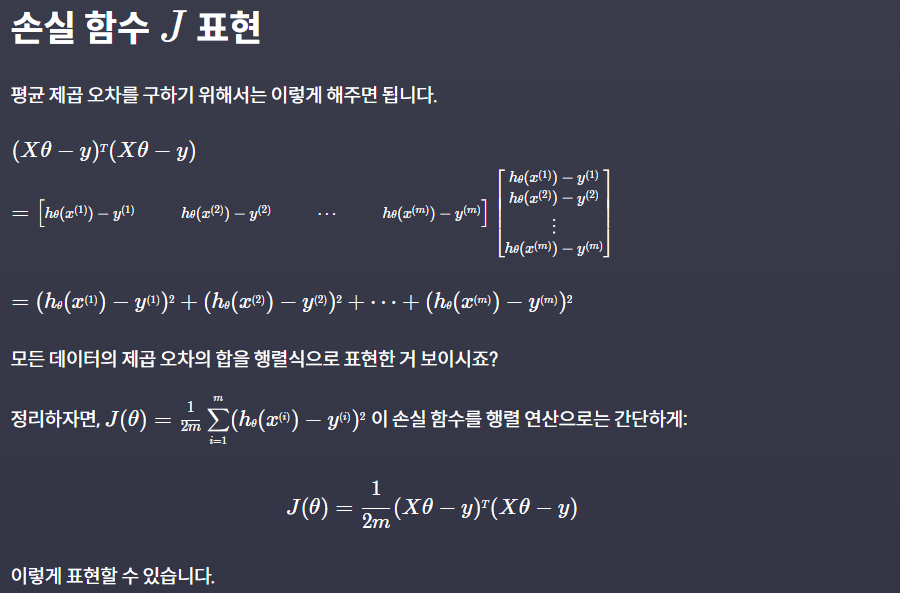
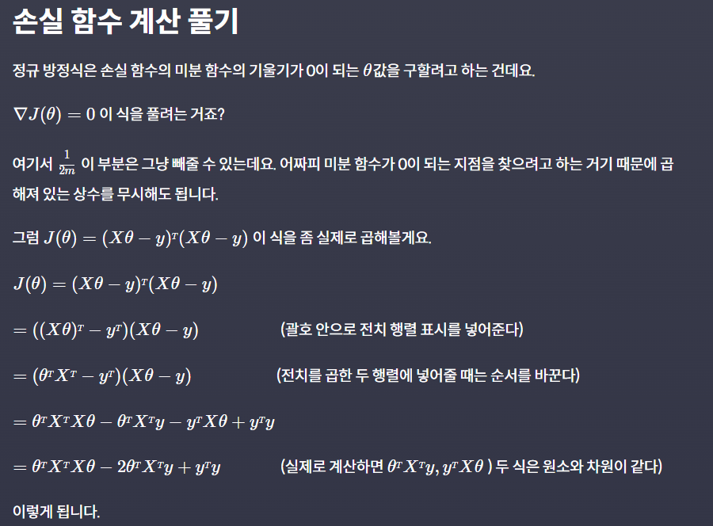

# Multiple Linear Regression
{: .no_toc .d-inline-block }
ing
{: .label .label-green }
<details open markdown="block">
  <summary>
    Table of contents
  </summary>
  {: .text-delta }
- TOC
{:toc}
</details>

<!------------------------------------ STEP ------------------------------------>
## STEP 1. Multiple Linear Regression

* **Multiple Linear Regression**
	* hard to visualized
	* principle is same to liear regression
* **Data Expression**
	* m is data number, n is feature(input) number
	* x<sub>j</sub><sup>(i)</sup> : (i) data, j feature

<br>

<!------------------------------------ STEP ------------------------------------>
## STEP 2. Hypothesis function

* **Hypothesis function for n features**
	* *h<sub>θ</sub>(x)  = θ<sub>0</sub> + θ<sub>1</sub>x<sub>1</sub> + θ<sub>2</sub>x<sub>2</sub> + ... + θ<sub>n</sub>x<sub>n</sub>*
	* *h<sub>θ</sub>(x)  =  θ<sup>T</sup>x*
		* *θ<sup>T</sup> = [θ<sub>0</sub>, θ<sub>1</sub>, θ<sub>2</sub>, ... , θ<sub>n</sub>]

<br>

<!------------------------------------ STEP ------------------------------------>
## STEP 3. Gradient Descent

### Step 3-1. Gradient Descent

* **Loss Functions**

*(θ = θ<sub>0</sub>, θ<sub>1</sub>, θ<sub>2</sub>, ... , θ<sub>n</sub>)*

* **θ Update** (result of partial derivative J(θ) by θ)

  

  *(j = 0, 1, 2, ..., n)*
  	

* **Matrics Express**

|Parameter|Expression|note|
|---|---|---|
|input, X|[](https://www.codeit.kr/learn/3048)|m: data number<br>n: feature number|
|hypothesis, H||*x<sub>0</sub>=1*|
|Xθ|||
|error, Xθ-y|||
|J(θ) 편미분|||
|θ Update|<br>||

### Step 3-2. θ Update Derivation


<br>

<!------------------------------------ STEP ------------------------------------>
## Step 4. Example Code

```python
import numpy as np

def prediction(X, theta):
    return X @ theta

def gradient_descent(X, theta, y, iterations, alpha):
    m = len(X)
    for _ in range(iterations):
        H = prediction(X, theta)
        error = H - y
        theta = theta - alpha / m * (X.T @ error)
    return theta
    

# 입력 변수
house_size = np.array([1.0, 1.5, 1.8, 5, 2.0, 2.5, 3.0, 3.5, 4.0, 5.0, 6.0, 7.0, 8.0, 8.5, 9.0, 10.0])  # 집 크기
distance_from_station = np.array([5, 4.6, 4.2, 3.9, 3.9, 3.6, 3.5, 3.4, 2.9, 2.8, 2.7, 2.3, 2.0, 1.8, 1.5, 1.0])  # 지하철역으로부터의 거리 (km)
number_of_rooms = np.array([1, 1, 1, 1, 2, 2, 2, 2, 3, 3, 3, 3, 4, 4, 4, 4])  # 방 수
# 목표 변수
house_price = np.array([3, 3.2, 3.6 , 8, 3.4, 4.5, 5, 5.8, 6, 6.5, 9, 9, 10, 12, 13, 15]) 

# 설계 행렬 X 정의
X = np.array([
    np.ones(16),
    house_size,
    distance_from_station,
    number_of_rooms
]).T
y = house_price	# 입력 변수 y 정의
theta = np.array([0, 0, 0, 0])	# 파라미터 theta 초기화
theta = gradient_descent(X, theta, y, 100, 0.01) 	# 학습률 0.01로 100번 경사 하강
```

<br>

<!------------------------------------ STEP ------------------------------------>
## STEP 5. Normal Equation

### Step 5-1. Normal Equation

|                                                              |                                                              | Normal Equation                                              |
| ------------------------------------------------------------ | ------------------------------------------------------------ | ------------------------------------------------------------ |
|  |  |  |

### Step 5-2. Normal Equation Derivation





### Step 5-3. Code

```python
def normal_equation(X, y):
    theta = np.linalg.pinv((X.T @ X)) @ X.T @ y
    return theta
```

### Step 5-4. Gradient Descent vs Normal Equation

|Gradient Descent|Normal Equation|
|--|--|
|적합한 학습율 α를 찾거나 정해야 한다.|학습율 α를 정할 필요가 없다.|
|반복문을 사용해야 한다.|한 단계로 계산을 끝낼 수 있다.|
|입력 변수의 개수 n이 커도 효율적으로 연산을 할 수 있다|입력 변수의 개수 n이 커지면 커질수록 월등히 비효율적이다. (행렬 연산을 하는 비용이 경사 하강법을 하는 것보다 크다)|
||역행렬이 존재하지 않을 수도 있다 (이때는 pseudo inverse를 이용해서 다르게 계산하는 방법이 있기 때문에 큰 문제는 안 됨)|

* **입력변수 1000개 이상 → Gradient Descent**
* **입력변수 1000개 이하 → Normal Equation**

<br>
<!------------------------------------ STEP ------------------------------------>

## STEP 6. Convex function

### Step 6-1. case

|non-convex|non-convex|convex|
|---|---|---|
||||

* **non-convex function**, **Local minimum** don't mean **Global Minium**

### Step 6-2. Linear Regression Loss function
* **Linear Regression MSE(or Loss function) is alway convex function**
* So, We alway find **Global Minimum** in **Linear Regression**

<br>

<!------------------------------------ STEP ------------------------------------>
## STEP 7. sklearn

```python
from sklearn.datasets import load_boston
from sklearn.model_selection import train_test_split
from sklearn.linear_model import LinearRegression
from sklearn.metrics import mean_squared_error

import pandas as pd
boston_dataset = load_boston()

x = pd.DataFrame(boston_dataset.data, columns=boston_dataset.feature_names)
y = pd.DataFrame(boston_dataset.target, columns=['MEDV'])

x_train, x_test, y_train, y_test = train_test_split(x, y, test_size=0.2, random_state=5)

model = LinearRegression()
model.fit(x_train, y_train)

model.coef_		 # all theta except theta_0
model.intercept_ # theta_0

y_test_prediction = model.predict(x_test)
mean_squared_error(y_test, y_test_prediction) ** 0.5 # RMSE
```

<br>
<!------------------------------------ STEP ------------------------------------>