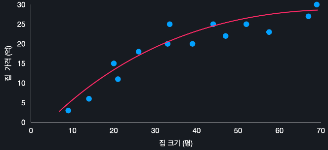

# Polynomial Regression
{: .no_toc }
<details open markdown="block">
  <summary>
    Table of contents
  </summary>
  {: .text-delta }
- TOC
{:toc}
</details>

<!------------------------------------ STEP ------------------------------------>
## STEP 1. Polynomial Regression hypothesis function

| h<sub>θ</sub>(x)=θ<sub>0</sub>+θ<sub>1</sub>x(Linear)        | h<sub>θ</sub>(x)=θ<sub>0</sub>+θ<sub>1</sub>x+θ<sub>2</sub>x<sup>2</sup> |
| ------------------------------------------------------------ | ------------------------------------------------------------ |
|  |  |
| **h<sub>θ</sub>(x)=θ<sub>0</sub>+θ<sub>1</sub>x+θ<sub>2</sub>x<sup>2</sup>+θ<sub>3</sub>x<sup>3</sup>** | **h<sub>θ</sub>(x)=θ<sub>0</sub>+θ<sub>1</sub>x+θ<sub>2</sub>x<sup>2</sup>+θ<sub>3</sub>x<sup>3</sup>+θ<sub>4</sub>x<sup>4</sup>** |
|  |  |

<br>

<!------------------------------------ STEP ------------------------------------>
## STEP 2. Single Feature

* Single feature polynomial regression is same as multiple linear regression
	
	

|first order|Add more polynomial as like multiple LR|
|---|---|
||  |

<br>

<!------------------------------------ STEP ------------------------------------>
## STEP 3. multiple polynomial function

* **multiple polynomial function** is same as **single feature polynomial function**
	* it represent **relation between features**
		* *ex> square width and height(meaning   
		area)*
	
* **Example**

	
	
	* **assume hypothesis function is quadratic term**
	
	  
	  

<br>

<!------------------------------------ STEP ------------------------------------>
## STEP 4. sklearn

```python
from sklearn.datasets import load_boston
from sklearn.preprocessing import PolynomialFeatures ### 다항속성 추가
from sklearn.model_selection import train_test_split
from sklearn.linear_model import LinearRegression
from sklearn.metrics import mean_squared_error

import pandas as pd

boston_dataset = load_boston()

polynominal_transformer = PolynomialFeatures(2) ### 가상함수 2차함수 가정
polynominal_data = polynominal_transformer.fit_transform(boston_dataset.data)
polynominal_feature_names = polynominal_transformer.get_feature_names(boston_dataset.feature_names)

polynominal_data.shape	# (506, 105) original data is (506, 13) 

x = pd.DataFrame(polynomial_data, columns=polynominal_feature_names)
y= pd.DataFrame(boston_dataset.target, columns=['MEDV'])

x_train, x_test, y_train, y_test = train_test_split(x, y, test_size=0.2, randome_state=5)

model = LinearRegression()
model.fit(x_train, y_train)

model.coef_
model.intercept_

y_test_prediction = model.predict(x_test)
mean_squared_error(y_test, y_test_prediction) ** 0.5
```