# Reinforcement Learning Basic
{: .no_toc }

  

    Table of contents
  

  {: .text-delta }
- TOC
{:toc}

<!------------------------------------ STEP ------------------------------------>

## STEP 1. MDP(Markov Decision Process)

### Step 1-1. MDP

* **MDP**

  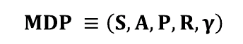

* **Component**

  | Items | Description                   | Equation                                                     |
  | ----- | ----------------------------- | ------------------------------------------------------------ |
  | S     | Group of states               |                                                              |
  | A     | Group of actions              |                                                              |
  | P     | Transition probability matrix | 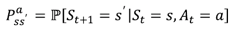 |
  | R     | Reward function               | 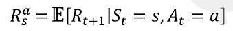 |
  | γ     | Damping factor                |                                                              |

### Step 1-2. Policy function and two value function

* **Policy function**

  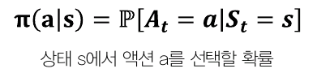

  * Policy function is related with agent(not environment)

* **If 𝝅 is given**, we can get **two value function**(two value function is depend on 𝝅)

* **State value function**

  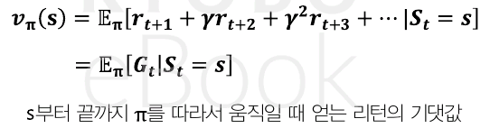 

* **State-action value function**

  

### Step 1-3. Prediction, Control

* **Prediction** : evaluate value of state with given 𝝅
* **Control** : find best policy function(𝝅)

 

<!------------------------------------ STEP ------------------------------------>

## STEP 2. Bellman Equation

### Step 2-1. Bellman Expectation Equation

* **Bellman Expectation Equation**(𝝅 is given)

  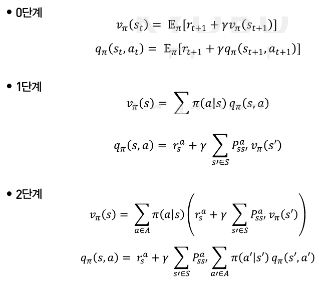

  * **Step 1 Example**

    | v                                                            | q                                                            |
    | ------------------------------------------------------------ | ------------------------------------------------------------ |
    |  | 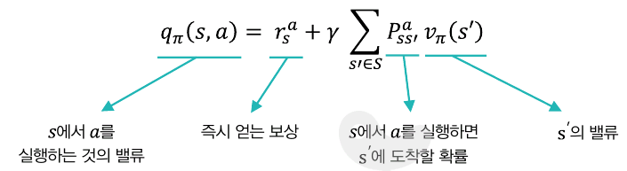 |
    | 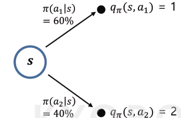 | 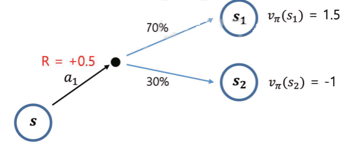 |

    

  * What it means to **know MDP** is **knowing rSa, Pss'a**
    * **Know MDP** →  Step 2. equation → Model-based, planning 
    * **Don't know MDP** → Step 0. equation → Model-free, sampling

### Step 2-2. Optimal Value/Policy

* **Optimal Value/Policy**

  

  * 상태 별(s, s' ...)로 가장 높은  value의 정책의 다른 경우

    → 각각의 정책(𝝅s, 𝝅s' ...)을 조합해 새로운 정책(𝝅*) 가능

  * MDP는 𝝅*가 반드시 존재함

    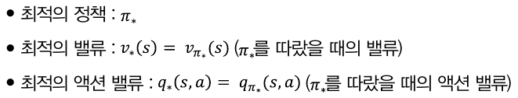

### Step 2-3. Bellman **Optimality** Equation

* **Bellman Optimality Equation**

  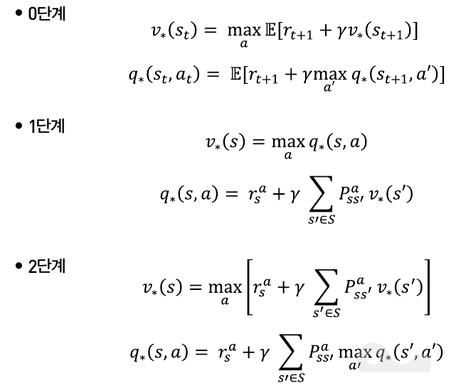

  *  Reason that is not max operator in front of q(s,a) equation
    *   우리가 평가하려는 a에 대한 value에서 a는 항상 최선의 행동을 의미하지는 않기 때문에 max 연산자가 앞에 붙지 않음
  *  𝝅(a`|`s) → maxa
    * **Bellman Expectation Equation** : 2 stochastic factor(P, 𝝅)
      * use to evaluate 𝝅
    * **Bellman Optimality Equation** : 1 stochastic factor(P)
      * use to get best value

 

<!------------------------------------ STEP ------------------------------------>

## STEP 3. Know MDP, and Small Problem

### Step 3-1. Preview

* **Prediction : Iterative policy evaluation**

* **Control**

  1. **Policy iteration**
  2. **Value iteration**

* using **tabular method**(Example)

  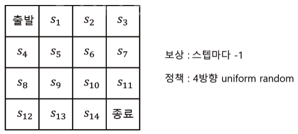

### Step 3-2. Prediction : Iterative Policy Evaluation(𝝅 given)

* **Method**

  1. Initialize table

  2. Update one state

     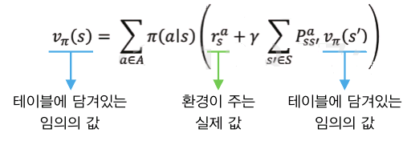

     * 무의미한 값에 실제 값이 섞여 반복에 의해 실제 값에 가까워 짐

     * ex) 𝝅(동서남북`|`s) = 0.25, r = -1, P = 1, 초기 value = 0

       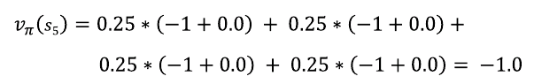

  3. apply 2. on all states

  4. iterate 2.~3.

     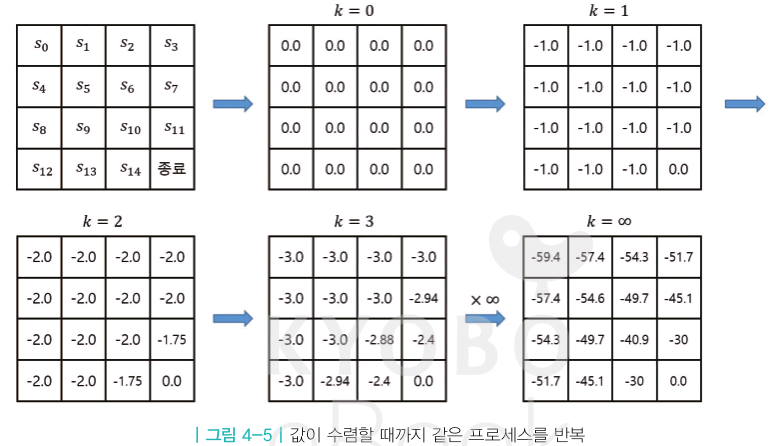

### Step 3-3. Contrl : Policy iteration

* **정책 평가/정책 개선 반복**

  * Policy evaluation : iterative policy evaluation
  * Policy improvement : get 𝝅greedy from policy evaluation

* **Greedy Policy**

  * Act to get more good value
  *  𝝅greedy is improved over 𝝅

* **early stopping**

  * There is no need to repeat to the limit, because even a **little repetition is worthwhile**

* **Method**

  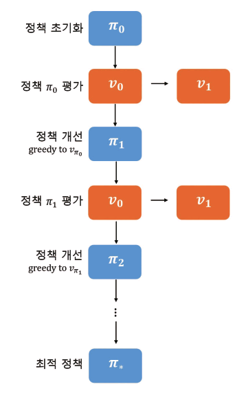

### Step 3-4. Control : Value iteration

* Get **optimal policy** from **optimal value** derived from **bellman optimality equation**

* **Method**

  1. Get optimal value From bellman optimality equation using iterative policy evaluation

     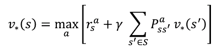

     * ex)

       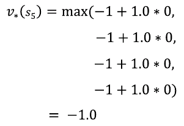

  2. Get 𝝅* from optimal value

     * 𝝅* is greedy policy to optimal value

 

<!------------------------------------ STEP ------------------------------------>

## STEP 4. Don't Know MDP, and Small Problem : Prediction

### Step 4-1. Preview

* **Prediction**

  1. MonteCarlo Method
  2. Temporal difference

* **model(model of enviromnet)** : 액션에 대하여 환경이 어떻게 응답할지 예측하는 모든 것

* using **tabular method**(Example)

  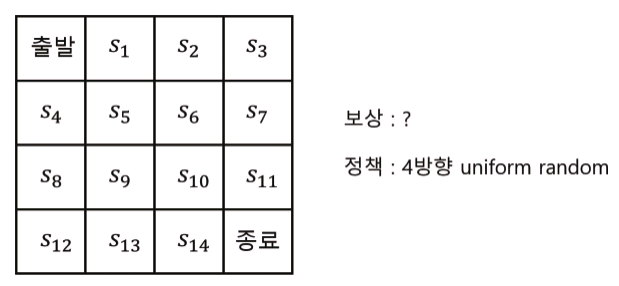

  * We know r=-1, P=1, but **system don't know about r, P**

### Step 4-2. MC(MonteCarlo) Learning

* Get value from **many sampling**

* **Method**

  1. Initialize table : (0, 0)

     * N(s) : counts of enter, V(s) : sum of returns

  2. Experience : arrived at ST

     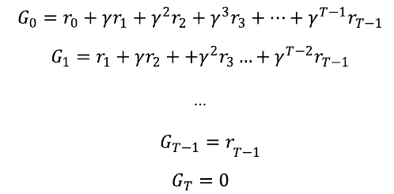

  3. Update table

     * N(st) ← N(st) + 1

     * V(st) ← V(st) + Gt

       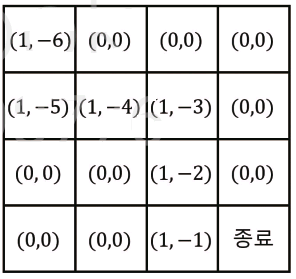

  4. Calculate value

     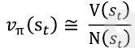

* **Version of partial update**

  * Above method is need **many episode to update v𝝅**(Because it need average)
    * Below expression is need only **one episode finishing to update  v𝝅**
    * Don't need to save N(st)

  
  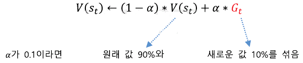
  
  
  

### Step 4-3. Implement MonteCalro Learning

* 4 things needed for implement 
  1. environment
  2. agent
  3. experience part
  4. learning part
* [code url](https://github.com/merucode/study_ML/blob/master/RL/basic/ch4_MCLearning.ipynb)

### Step 4-4. TD(Temporal Difference) Learning

* **MC and TD**

  | Items        | MC                                                           | TD                                                           |
  | ------------ | ------------------------------------------------------------ | ------------------------------------------------------------ |
  | Update point | One episode finish                                           | **After operate step** Don't need to finish episode       |
  | Theory       | 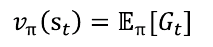 | 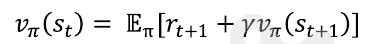 |
  | Note         | 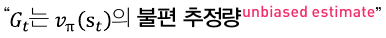 |                                                              |

* **TD target**
  * rt+1 +γ v𝝅(st+1) 을 여러번 sampling 하여 평균을 내면 v𝝅(st) 에 수렴
  * 즉, **rt+1 +γ v𝝅(st+1)** 는 우리의 목표(정답)가 되는 값이기 때문에 **TD target**

* **TD Learning Algorithm**

  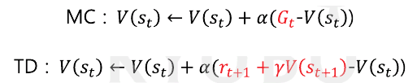

  * ex> s0 → s1 →  s2 →  ...  s11 →  종료

    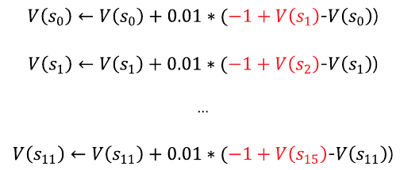

### Step 4-5. Implement TD Leaning

* [code url](https://github.com/merucode/study_ML/blob/master/RL/basic/ch4_TDLearning.ipynb)

### Step 4-6. MC vs TD

* **Compare MC and TD**

  | Items    | MC                                                           | TD                                                           |
  | -------- | ------------------------------------------------------------ | ------------------------------------------------------------ |
  | Leaning  | Episodic MDP (종료상태가 있는 것)                         | Episodic MDP Non-Episodic MDP                             |
  | Bias     |  **unbiased** |  **biased** |
  | Variance | 서울시청 → 강릉 변동성 큼(작은 **α**)                     | 서울시청 → 앞 편의점 변동성 낮음(큰 **α**)                |

* **Reason that TD is biased**

  * **rt+1 +γ v𝝅(st+1)**(실제 TD target) is **unbiased**

  * **rt+1 +γ V(st+1)**(우리가 사용하는 TD target) is **baised**

    * TD에서는 실제 값(**v𝝅**)모름으로 추측 값(**V**)을 정답으로 사용하여 update 수행

    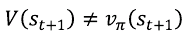

​	

### Step 4-7. n Step MDP

* **Relation between MC and TD**

  * N step TD target

    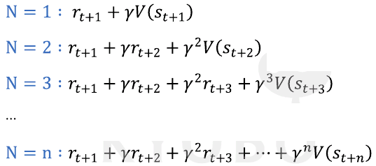

  * N = T(end point) → MC

    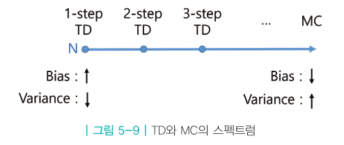

 

<!------------------------------------ STEP ------------------------------------>

### 초안 작성

## STEP 5. Don't Know MDP, and Small Problem : Control

### Step 5-1. Preview

* **Control**
  1. MC Control
  2. TD Control : SARSA
  3. Q Leaning

### Step 5-2. MC Control

* We want to use **Policy interation** but **don't know MDP(rSa, Pss'a)**

  * don't know **rSa**  → don't select 𝝅greedy
  * don't know **Pss'a** → don't select action(don't know result of action)

* **Solution**

  1. Policy evaluation : MC Learning

  2. Policy improvement : use Q instead of V

     | V                                                            | Q                                                            |
     | ------------------------------------------------------------ | ------------------------------------------------------------ |
     | 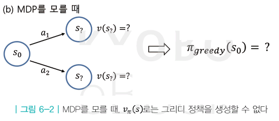 | 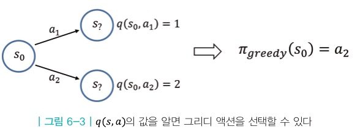 |
     |                                                              | Need q(s,a) value to use MC                                  |

  3. exploration

     * 무조건 한 방향만 Action 시 더 좋은 value를 놓칠 수 있음

     * Introduce **ε-greed**(decay)

       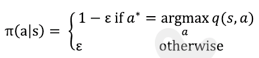

       * decay : 초기 높은 ε, 후기 낮은 일정 ε

* **MC Control**

  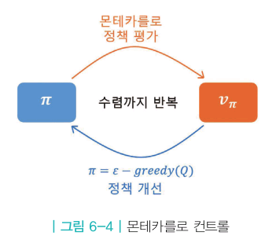

### Step 5-3. Implement MC Control

* **Example**

  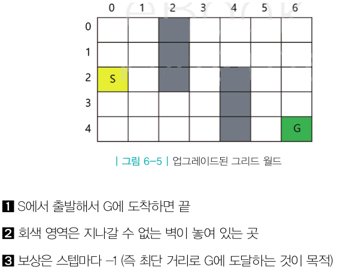

* [code url](https://github.com/merucode/study_ML/blob/master/RL/basic/ch5_MCContorl.ipynb)

### Step 5-4. TD Control : SARSA

* **Policy evaluation : using TD instead of MD**

  * It's help to **update not end of episode but end of step**

    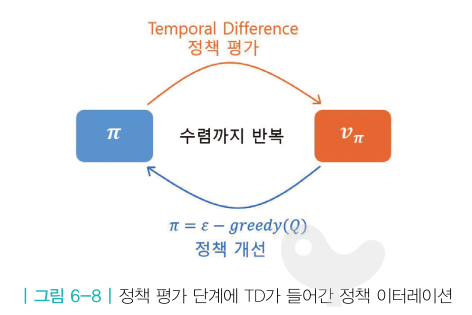

* **SARSA**

  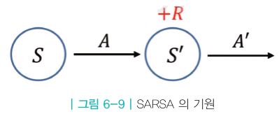

  * **TD Target**

    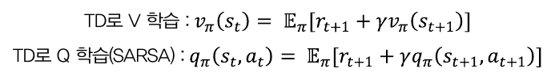

    * **기대값 안의 수식 Sampling → 실제 기대값에 가까워짐**

  * **SARSA**

    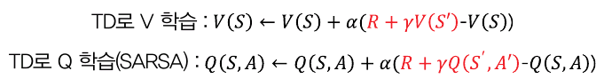

### Step 5-5. Implement TD Contorl : SARSA

* [code_url](https://github.com/merucode/study_ML/blob/master/RL/basic/ch5_SARSA.ipynb)

### Step 5-6. TD Contorl : Q Learning

* **On/Off Policy**
  * on-policy : same **target policy** and **behavior policy**
  * off-policy : different **target policy** and **behavior policy**

* **Target/Behavior Policy**

  * target policy : 강화하고자 하는 목표가 되는 정책
  * behavior policy : 실제 환경과 상호작용하여 경험을 쌓는 정책

* **Off Policy Adventage**

  1. reuse past experience
  2. learning from data of person
     * system learn from (s, a, r, s') data
  3. 1:N or N:1 learning is possible

* **Theory Background**

  - From bellman optimality equation

    

    - If we know **q***, optimal policy is below(just move to highest **q* action**)

    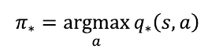

    * **Q에 대하여 greed policy**

  - So, our purpose is getting **q***

    * From bellman optimality equation(step 0)

      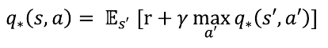

    * Replace E with sampling value

* **Compare SARSA and Q-Learning**

  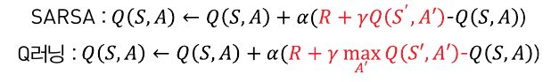

  | Items           | SARSA                                                        | Q-Learning                                                   |
  | --------------- | ------------------------------------------------------------ | ------------------------------------------------------------ |
  | Behavior Policy | Q에 대해 ε-greedy                                         | Q에 대해 ε-greedy                                        |
  | Target Policy   | Q에 대해 ε-greedy                                        | Q에 대해 greedy                                          |
  | Policy          | on                                                           | off Difference Behavior and Target policy                 |
  | Theory          | 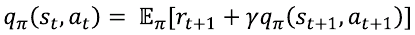 Bellman Expectaion |  Bellman Optimality |
  | Difference      | 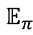 | 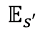 𝝅 only greedy select for Q |
  | Note            |                                                              | 𝝅* is dependent on environment(q)                 |

### Step 5-6. Implement Q-Learning

* [code url](https://github.com/merucode/study_ML/blob/master/RL/basic/ch5_QLearning.ipynb)

 

<!------------------------------------ STEP ------------------------------------>

## STEP 6. Deep RL

### Step 6-1. Function to save data

* To solve large scale problem 
  * We use deep RL(Deep Learning + Reinforce Learning)
* Don't use tabular method to solve problem have to many state(바둑, continuous state space problem ...)
  * Introduce function to save data
* **Function Generalization**
  * **Make general function for state/action data express using parameters(w or theta)**
  * Small storage to save results of learning
  * Use deep learning to find general function

### Step 6-2. Implement Function Generalization

* **Example**

  * get data from below function and make general function

    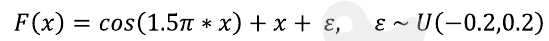

* [code url](https://github.com/merucode/study_ML/blob/master/RL/basic/ch6_Fitting.ipynb)

 

##  여기부터 빠르게 진행 복습 필요

<!------------------------------------ STEP ------------------------------------>

## STEP 7. Model free, Large state/action space

### Step 7-1 Preview

* **Deep ML**

  1. Value based : v𝝅(s), q𝝅(s,a) → neural net
  2. Policy Based : 𝝅(a`|`s) → neural net

* **RL Agent**

  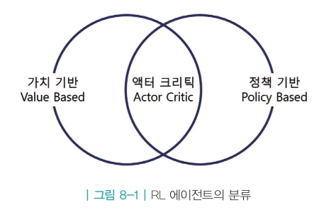

  1. value based
     * Select action from value(q(s,a))
     * SARSA, Q-Learning
     * When select action, **only greedy select high q(s,a)**
       * So, don't need 𝝅(a`|`s) and **q(s,a)** is rule of 𝝅
  2. policy based
     * Select action from 𝝅(a`|`s)
     * When select action, **only use 𝝅**. So, don't need value, evaluation function
  3.  Actor-Critic
     * Select action from both value and policy
       * Actor : 𝝅
       * Critic : v(s) or q(s,a)

* **value based**
  * 𝝅가 고정되었을 떄, 𝝅의 가치함수 v𝝅(s)를 학습
  * value network
    * θ is neural net parameters
    * purpose : learning proper θ, to vθ(s) get proper value per states

## Step 7-2. Learn Value Network

* Value network of vθ(s)(𝝅 고정)

  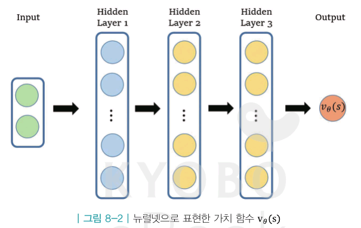

* **Loss function**

  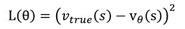

  * 위 식은, 어떤 s에 대한 것인지가 없음

    

  * 𝝅에 의한 sampling 통해 기대값을 근사적으로 계산 가능, 

  * gradient 수행하면(상수 생략)

    

  * 𝝅에 의해 상태 s에 들어갈 경우

    

  * 위 식 하나로만은 성립하지 않으나, Sampling을 통해 수많은 값으로 우변 평균을 내면 좌변에 근사하게 됨

  * θ Update

    

  * Sampling 및 gradient descent 의해 vθ(s)는 vtrue(s)에 근사하게 됨

* **But, we don't know  vtrue(s)**

  * To get  vtrue(s)
    1. MC return
    2. TD target

### Step 7-3 MC Return

* **MC return**

  

  * Gt 사용 가능한 이유는 실제 가치함수 정의가 Gt의 기대값이기 때문에(Gt = vture(st))

  

  

### Step 7-4. TD Target

* Introduce TD target instead of Gt

  

  

* TD target is 상수 not function of θ → θ 편미분시 TD target 항 0
  * 만약 상수 취급 안한다면 TD target(추측 정답값)도 변하게 되어 모델 안전성이 떨어짐

### Step 7-5. Deep Q learning

* Value based agent don't have **explicit policy(𝝅)**
  * 𝝅 is not exist
  * act for greedy at q(s,a) → **implicit policy q(s,a)**

* **Theory Background**

  * From Bellman optimality Equation

    

    * 추측 정답인 TD target 과 추측인 Q(s,a) 사이 차이를 줄이는 방향으로 업데이트

  * Loss function

    

    

    * 정답 Q*과 Qθ 차이를 줄이는 방향으로 업데이트

  * use mini-batch instead of E

* **Deep Q Learning : pseudo code**

  

  * 3-A real act(Behavior policy : eps-greedy)

  * 3-C is not real action but operate to calculate TD value(Target policy : greedy)

  * off-policy

  * When Implement we just define L(θ). don't need gradient of L(θ)

    * optimizer and 역전파가 알아서 계산 수행해줌

      

### Step 7-6. Implement DQN

* **Experience Replay**

  * episode is consist of many transitions(one transition = et)

    

  * use replay buffer to **reuse transition**

    * If save new data, delete oldest data

    * mini-batch extract data from replay buffer

      * mini-batch is consist of not continuous data. It's mean they are small correalation

        → help to improve performance

  * only use to off-policy algorithm

* **Target Network**

  

  * Q-Learning 정답

    

    * θ에 대한 함수이므로 θ가 변하면 변하게 됨
    * 일정 시간 freezing 시키는 θi- 도입

  * **Target and Q network**

    * Target network : Calculate answer, freezing θi-
    * Q network :  Learning, θ updated, 일정 주기마다 θ → θi-

* [code url](https://github.com/merucode/study_ML/blob/master/RL/basic/ch7_DQN.ipynb)

 

<!------------------------------------ STEP ------------------------------------>

https://github.com/seungeunrho/RLfrombasics/blob/master/ch8_DQN.py

 

<!------------------------------------ STEP ------------------------------------>

 

<!------------------------------------ STEP ------------------------------------>

