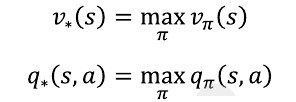
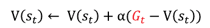

# Reinforcement Learning Basic
{: .no_toc }

  

    Table of contents
  

  {: .text-delta }
- TOC
{:toc}

<!------------------------------------ STEP ------------------------------------>

## STEP 1. MDP(Markov Decision Process)

### Step 1-1. MDP

* **MDP**

  

* **Component**

  | Items | Description                   | Equation                                                     |
  | ----- | ----------------------------- | ------------------------------------------------------------ |
  | S     | Group of states               |                                                              |
  | A     | Group of actions              |                                                              |
  | P     | Transition probability matrix |  |
  | R     | Reward function               |  |
  | γ     | Damping factor                |                                                              |

### Step 1-2. Policy function and two value function

* **Policy function**

  

  * Policy function is related with agent(not environment)

* **If 𝝅 is given**, we can get **two value function**(two value function is depend on 𝝅)

* **State value function**

   

* **State-action value function**

  

### Step 1-3. Prediction, Control

* **Prediction** : evaluate value of state with given 𝝅
* **Control** : find best policy function(𝝅)

 

<!------------------------------------ STEP ------------------------------------>

## STEP 2. Bellman Equation

### Step 2-1. Bellman Expectation Equation

* **Bellman Expectation Equation**(𝝅 is given)

  

  * **Step 1 Example**

    | v                                                            | q                                                            |
    | ------------------------------------------------------------ | ------------------------------------------------------------ |
    |  |  |
    |  |  |

    

  * What it means to **know MDP** is **knowing rSa, Pss'a**
    * **Know MDP** →  Step 2. equation → Model-based, planning 
    * **Don't know MDP** → Step 0. equation → Model-free, sampling

### Step 2-2. Optimal Value/Policy

* **Optimal Value/Policy**

  

  * 상태 별(s, s' ...)로 가장 높은  value의 정책의 다른 경우

    → 각각의 정책(𝝅s, 𝝅s' ...)을 조합해 새로운 정책(𝝅*) 가능

  * MDP는 𝝅*가 반드시 존재함

    

### Step 2-3. Bellman **Optimality** Equation

* **Bellman Optimality Equation**

  

  *  𝝅(a|s) → maxa
    * **Bellman Expectation Equation** : 2 stochastic factor(P, 𝝅)
      * use to evaluate 𝝅
    * **Bellman Optimality Equation** : 1 stochastic factor(P)
      * use to get best value

 

<!------------------------------------ STEP ------------------------------------>

## STEP 3. Know MDP, and Small Problem

### Step 3-1. Preview

* **Prediction : Iterative policy evaluation**

* **Control**

  1. **Policy iteration**
  2. **Value iteration**

* using **tabular method**(Example)

  

### Step 3-2. Prediction : Iterative Policy Evaluation

* **Method**

  1. Initialize table

  2. Update on state

     

     * 무의미한 값에 실제 값이 섞여 반복에 의해 실제 값에 가까워 짐

     * ex) 𝝅(동서남북|s) = 0.25, r = -1, P = 1, 초기 value = 0

       

  3. apply 2. on all states

  4. iterate 2.~3.

     

### Step 3-3. Contrl : Policy iteration

* **정책 평가/정책 개선 반복**

  * Policy evaluation : iterative policy evaluation
  * Policy improvement : get 𝝅greedy from policy evaluation

* **Greedy Policy**

  * Act to get more good value
  *  𝝅greedy is improved over 𝝅

* **early stopping**

  * There is no need to repeat to the limit, because even a **little repetition is worthwhile**

* **Method**

  

### Step 3-4. Control : Value iteration

* Get **optimal policy** from **optimal value** derived from **bellman optimality equation**

* **Method**

  1. Get optimal value From bellman optimality equation using iterative policy evaluation

     

     * ex)

       

  2. Get 𝝅* from optimal value

     * 𝝅* is greedy policy to optimal value

 

<!------------------------------------ STEP ------------------------------------>

## STEP 4. Don't Know MDP, and Small Problem

### Step 4-1. Preview

* **Prediction**

  1. MonteCarlo Method
  2. Temporal difference

* **Control**

* **model(model of enviromnet)** : 액션에 대하여 환경이 어떻게 응답할지 예측하는 모든 것

* using **tabular method**(Example)

  

  * We know r=-1, P=1, but system don't know about r, P

### Step 4-2. MonteCarlo Method

* Get value from **many sampling**

* **Method**

  1. Initialize table : (0, 0)

     * N(s) : counts of enter, V(s) : sum of returns

  2. Experience : arrived at ST

     

  3. Update table

     * N(st) ↠N(st) + 1

     * V(st) ↠V(st) + Gt

       

  4. Calculate value

     

* **Version of partial update**

  

  

  * Don't need to save N(st)

### Step 4-3. Implement MonteCalro Method

* 4 things needed for implement 
  1. environment
  2. agent
  3. experience part
  4. learning part
* [code url](https://github.com/merucode/study_ml/blob/master/reinforcement/basic/ch1_montecarlo/Untitled.ipynb)

