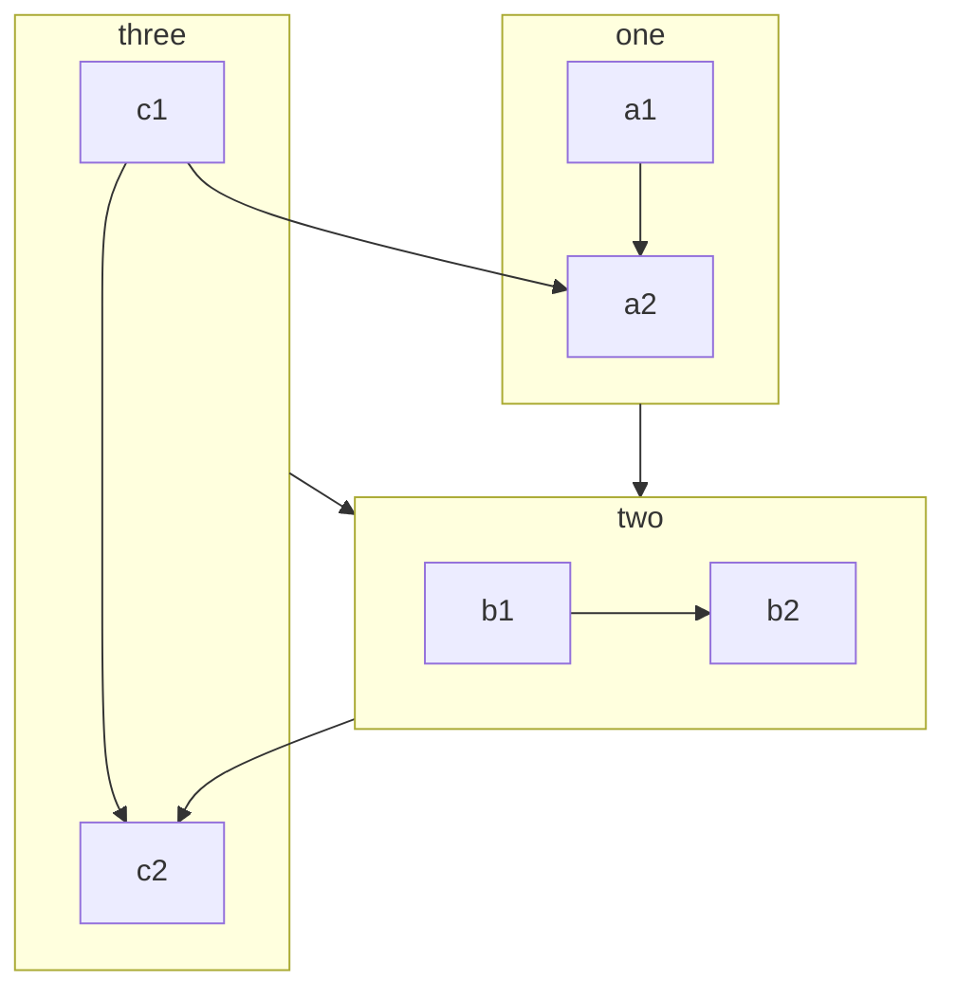

# Just-the-docs
{: .no_toc }
<details open markdown="block">
  <summary>
    Table of contents
  </summary>
  {: .text-delta }
- TOC
{:toc}
</details>

<!---------------------------------- STEP 1 ---------------------------------->
## STEP 1. Label

* `.label`, `.label .label-green`, `.label .label-red`, `.label .label-yellow`

```
Default label
{: .label }
```

Default label
{: .label }


```
Label
{: .d-inline-block }

New
{: .label .label-green } # Can use .label-yellow, .label-red
```

Label
{: .d-inline-block }

New
{: .label .label-green }

<br>

<!---------------------------------- STEP 2 ---------------------------------->
## STEP 2. Callouts
* `.highlight`, `.important`, `.new`, `.note`, `.warning`
```
{: .highlight } # Can use 
A paragraph
```

{: .highlight }
A paragraph


```
{: .note-title }
> My note title
>
> A paragraph with a custom title callout
```

{: .note-title }
> My note title
>
> A paragraph with a custom title callout

<br>

<!---------------------------------- STEP 3 ---------------------------------->
## STEP 3. Page TOC

```html
<!-- write below code at top of page.md -->
# Title
{: .no_toc }
<details open markdown="block">
  <summary>
    Table of contents
  </summary>
  {: .text-delta }
- TOC
{:toc}
</details>
```

<br>

<!---------------------------------- STEP 3 ---------------------------------->
## STEP 4. [Mermaid]





---
[Mermaid]: https://mermaid.js.org/syntax/flowchart.html