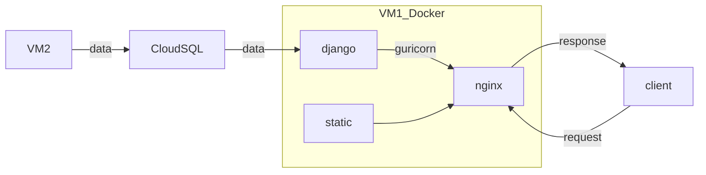

# menu6 sub1 sub1
{: .no_toc }

```mermaid
flowchart LR
    a1[VM2]--data-->a2[CloudSQL]
    a2--"data"-->b1
    subgraph VM1_Docker
    b1[django]--guricorn-->b2[nginx]
    b3[static]-->b2
    end
    c1[client]--request-->b2
    b2--response-->c1
```

* VM1 : Web instance
* VM2 : Get data instance
* data : word, ohlc