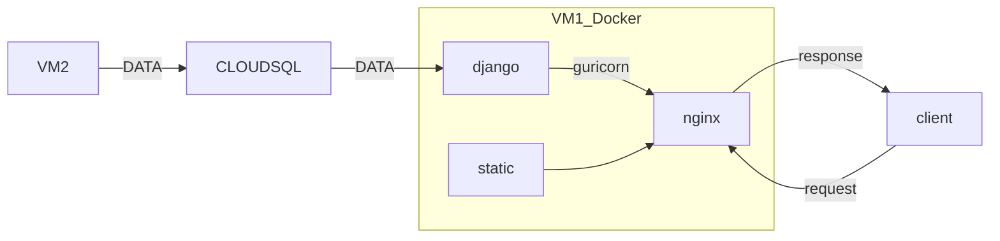
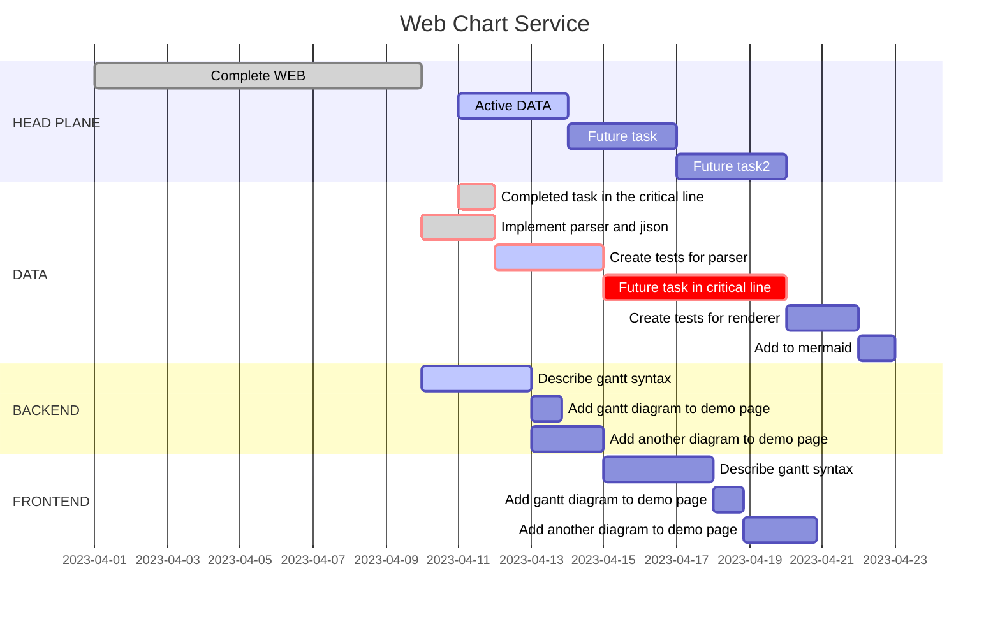

# Design
{: .no_toc .d-inline-block }
ing
{: .label .label-green }

  

    Table of contents
  

  {: .text-delta }
- TOC
{:toc}

<!------------------------------------ STEP ------------------------------------>
## STEP 1. STRUCTURE

* VM1 : Web instance
* VM2 : Get data instance
* data : word, ohlc

 

<!------------------------------------ STEP ------------------------------------>
## STEP 2. To do list

- [x] WEB_Connect django, guricorn, nginx in VM instance
- [ ] DATA_Get data instance and connect it and cloudsql
- [ ] BACKEND_Connect cloudsql and django
- [ ] FRONTEND_Make front page including data chart